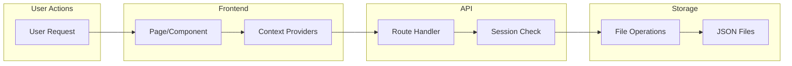
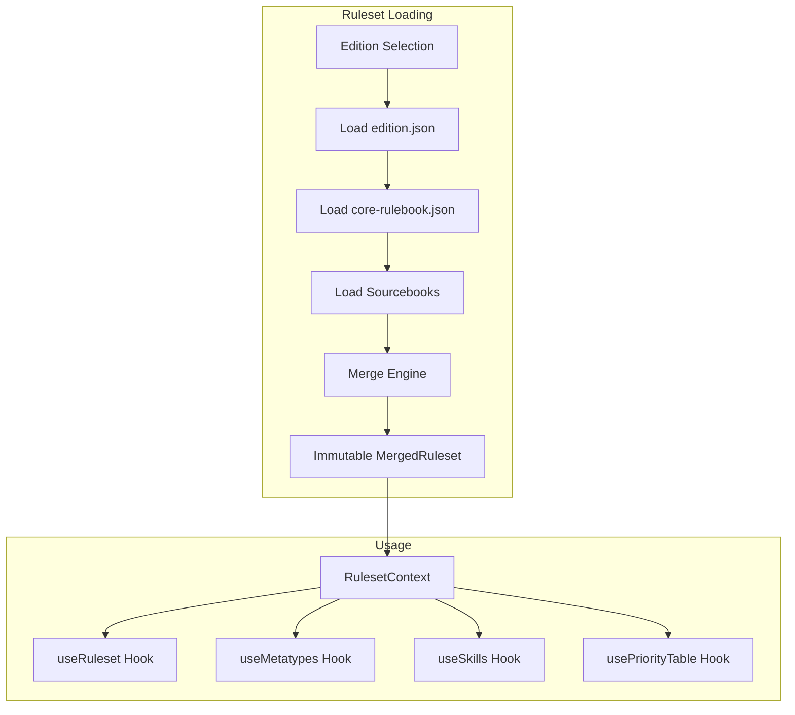
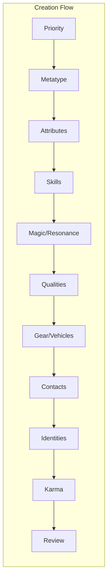
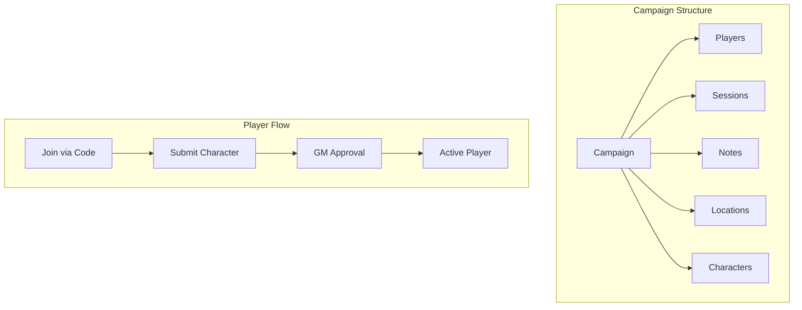
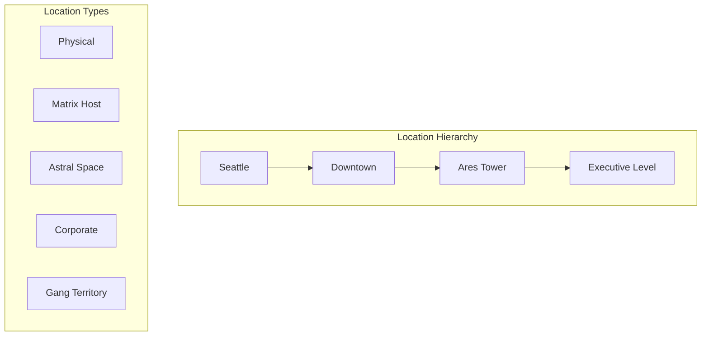

# Architecture Overview

## Tech Stack

### Frontend Framework
- **Next.js 16.0.7** - React framework with App Router
- **React 19.2.0** - UI library
- **React DOM 19.2.0** - React rendering for web
- **TypeScript 5** - Type-safe JavaScript

### UI Components
- **React Aria Components 1.13.0** - Accessible component primitives built on React Aria
- **Lucide React 0.561.0** - Icon library

### Styling
- **Tailwind CSS 4** - Utility-first CSS framework
- **@tailwindcss/postcss** - Tailwind CSS v4 PostCSS plugin
- **PostCSS** - CSS processing with Tailwind plugin
- **Geist Fonts** - Custom font family (Sans & Mono) via Next.js font optimization
  - CSS variables: `--font-geist-sans` and `--font-geist-mono`

### Authentication & Security
- **bcryptjs 3.0.3** - Password hashing
- **Cookie-based sessions** - httpOnly, 7-day expiration

### Utilities
- **uuid 13.0.0** - UUID generation for entity IDs

### Testing
- **Vitest 4.0.15** - Unit and integration testing
- **Playwright 1.57.0** - End-to-end testing
- **Testing Library** - React testing utilities
  - `@testing-library/react 16.3.0`
  - `@testing-library/jest-dom 6.9.1`
  - `@testing-library/user-event 14.6.1`

### Development Tools
- **ESLint 9** - Code linting with Next.js configurations
  - Flat config format (`eslint.config.mjs`)
  - `eslint-config-next/core-web-vitals`
  - `eslint-config-next/typescript`
- **pnpm 10.0.0** - Package manager

### Build & Runtime
- **Node.js** - Runtime environment
- **TypeScript Compiler** - Type checking and compilation
  - Target: ES2017
  - Module: ESNext
  - Module Resolution: Bundler

---

## System Architecture

### High-Level Overview

```mermaid
graph TB
    subgraph "Client Layer"
        Browser[Browser]
        Pages[Next.js Pages]
        Components[React Components]
    end

    subgraph "Application Layer"
        AppRouter[App Router]
        API[API Routes]
        Auth[Auth Middleware]
    end

    subgraph "Business Logic"
        Rules[Ruleset Engine]
        Validation[Validation Engine]
        Storage[Storage Layer]
    end

    subgraph "Data Layer"
        Users[(Users JSON)]
        Characters[(Characters JSON)]
        Campaigns[(Campaigns JSON)]
        Locations[(Locations JSON)]
        Editions[(Edition Data)]
    end

    Browser --> Pages
    Pages --> Components
    Pages --> AppRouter
    AppRouter --> API
    API --> Auth
    Auth --> Rules
    Auth --> Storage
    Rules --> Editions
    Storage --> Users
    Storage --> Characters
    Storage --> Campaigns
    Storage --> Locations
```



### Data Flow



---

## Project Structure

```
shadow-master/
├── app/                          # Next.js App Router directory
│   ├── layout.tsx                # Root layout with fonts and providers
│   ├── page.tsx                  # Home page (dashboard)
│   ├── globals.css               # Global styles with Tailwind imports
│   ├── providers.tsx             # React context providers wrapper
│   │
│   ├── api/                      # API route handlers
│   │   ├── auth/                 # Authentication endpoints
│   │   ├── campaigns/            # Campaign management
│   │   ├── characters/           # Character CRUD
│   │   ├── editions/             # Edition metadata
│   │   ├── health/               # Health check
│   │   ├── locations/            # Location management
│   │   ├── location-templates/   # Location templates
│   │   ├── rulesets/             # Merged ruleset loading
│   │   ├── settings/             # User settings
│   │   └── users/                # User management (admin)
│   │
│   ├── campaigns/                # Campaign management pages
│   │   └── [id]/                 # Campaign detail with tabs
│   │       ├── components/       # Tab components
│   │       └── locations/        # Location management
│   │
│   ├── characters/               # Character management
│   │   ├── [id]/                 # Character sheet view/edit
│   │   └── create/               # Character creation wizard
│   │       └── components/
│   │           └── steps/        # Wizard step components
│   │
│   ├── rulesets/                 # Edition browser
│   ├── settings/                 # User settings pages
│   ├── signin/                   # Sign in page
│   ├── signup/                   # Sign up page
│   └── users/                    # User management (admin)
│
├── components/                   # Shared React components
│   ├── ThemeProvider.tsx         # Theme context provider
│   └── DiceRoller.tsx            # Dice rolling component
│
├── lib/                          # Core business logic
│   ├── auth/                     # Authentication logic
│   │   ├── middleware.ts         # Auth middleware
│   │   ├── password.ts           # Password hashing
│   │   ├── session.ts            # Session management
│   │   └── validation.ts         # Input validation
│   │
│   ├── rules/                    # Ruleset system
│   │   ├── loader.ts             # Edition/book loading
│   │   ├── merge.ts              # Ruleset merging
│   │   ├── validation.ts         # Character validation
│   │   ├── RulesetContext.tsx    # React context + hooks
│   │   └── index.ts              # Public exports
│   │
│   ├── storage/                  # File-based persistence
│   │   ├── base.ts               # Core file operations
│   │   ├── users.ts              # User storage
│   │   ├── characters.ts         # Character storage
│   │   ├── campaigns.ts          # Campaign storage
│   │   ├── locations.ts          # Location storage
│   │   ├── editions.ts           # Edition data loading
│   │   └── index.ts              # Public exports
│   │
│   ├── types/                    # TypeScript type definitions
│   │   ├── index.ts              # Re-exports all types
│   │   ├── core.ts               # Base types (ID, dates, etc.)
│   │   ├── user.ts               # User types
│   │   ├── character.ts          # Character types
│   │   ├── campaign.ts           # Campaign types
│   │   ├── location.ts           # Location types
│   │   ├── edition.ts            # Edition/ruleset types
│   │   ├── creation.ts           # Character creation types
│   │   ├── vehicles.ts           # Vehicle types
│   │   └── programs.ts           # Matrix program types
│   │
│   ├── themes.ts                 # Character sheet themes
│   └── utils.ts                  # Utility functions
│
├── data/                         # JSON file storage
│   ├── users/                    # User records
│   ├── characters/               # Character records (by userId)
│   ├── campaigns/                # Campaign records
│   ├── locations/                # Location records (by campaignId)
│   └── editions/                 # Edition ruleset data
│       └── sr5/
│           ├── edition.json
│           └── core-rulebook.json
│
├── docs/                         # Documentation
│   ├── architecture/             # Architecture docs
│   ├── requirements/             # Requirements docs
│   └── prompts/                  # Feature prompts
│
└── Configuration files
    ├── package.json
    ├── tsconfig.json
    ├── next.config.ts
    ├── postcss.config.mjs
    ├── eslint.config.mjs
    ├── vitest.config.ts
    └── playwright.config.ts
```

---

## Core Domains

### 1. Ruleset System

The ruleset architecture enables supporting multiple Shadowrun editions without code duplication.



**Key Concepts:**
- **Edition**: Top-level ruleset container (e.g., `sr5`, `sr6`)
- **Book**: Physical/digital publication with rules (core rulebook, sourcebooks)
- **RuleModule**: Domain-specific rules (metatypes, skills, qualities, magic, etc.)
- **Merge Strategies**: `merge`, `replace`, `append`, `remove`
- **MergedRuleset**: Final immutable ruleset after merging all books

### 2. Character Creation

Wizard-based, step-driven, budget-constrained character creation.



**Available Steps:**
| Step | Component | Description |
|------|-----------|-------------|
| Priority | `PriorityStep.tsx` | Assign A-E priorities |
| Metatype | `MetatypeStep.tsx` | Select race/variant |
| Attributes | `AttributesStep.tsx` | Allocate attribute points |
| Skills | `SkillsStep.tsx` | Select and rate skills |
| Magic | `MagicStep.tsx` | Magic tradition/type |
| Spells | `SpellsStep.tsx` | Choose spells |
| Rituals | `RitualsStep.tsx` | Select rituals |
| Adept Powers | `AdeptPowersStep.tsx` | Select adept powers |
| Programs | `ProgramsStep.tsx` | Matrix programs |
| Qualities | `QualitiesStep.tsx` | Positive/negative qualities |
| Gear | `GearStep.tsx` | Equipment purchasing |
| Vehicles | `VehiclesStep.tsx` | Vehicle selection |
| Contacts | `ContactsStep.tsx` | Build contact network |
| Identities | `IdentitiesStep.tsx` | SINs and licenses |
| Karma | `KarmaStep.tsx` | Spend remaining karma |
| Review | `ReviewStep.tsx` | Final validation |

### 3. Campaign System

GM-managed campaigns with player roster and world building.



**Campaign Features:**
- **Visibility Levels**: private, invite-only, public
- **Gameplay Levels**: street, experienced, prime-runner
- **Status**: active, paused, archived, completed
- **Ruleset Constraints**: Edition, enabled books, creation methods

### 4. Location System

Hierarchical world-building for campaigns.



**Location Features:**
- **Types**: physical, matrix-host, astral, corporate, gang-territory, etc.
- **Visibility**: gm-only, players, public
- **Connections**: Physical, matrix, astral, transport links
- **Templates**: Reusable location patterns
- **GM Notes**: Hidden content for game masters

### 5. Theme System

Character sheet theming for visual customization.

**Components:**
- `ThemeProvider.tsx` - React context for theme state
- `lib/themes.ts` - Theme definitions and utilities

---

## API Endpoints

### Authentication (`/api/auth/*`)
| Method | Endpoint | Description |
|--------|----------|-------------|
| POST | `/api/auth/signup` | Create new user |
| POST | `/api/auth/signin` | Authenticate user |
| POST | `/api/auth/signout` | End session |
| GET | `/api/auth/me` | Get current user |

### Characters (`/api/characters/*`)
| Method | Endpoint | Description |
|--------|----------|-------------|
| GET | `/api/characters` | List user's characters |
| POST | `/api/characters` | Create character draft |
| GET | `/api/characters/[id]` | Get character |
| PUT | `/api/characters/[id]` | Update character |
| DELETE | `/api/characters/[id]` | Delete character |
| POST | `/api/characters/[id]/finalize` | Finalize draft |
| PATCH | `/api/characters/[id]/gameplay` | Update gameplay state |
| POST | `/api/characters/import` | Import character |

### Campaigns (`/api/campaigns/*`)
| Method | Endpoint | Description |
|--------|----------|-------------|
| GET | `/api/campaigns` | List user's campaigns |
| POST | `/api/campaigns` | Create campaign |
| GET | `/api/campaigns/[id]` | Get campaign |
| PUT | `/api/campaigns/[id]` | Update campaign |
| DELETE | `/api/campaigns/[id]` | Delete campaign |
| POST | `/api/campaigns/[id]/join` | Join campaign |
| POST | `/api/campaigns/[id]/leave` | Leave campaign |
| POST | `/api/campaigns/[id]/regenerate-code` | New join code |
| GET | `/api/campaigns/public` | List public campaigns |

### Campaign Sub-resources
| Method | Endpoint | Description |
|--------|----------|-------------|
| GET/POST | `/api/campaigns/[id]/sessions` | Sessions CRUD |
| GET/PUT/DELETE | `/api/campaigns/[id]/sessions/[sessionId]` | Session detail |
| GET/POST | `/api/campaigns/[id]/notes` | Notes CRUD |
| GET/PUT/DELETE | `/api/campaigns/[id]/notes/[noteId]` | Note detail |
| GET/POST | `/api/campaigns/[id]/players` | Player management |
| DELETE | `/api/campaigns/[id]/players/[playerId]` | Remove player |
| GET/POST | `/api/campaigns/[id]/characters` | Campaign characters |
| POST | `/api/campaigns/[id]/characters/[id]/approve` | Approve character |
| GET/POST | `/api/campaigns/[id]/locations` | Locations CRUD |
| GET | `/api/campaigns/[id]/locations/export` | Export locations |
| POST | `/api/campaigns/[id]/locations/import` | Import locations |
| POST | `/api/campaigns/[id]/events` | Campaign events |
| POST | `/api/campaigns/[id]/posts` | Campaign posts |
| GET/PUT | `/api/campaigns/[id]/template` | Campaign template |

### Locations (`/api/locations/*`)
| Method | Endpoint | Description |
|--------|----------|-------------|
| GET/PUT/DELETE | `/api/locations/[id]` | Location CRUD |
| POST | `/api/locations/[id]/link` | Link locations |
| POST | `/api/locations/[id]/visit` | Record visit |
| POST | `/api/locations/[id]/create-template` | Create template |

### Location Templates (`/api/location-templates/*`)
| Method | Endpoint | Description |
|--------|----------|-------------|
| GET/POST | `/api/location-templates` | Templates CRUD |
| GET/PUT/DELETE | `/api/location-templates/[id]` | Template detail |

### Rulesets & Editions
| Method | Endpoint | Description |
|--------|----------|-------------|
| GET | `/api/editions` | List editions |
| GET | `/api/editions/[code]` | Edition metadata |
| GET | `/api/rulesets/[code]` | Merged ruleset |

### Settings (`/api/settings/*`)
| Method | Endpoint | Description |
|--------|----------|-------------|
| PUT | `/api/settings/account` | Update account |
| PUT | `/api/settings/password` | Change password |
| GET | `/api/settings/export` | Export user data |

### Admin (`/api/users/*`)
| Method | Endpoint | Description |
|--------|----------|-------------|
| GET | `/api/users` | List users |
| GET/PUT/DELETE | `/api/users/[id]` | User CRUD |

### System
| Method | Endpoint | Description |
|--------|----------|-------------|
| GET | `/api/health` | Health check |

---

## Testing Infrastructure

### Unit & Integration Tests (Vitest)

```
lib/
├── auth/__tests__/
│   ├── password.test.ts
│   └── session.test.ts
├── rules/__tests__/
│   ├── loader.test.ts
│   └── merge.test.ts
└── storage/__tests__/
    ├── base.test.ts
    ├── users.test.ts
    ├── characters.test.ts
    └── locations.test.ts

app/api/
├── auth/__tests__/
│   ├── me.test.ts
│   ├── signin.test.ts
│   ├── signout.test.ts
│   └── signup.test.ts
├── characters/__tests__/
│   └── route.test.ts
└── rulesets/[editionCode]/__tests__/
    └── route.test.ts
```

### E2E Tests (Playwright)
Located in project root or `/e2e` directory.

---

## Development Workflow

### Available Scripts
| Command | Description |
|---------|-------------|
| `pnpm dev` | Start development server |
| `pnpm build` | Build for production |
| `pnpm start` | Start production server |
| `pnpm lint` | Run ESLint |
| `pnpm test` | Run unit tests (Vitest) |
| `pnpm test:ci` | Run tests in CI mode |
| `pnpm test:e2e` | Run E2E tests (Playwright) |
| `pnpm test:e2e:ui` | Run E2E tests with UI |

### Development Server
- Default port: 3000
- Hot module replacement enabled
- TypeScript type checking in development

### Testing Workflow
1. Write unit tests alongside implementation in `__tests__/` directories
2. Run `pnpm test` during development for fast feedback
3. Run `pnpm test:e2e` before commits for integration verification
4. CI runs `pnpm test:ci` and `pnpm test:e2e` on all PRs

---

## Configuration Details

### TypeScript Configuration
- Strict mode enabled
- Path aliases: `@/*` maps to root directory
- JSX: React JSX transform
- Module resolution: Bundler (for Next.js)

### Next.js Configuration
- App Router enabled
- Server Components by default
- Ready for custom configuration as needed

### ESLint Configuration
- Flat config format (ESLint 9)
- Next.js core web vitals rules
- TypeScript-specific rules
- Custom global ignore patterns (`.next/`, `out/`, `build/`)

---

## Design Principles

1. **Modularity**: Rules organized into discrete, composable modules
2. **Immutability**: Rulesets are immutable after merge to ensure consistency
3. **Extensibility**: Book-based override system allows for easy expansion
4. **Type Safety**: TypeScript throughout for compile-time error detection
5. **Accessibility**: React Aria Components for accessible UI primitives
6. **Performance**: Next.js optimizations (font loading, image optimization, etc.)

---

## Related Documentation

### Architecture
- `database_schema.md` - Database structure (planned)
- `edition_support_and_ruleset_architecture.md` - Ruleset architecture details
- `merging_algorithm.md` - Ruleset merging logic
- `system_design_diagram.md` - Visual system flow
- `character_creation_framework.md` - Creation method design

### Requirements
- `shadowrun_edition_support_requirements.md` - Edition support requirements

### Prompts
- `update-architecture-overview.md` - Prompt for updating this document
