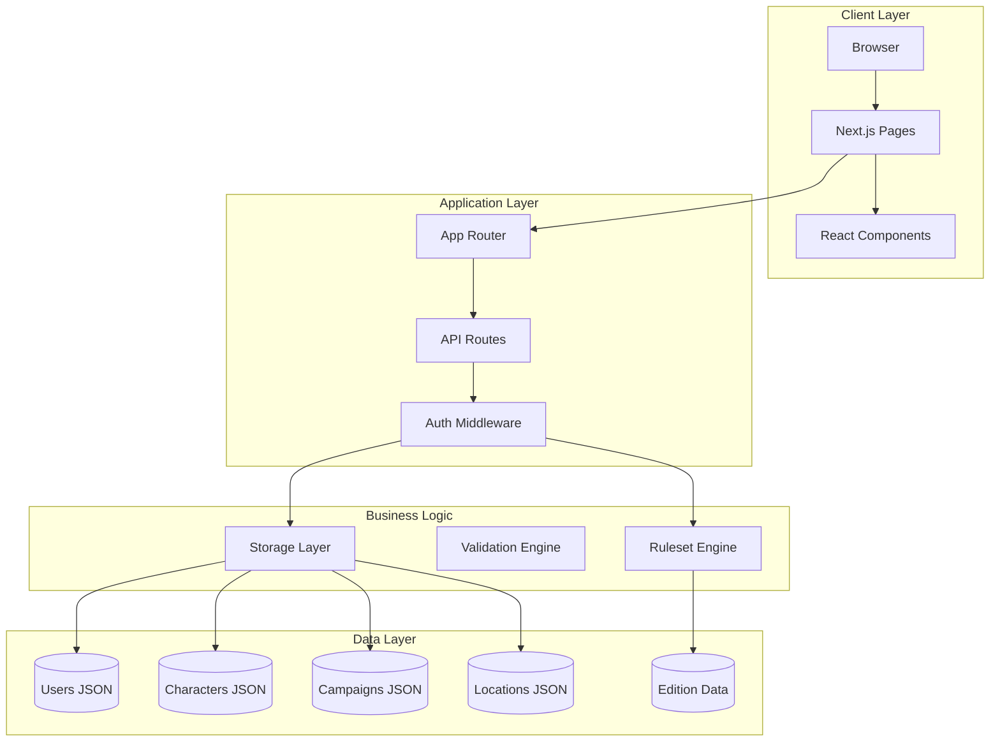
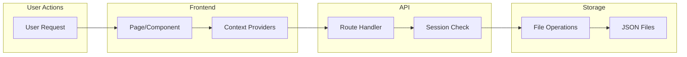

# Architecture Overview

## Tech Stack

### Frontend Framework

- **Next.js 16.0.7** - React framework with App Router
- **React 19.2.0** - UI library
- **React DOM 19.2.0** - React rendering for web
- **TypeScript 5** - Type-safe JavaScript

### UI Components

- **React Aria Components 1.13.0** - Accessible component primitives built on React Aria
- **Lucide React 0.561.0** - Icon library

### Styling

- **Tailwind CSS 4** - Utility-first CSS framework
- **@tailwindcss/postcss** - Tailwind CSS v4 PostCSS plugin
- **PostCSS** - CSS processing with Tailwind plugin
- **Geist Fonts** - Custom font family (Sans & Mono) via Next.js font optimization
  - CSS variables: `--font-geist-sans` and `--font-geist-mono`

### Authentication & Security

- **bcryptjs 3.0.3** - Password hashing
- **Cookie-based sessions** - httpOnly, 7-day expiration

### Utilities

- **uuid 13.0.0** - UUID generation for entity IDs

### Testing

- **Vitest 4.0.15** - Unit and integration testing
- **Playwright 1.57.0** - End-to-end testing
- **Testing Library** - React testing utilities
  - `@testing-library/react 16.3.0`
  - `@testing-library/jest-dom 6.9.1`
  - `@testing-library/user-event 14.6.1`

### Development Tools

- **ESLint 9** - Code linting with Next.js configurations
  - Flat config format (`eslint.config.mjs`)
  - `eslint-config-next/core-web-vitals`
  - `eslint-config-next/typescript`
- **pnpm 10.0.0** - Package manager

### Build & Runtime

- **Node.js** - Runtime environment
- **TypeScript Compiler** - Type checking and compilation
  - Target: ES2017
  - Module: ESNext
  - Module Resolution: Bundler

---

## System Architecture

### High-Level Overview



### Data Flow



---

## Project Structure

```
shadow-master/
├── app/                          # Next.js App Router directory
│   ├── layout.tsx                # Root layout with fonts and providers
│   ├── page.tsx                  # Home page (dashboard)
│   ├── globals.css               # Global styles with Tailwind imports
│   ├── providers.tsx             # React context providers wrapper
│   │
│   ├── api/                      # API route handlers
│   │   ├── auth/                 # Authentication endpoints
│   │   ├── campaigns/            # Campaign management
│   │   ├── characters/           # Character CRUD
│   │   ├── editions/             # Edition metadata
│   │   ├── health/               # Health check
│   │   ├── locations/            # Location management
│   │   ├── location-templates/   # Location templates
│   │   ├── rulesets/             # Merged ruleset loading
│   │   ├── settings/             # User settings
│   │   └── users/                # User management (admin)
│   │
│   ├── campaigns/                # Campaign management pages
│   │   └── [id]/                 # Campaign detail with tabs
│   │       ├── components/       # Tab components
│   │       └── locations/        # Location management
│   │
│   ├── characters/               # Character management
│   │   ├── [id]/                 # Character sheet view/edit
│   │   └── create/               # Character creation wizard
│   │       └── components/
│   │           └── steps/        # Wizard step components
│   │
│   ├── rulesets/                 # Edition browser
│   ├── settings/                 # User settings pages
│   ├── signin/                   # Sign in page
│   ├── signup/                   # Sign up page
│   └── users/                    # User management (admin)
│
├── components/                   # Shared React components
│   ├── ThemeProvider.tsx         # Theme context provider
│   └── DiceRoller.tsx            # Dice rolling component
│
├── lib/                          # Core business logic
│   ├── auth/                     # Authentication logic
│   │   ├── middleware.ts         # Auth middleware
│   │   ├── password.ts           # Password hashing
│   │   ├── session.ts            # Session management
│   │   └── validation.ts         # Input validation
│   │
│   ├── rules/                    # Ruleset system
│   │   ├── loader.ts             # Edition/book loading
│   │   ├── merge.ts              # Ruleset merging
│   │   ├── validation.ts         # Character validation
│   │   ├── RulesetContext.tsx    # React context + hooks
│   │   └── index.ts              # Public exports
│   │
│   ├── storage/                  # File-based persistence
│   │   ├── base.ts               # Core file operations
│   │   ├── users.ts              # User storage
│   │   ├── characters.ts         # Character storage
│   │   ├── campaigns.ts          # Campaign storage
│   │   ├── locations.ts          # Location storage
│   │   ├── editions.ts           # Edition data loading
│   │   └── index.ts              # Public exports
│   │
│   ├── types/                    # TypeScript type definitions
│   │   ├── index.ts              # Re-exports all types
│   │   ├── core.ts               # Base types (ID, dates, etc.)
│   │   ├── user.ts               # User types
│   │   ├── character.ts          # Character types
│   │   ├── campaign.ts           # Campaign types
│   │   ├── location.ts           # Location types
│   │   ├── edition.ts            # Edition/ruleset types
│   │   ├── creation.ts           # Character creation types
│   │   ├── vehicles.ts           # Vehicle types
│   │   └── programs.ts           # Matrix program types
│   │
│   ├── themes.ts                 # Character sheet themes
│   └── utils.ts                  # Utility functions
│
├── data/                         # JSON file storage
│   ├── users/                    # User records
│   ├── characters/               # Character records (by userId)
│   ├── campaigns/                # Campaign records
│   ├── locations/                # Location records (by campaignId)
│   └── editions/                 # Edition ruleset data
│       └── sr5/
│           ├── edition.json
│           └── core-rulebook.json
│
├── docs/                         # Documentation
│   ├── architecture/             # Architecture docs
│   ├── requirements/             # Requirements docs
│   └── prompts/                  # Feature prompts
│
└── Configuration files
    ├── package.json
    ├── tsconfig.json
    ├── next.config.ts
    ├── postcss.config.mjs
    ├── eslint.config.mjs
    ├── vitest.config.ts
    └── playwright.config.ts
```

---

---

## Related Documentation

### Architecture

- `database_schema.md` - Database structure (planned)
- `system_design_diagram.md` - Visual system flow

### Prompts

- `update-architecture-overview.md` - Prompt for updating this document
