# Creation Components

Components in `/components/creation/`

## Component Hierarchy

```mermaid
graph TD
    subgraph "Armor"
        ArmorModificationModal[ArmorModificationModal]
        ArmorPanel[ArmorPanel]
        ArmorPurchaseModal[ArmorPurchaseModal]
        ArmorRow[ArmorRow]
        ArmorPanel --> ArmorRow
        ArmorPanel --> ArmorModificationModal
        ArmorPanel --> ArmorPurchaseModal
        ArmorRow --> ArmorModificationModal
        ArmorRow --> ArmorPurchaseModal
    end

    subgraph "Augmentations"
        AugmentationModal[AugmentationModal]
        CyberlimbAccessoryModal[CyberlimbAccessoryModal]
        CyberlimbWeaponModal[CyberlimbWeaponModal]
        CyberwareEnhancementModal[CyberwareEnhancementModal]
    end

    subgraph "Contacts"
        ContactKarmaConfirmModal[ContactKarmaConfirmModal]
        ContactModal[ContactModal]
        ContactsCard[ContactsCard]
        constants[constants]
        types[types]
        ContactsCard --> ContactKarmaConfirmModal
        ContactsCard --> ContactModal
    end

    subgraph "Foci"
        FociCard[FociCard]
        FocusModal[FocusModal]
        FociCard --> FocusModal
    end

    subgraph "Gear"
        GearModificationModal[GearModificationModal]
        GearPanel[GearPanel]
        GearPurchaseModal[GearPurchaseModal]
        GearRow[GearRow]
        GearPanel --> GearRow
        GearPanel --> GearModificationModal
        GearPanel --> GearPurchaseModal
        GearRow --> GearModificationModal
        GearRow --> GearPurchaseModal
    end

    subgraph "Identities"
        IdentitiesCard[IdentitiesCard]
        IdentityCard[IdentityCard]
        IdentityModal[IdentityModal]
        LicenseModal[LicenseModal]
        LifestyleModal[LifestyleModal]
        Modal[Modal]
        constants[constants]
        types[types]
        IdentitiesCard --> IdentityModal
        IdentitiesCard --> LicenseModal
        IdentitiesCard --> LifestyleModal
        IdentityCard --> IdentityModal
    end

    subgraph "Knowledge Languages"
        KnowledgeLanguageModal[KnowledgeLanguageModal]
        KnowledgeLanguagesCard[KnowledgeLanguagesCard]
        KnowledgeSkillRow[KnowledgeSkillRow]
        KnowledgeSkillSpecModal[KnowledgeSkillSpecModal]
        LanguageRow[LanguageRow]
        constants[constants]
        types[types]
        KnowledgeLanguagesCard --> KnowledgeSkillRow
        KnowledgeLanguagesCard --> LanguageRow
        KnowledgeLanguagesCard --> KnowledgeLanguageModal
        KnowledgeLanguagesCard --> KnowledgeSkillSpecModal
        KnowledgeSkillRow --> KnowledgeSkillSpecModal
        LanguageRow --> KnowledgeLanguageModal
    end

    subgraph "Magic Path"
        MagicPathCard[MagicPathCard]
        MagicPathModal[MagicPathModal]
        constants[constants]
        types[types]
        utils[utils]
        MagicPathCard --> MagicPathModal
    end

    subgraph "Matrix Gear"
        MatrixGearCard[MatrixGearCard]
        MatrixGearModal[MatrixGearModal]
        MatrixGearCard --> MatrixGearModal
    end

    subgraph "Metatype"
        MetatypeCard[MetatypeCard]
        MetatypeModal[MetatypeModal]
        constants[constants]
        types[types]
        MetatypeCard --> MetatypeModal
    end

    subgraph "Qualities"
        QualitiesCard[QualitiesCard]
        QualitySelectionModal[QualitySelectionModal]
        SelectedQualityCard[SelectedQualityCard]
        constants[constants]
        types[types]
        utils[utils]
        QualitiesCard --> QualitySelectionModal
    end

    subgraph "Shared"
        BudgetIndicator[BudgetIndicator]
        BulkQuantitySelector[BulkQuantitySelector]
        CardSkeleton[CardSkeleton]
        CreationCard[CreationCard]
        EmptyState[EmptyState]
        KarmaConversionModal[KarmaConversionModal]
        LifestyleModificationSelector[LifestyleModificationSelector]
        LifestyleSubscriptionSelector[LifestyleSubscriptionSelector]
        RatingSelector[RatingSelector]
        Stepper[Stepper]
        SummaryFooter[SummaryFooter]
        ValidationBadge[ValidationBadge]
        useKarmaConversionPrompt[useKarmaConversionPrompt]
    end

    subgraph "Skills"
        FreeSkillDesignationModal[FreeSkillDesignationModal]
        FreeSkillsPanel[FreeSkillsPanel]
        SkillCustomizeModal[SkillCustomizeModal]
        SkillGroupBreakModal[SkillGroupBreakModal]
        SkillGroupKarmaConfirmModal[SkillGroupKarmaConfirmModal]
        SkillGroupModal[SkillGroupModal]
        SkillKarmaConfirmModal[SkillKarmaConfirmModal]
        SkillListItem[SkillListItem]
        SkillModal[SkillModal]
        SkillSpecModal[SkillSpecModal]
        SkillListItem --> FreeSkillDesignationModal
        SkillListItem --> SkillCustomizeModal
        SkillListItem --> SkillGroupBreakModal
        SkillListItem --> SkillGroupKarmaConfirmModal
        SkillListItem --> SkillGroupModal
        SkillListItem --> SkillKarmaConfirmModal
        SkillListItem --> SkillModal
        SkillListItem --> SkillSpecModal
    end

    subgraph "Spells"
        SpellListItem[SpellListItem]
        SpellModal[SpellModal]
        SpellListItem --> SpellModal
    end

    subgraph "Vehicles"
        AutosoftModal[AutosoftModal]
        DroneModal[DroneModal]
        RCCModal[RCCModal]
        VehicleModal[VehicleModal]
    end

    subgraph "Weapons"
        AmmunitionModal[AmmunitionModal]
        WeaponModificationModal[WeaponModificationModal]
        WeaponPurchaseModal[WeaponPurchaseModal]
        WeaponRow[WeaponRow]
        WeaponRow --> WeaponModificationModal
        WeaponRow --> WeaponPurchaseModal
    end

    subgraph "Root"
        AdeptPowersCard[AdeptPowersCard]
        AttributesCard[AttributesCard]
        AugmentationsCard[AugmentationsCard]
        CharacterInfoCard[CharacterInfoCard]
        ComplexFormsCard[ComplexFormsCard]
        CreationErrorBoundary[CreationErrorBoundary]
        DerivedStatsCard[DerivedStatsCard]
        EditionSelector[EditionSelector]
        GearTabsCard[GearTabsCard]
        PrioritySelectionCard[PrioritySelectionCard]
        SkillsCard[SkillsCard]
        SpellsCard[SpellsCard]
        VehiclesCard[VehiclesCard]
        WeaponsPanel[WeaponsPanel]
    end

    %% Styling
    style AdeptPowersCard fill:#3b82f6,color:#fff
    style AttributesCard fill:#3b82f6,color:#fff
    style AugmentationsCard fill:#3b82f6,color:#fff
    style CharacterInfoCard fill:#3b82f6,color:#fff
    style ComplexFormsCard fill:#3b82f6,color:#fff
    style CreationErrorBoundary fill:#6b7280,color:#fff
    style DerivedStatsCard fill:#3b82f6,color:#fff
    style EditionSelector fill:#6b7280,color:#fff
    style GearTabsCard fill:#3b82f6,color:#fff
    style PrioritySelectionCard fill:#3b82f6,color:#fff
    style SkillsCard fill:#3b82f6,color:#fff
    style SpellsCard fill:#3b82f6,color:#fff
    style VehiclesCard fill:#3b82f6,color:#fff
    style WeaponsPanel fill:#3b82f6,color:#fff
    style ArmorModificationModal fill:#8b5cf6,color:#fff
    style ArmorPanel fill:#3b82f6,color:#fff
    style ArmorPurchaseModal fill:#8b5cf6,color:#fff
    style ArmorRow fill:#22c55e,color:#fff
    style AugmentationModal fill:#8b5cf6,color:#fff
    style CyberlimbAccessoryModal fill:#8b5cf6,color:#fff
    style CyberlimbWeaponModal fill:#8b5cf6,color:#fff
    style CyberwareEnhancementModal fill:#8b5cf6,color:#fff
    style ContactKarmaConfirmModal fill:#8b5cf6,color:#fff
    style ContactModal fill:#8b5cf6,color:#fff
    style ContactsCard fill:#3b82f6,color:#fff
    style constants fill:#6b7280,color:#fff
    style types fill:#6b7280,color:#fff
    style FociCard fill:#3b82f6,color:#fff
    style FocusModal fill:#8b5cf6,color:#fff
    style GearModificationModal fill:#8b5cf6,color:#fff
    style GearPanel fill:#3b82f6,color:#fff
    style GearPurchaseModal fill:#8b5cf6,color:#fff
    style GearRow fill:#22c55e,color:#fff
    style IdentitiesCard fill:#3b82f6,color:#fff
    style IdentityCard fill:#3b82f6,color:#fff
    style IdentityModal fill:#8b5cf6,color:#fff
    style LicenseModal fill:#8b5cf6,color:#fff
    style LifestyleModal fill:#8b5cf6,color:#fff
    style Modal fill:#8b5cf6,color:#fff
    style constants fill:#6b7280,color:#fff
    style types fill:#6b7280,color:#fff
    style KnowledgeLanguageModal fill:#8b5cf6,color:#fff
    style KnowledgeLanguagesCard fill:#3b82f6,color:#fff
    style KnowledgeSkillRow fill:#22c55e,color:#fff
    style KnowledgeSkillSpecModal fill:#8b5cf6,color:#fff
    style LanguageRow fill:#22c55e,color:#fff
    style constants fill:#6b7280,color:#fff
    style types fill:#6b7280,color:#fff
    style MagicPathCard fill:#3b82f6,color:#fff
    style MagicPathModal fill:#8b5cf6,color:#fff
    style constants fill:#6b7280,color:#fff
    style types fill:#6b7280,color:#fff
    style utils fill:#6b7280,color:#fff
    style MatrixGearCard fill:#3b82f6,color:#fff
    style MatrixGearModal fill:#8b5cf6,color:#fff
    style MetatypeCard fill:#3b82f6,color:#fff
    style MetatypeModal fill:#8b5cf6,color:#fff
    style constants fill:#6b7280,color:#fff
    style types fill:#6b7280,color:#fff
    style QualitiesCard fill:#3b82f6,color:#fff
    style QualitySelectionModal fill:#8b5cf6,color:#fff
    style SelectedQualityCard fill:#3b82f6,color:#fff
    style constants fill:#6b7280,color:#fff
    style types fill:#6b7280,color:#fff
    style utils fill:#6b7280,color:#fff
    style BudgetIndicator fill:#6b7280,color:#fff
    style BulkQuantitySelector fill:#6b7280,color:#fff
    style CardSkeleton fill:#6b7280,color:#fff
    style CreationCard fill:#3b82f6,color:#fff
    style EmptyState fill:#6b7280,color:#fff
    style KarmaConversionModal fill:#8b5cf6,color:#fff
    style LifestyleModificationSelector fill:#6b7280,color:#fff
    style LifestyleSubscriptionSelector fill:#6b7280,color:#fff
    style RatingSelector fill:#6b7280,color:#fff
    style Stepper fill:#6b7280,color:#fff
    style SummaryFooter fill:#6b7280,color:#fff
    style ValidationBadge fill:#6b7280,color:#fff
    style useKarmaConversionPrompt fill:#f59e0b,color:#fff
    style FreeSkillDesignationModal fill:#8b5cf6,color:#fff
    style FreeSkillsPanel fill:#3b82f6,color:#fff
    style SkillCustomizeModal fill:#8b5cf6,color:#fff
    style SkillGroupBreakModal fill:#8b5cf6,color:#fff
    style SkillGroupKarmaConfirmModal fill:#8b5cf6,color:#fff
    style SkillGroupModal fill:#8b5cf6,color:#fff
    style SkillKarmaConfirmModal fill:#8b5cf6,color:#fff
    style SkillListItem fill:#22c55e,color:#fff
    style SkillModal fill:#8b5cf6,color:#fff
    style SkillSpecModal fill:#8b5cf6,color:#fff
    style SpellListItem fill:#22c55e,color:#fff
    style SpellModal fill:#8b5cf6,color:#fff
    style AutosoftModal fill:#8b5cf6,color:#fff
    style DroneModal fill:#8b5cf6,color:#fff
    style RCCModal fill:#8b5cf6,color:#fff
    style VehicleModal fill:#8b5cf6,color:#fff
    style AmmunitionModal fill:#8b5cf6,color:#fff
    style WeaponModificationModal fill:#8b5cf6,color:#fff
    style WeaponPurchaseModal fill:#8b5cf6,color:#fff
    style WeaponRow fill:#22c55e,color:#fff
```

## Component Summary

| Folder                  | Files  | Containers | Modals | Rows  | Hooks |
| ----------------------- | ------ | ---------- | ------ | ----- | ----- |
| (root)                  | 14     | 12         | 0      | 0     | 0     |
| `/armor/`               | 4      | 1          | 2      | 1     | 0     |
| `/augmentations/`       | 4      | 0          | 4      | 0     | 0     |
| `/contacts/`            | 5      | 1          | 2      | 0     | 0     |
| `/foci/`                | 2      | 1          | 1      | 0     | 0     |
| `/gear/`                | 4      | 1          | 2      | 1     | 0     |
| `/identities/`          | 8      | 2          | 4      | 0     | 0     |
| `/knowledge-languages/` | 7      | 1          | 2      | 2     | 0     |
| `/magic-path/`          | 5      | 1          | 1      | 0     | 0     |
| `/matrix-gear/`         | 2      | 1          | 1      | 0     | 0     |
| `/metatype/`            | 4      | 1          | 1      | 0     | 0     |
| `/qualities/`           | 6      | 2          | 1      | 0     | 0     |
| `/shared/`              | 13     | 1          | 1      | 0     | 1     |
| `/skills/`              | 10     | 1          | 8      | 1     | 0     |
| `/spells/`              | 2      | 0          | 1      | 1     | 0     |
| `/vehicles/`            | 4      | 0          | 4      | 0     | 0     |
| `/weapons/`             | 4      | 0          | 3      | 1     | 0     |
| **Total**               | **98** | **26**     | **38** | **7** | **1** |

## Color Key

| Color  | Type      | Examples                |
| ------ | --------- | ----------------------- |
| Blue   | Container | Card, Panel, Tracker    |
| Purple | Modal     | Selection, Edit dialogs |
| Green  | Row       | ListItem, Row           |
| Orange | Hook      | useX, Context           |
| Gray   | Shared    | Utilities               |

---

_Generated by `pnpm generate-diagrams --area=creation`_
