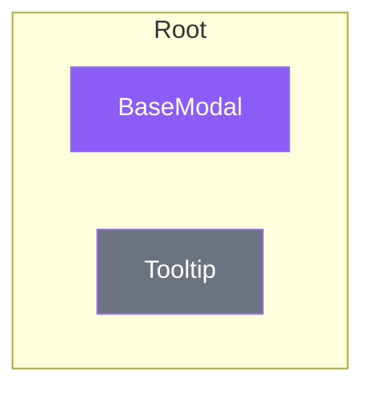

# Ui Components

Components in `/components/ui/`

## Component Hierarchy

## Component Summary

| Folder    | Files | Containers | Modals | Rows  | Hooks |
| --------- | ----- | ---------- | ------ | ----- | ----- |
| (root)    | 2     | 0          | 1      | 0     | 0     |
| **Total** | **2** | **0**      | **1**  | **0** | **0** |

## Color Key

| Color  | Type      | Examples                |
| ------ | --------- | ----------------------- |
| Blue   | Container | Card, Panel, Tracker    |
| Purple | Modal     | Selection, Edit dialogs |
| Green  | Row       | ListItem, Row           |
| Orange | Hook      | useX, Context           |
| Gray   | Shared    | Utilities               |

---

_Generated by `pnpm generate-diagrams --area=ui`_
