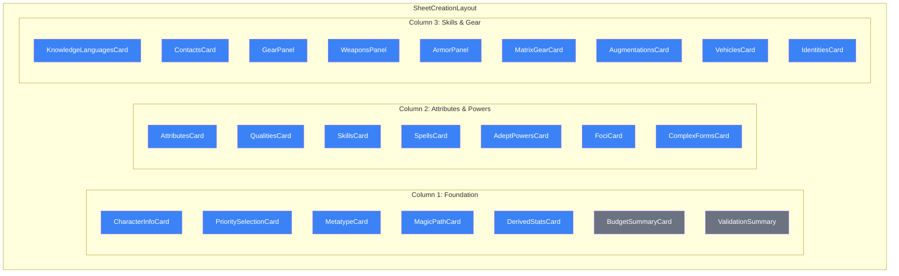

# Layout Overview

The character creation interface uses a three-column responsive layout defined in `SheetCreationLayout.tsx`.

## Three-Column Layout



## Responsive Behavior

| Viewport            | Layout                                  |
| ------------------- | --------------------------------------- |
| Desktop (>1280px)   | Three columns                           |
| Tablet (768-1280px) | Two columns                             |
| Mobile (<768px)     | Single column with collapsible sections |

## Conditional Cards

Some cards are conditionally rendered based on magical path selection:

| Card             | Condition                                   |
| ---------------- | ------------------------------------------- |
| SpellsCard       | `magician`, `mystic-adept`, `aspected-mage` |
| AdeptPowersCard  | `adept`, `mystic-adept`                     |
| FociCard         | `magician`, `mystic-adept`, `aspected-mage` |
| ComplexFormsCard | `technomancer`                              |

## Dynamic Imports

Conditional cards use Next.js dynamic imports for code splitting:

```typescript
const SpellsCard = dynamic(
  () => import("@/components/creation/SpellsCard"),
  { loading: () => <CardSkeleton title="Spells" rows={4} /> }
);
```

## Component Reference

| Component           | Location                                   | Purpose                                |
| ------------------- | ------------------------------------------ | -------------------------------------- |
| SheetCreationLayout | `/app/characters/create/sheet/components/` | Main layout orchestrator               |
| BudgetSummaryCard   | Inline in SheetCreationLayout              | Budget progress bars                   |
| ValidationSummary   | Inline in SheetCreationLayout              | Finalize button and status             |
| PlaceholderCard     | Inline in SheetCreationLayout              | Placeholder for unimplemented sections |

## Props Interface

```typescript
interface SheetCreationLayoutProps {
  creationState: CreationState;
  updateState: (updates: Partial<CreationState>) => void;
  onFinalize: () => void;
  isSaving: boolean;
  lastSaved: Date | null;
  saveError?: string | null;
  onRetry?: () => void;
  campaignId?: string;
  campaign?: Campaign | null;
}
```

## Context Dependencies

The layout and all child components rely on these contexts:

- **CreationBudgetContext** - Budget tracking and validation
- **RulesetContext** - Game rules and catalogs
- **AuthContext** - User authentication (for save operations)
