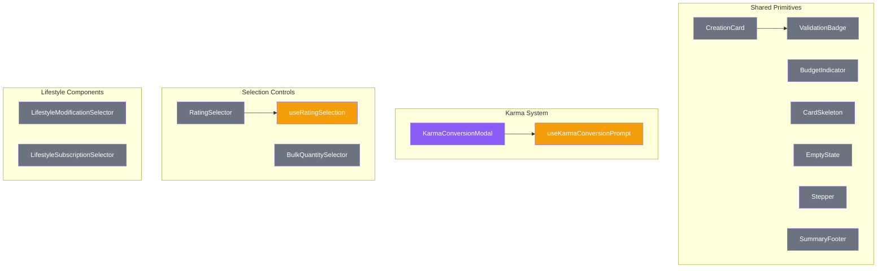

# Shared Primitives

Reusable UI components in `/components/creation/shared/` that provide consistent styling and behavior across all creation cards.

## Component Hierarchy



## Core Components

### CreationCard

Base wrapper for all creation sections. Provides:

- Validation status border coloring
- Collapsible state with localStorage persistence
- Auto-collapse when status becomes valid
- Header actions area

```typescript
interface CreationCardProps {
  id?: string; // Required for localStorage persistence
  title: string;
  description?: string;
  status?: "valid" | "warning" | "error" | "pending";
  errorCount?: number;
  warningCount?: number;
  headerAction?: ReactNode;
  children: ReactNode;
  collapsible?: boolean;
  defaultCollapsed?: boolean;
  collapsedSummary?: ReactNode;
  autoCollapseOnValid?: boolean;
}
```

### ValidationBadge

Status indicator showing validation state:

- **valid** - Green checkmark
- **warning** - Yellow warning icon with count
- **error** - Red X icon with count
- **pending** - Gray clock icon

### BudgetIndicator

Progress bar for budget tracking with:

- `LegacyBudgetIndicator` for backwards compatibility
- Overspent state (red bar)
- Percentage display

### CardSkeleton

Loading placeholder with animated pulse:

- Configurable title
- Configurable row count

### EmptyState

Empty collection display with:

- Icon
- Title
- Description
- Optional action button

### SummaryFooter

Item count and cost summary with:

- `pluralize()` helper for "1 item" vs "2 items"
- Currency formatting

### Stepper

Multi-step progress indicator (used in wizard mode)

## Karma Conversion System

### KarmaConversionModal

Dialog for converting karma to nuyen:

- Shows conversion rate (1 karma = 2,000¥)
- Shows remaining karma
- Validates against MAX_KARMA_CONVERSION (10)

### useKarmaConversionPrompt

Hook providing karma conversion logic:

- Exports `KARMA_TO_NUYEN_RATE` (2000)
- Exports `MAX_KARMA_CONVERSION` (10)
- Returns modal state and handlers

```typescript
interface UseKarmaConversionPromptReturn {
  modalState: KarmaConversionModalState;
  showPrompt: (info: KarmaConversionInfo) => void;
  handleConfirm: (karmaToConvert: number) => void;
  handleCancel: () => void;
}
```

## Selection Controls

### RatingSelector

Rating selection control for items with variable ratings:

- Min/max rating bounds
- Step increment
- Current value display

### useRatingSelection

Hook for rating selection state management

### BulkQuantitySelector

Quantity selector for bulk purchases:

- Min/max quantity bounds
- Total cost calculation

## Lifestyle Components

### LifestyleModificationSelector

UI for selecting lifestyle modifications (comforts, security, etc.)

### LifestyleSubscriptionSelector

UI for selecting subscription-based lifestyle options

## File Reference

| File                                | Exports                                                             |
| ----------------------------------- | ------------------------------------------------------------------- |
| `BudgetIndicator.tsx`               | BudgetIndicator, LegacyBudgetIndicator                              |
| `CardSkeleton.tsx`                  | CardSkeleton                                                        |
| `CreationCard.tsx`                  | CreationCard                                                        |
| `EmptyState.tsx`                    | EmptyState                                                          |
| `Stepper.tsx`                       | Stepper                                                             |
| `SummaryFooter.tsx`                 | SummaryFooter, pluralize                                            |
| `ValidationBadge.tsx`               | ValidationBadge                                                     |
| `KarmaConversionModal.tsx`          | KarmaConversionModal                                                |
| `useKarmaConversionPrompt.ts`       | useKarmaConversionPrompt, KARMA_TO_NUYEN_RATE, MAX_KARMA_CONVERSION |
| `RatingSelector.tsx`                | RatingSelector, useRatingSelection                                  |
| `BulkQuantitySelector.tsx`          | BulkQuantitySelector                                                |
| `LifestyleModificationSelector.tsx` | LifestyleModificationSelector                                       |
| `LifestyleSubscriptionSelector.tsx` | LifestyleSubscriptionSelector                                       |
| `index.ts`                          | All exports                                                         |

## Usage Pattern

All creation cards follow this pattern:

```tsx
<CreationCard
  id="skills"
  title="Skills"
  status={validationStatus}
  errorCount={errors.length}
  collapsible
  autoCollapseOnValid
  collapsedSummary={<span>{skillCount} skills selected</span>}
  headerAction={<Button>Add Skill</Button>}
>
  {/* Card content */}
  <SummaryFooter count={skillCount} total={skillLimit} label="skill" />
</CreationCard>
```
