# Foundation Cards

Core character definition cards: Priority, Metatype, Magic Path, Character Info, and Derived Stats.

## Component Hierarchy

```mermaid
graph TD
    subgraph "Priority System"
        PrioritySelectionCard[PrioritySelectionCard]
    end

    subgraph "Metatype Selection"
        MetatypeCard[MetatypeCard]
        MetatypeModal[MetatypeModal]
        MetatypeCard --> MetatypeModal
    end

    subgraph "Magic Path"
        MagicPathCard[MagicPathCard]
        MagicPathModal[MagicPathModal]
        MagicPathCard --> MagicPathModal
    end

    subgraph "Character Info"
        CharacterInfoCard[CharacterInfoCard]
    end

    subgraph "Derived Stats"
        DerivedStatsCard[DerivedStatsCard]
    end

    subgraph "Attributes"
        AttributesCard[AttributesCard]
    end

    style PrioritySelectionCard fill:#3b82f6,color:#fff
    style MetatypeCard fill:#3b82f6,color:#fff
    style MetatypeModal fill:#8b5cf6,color:#fff
    style MagicPathCard fill:#3b82f6,color:#fff
    style MagicPathModal fill:#8b5cf6,color:#fff
    style CharacterInfoCard fill:#3b82f6,color:#fff
    style DerivedStatsCard fill:#3b82f6,color:#fff
    style AttributesCard fill:#3b82f6,color:#fff
```

## PrioritySelectionCard

Location: `/components/creation/PrioritySelectionCard.tsx`

Manages the SR5 priority selection grid (A-E for 5 categories).

| Feature             | Description                                    |
| ------------------- | ---------------------------------------------- |
| Priority categories | Metatype, Attributes, Magic, Skills, Resources |
| Validation          | Each priority level used exactly once          |
| Budget impact       | Updates all budget totals when changed         |

## Metatype System

### MetatypeCard

Location: `/components/creation/metatype/MetatypeCard.tsx`

Displays selected metatype with attribute limits and special abilities.

### MetatypeModal

Location: `/components/creation/metatype/MetatypeModal.tsx`

Full-screen modal for metatype selection with:

- Metatype list filtered by priority
- Attribute limit displays
- Special ability descriptions
- Racial cost display

### Supporting Files

| File           | Purpose                    |
| -------------- | -------------------------- |
| `constants.ts` | Metatype-related constants |
| `types.ts`     | MetatypeCard prop types    |
| `index.ts`     | Exports MetatypeCard       |

## Magic Path System

### MagicPathCard

Location: `/components/creation/magic-path/MagicPathCard.tsx`

Displays selected magical tradition or mundane status.

### MagicPathModal

Location: `/components/creation/magic-path/MagicPathModal.tsx`

Modal for selecting magical path:

- Magician, Mystic Adept, Adept, Aspected Mage
- Technomancer
- Mundane

Also handles tradition selection for magical characters.

### Supporting Files

| File           | Purpose                    |
| -------------- | -------------------------- |
| `constants.ts` | Magic paths and traditions |
| `utils.ts`     | Magic calculation helpers  |
| `types.ts`     | Magic path types           |
| `index.ts`     | Exports MagicPathCard      |

## CharacterInfoCard

Location: `/components/creation/CharacterInfoCard.tsx`

Basic character information fields:

- Character name
- Street name
- Gender
- Age
- Ethnicity
- Description/backstory

## DerivedStatsCard

Location: `/components/creation/DerivedStatsCard.tsx`

Calculated values derived from attributes and other selections:

- Initiative
- Physical/Stun damage tracks
- Composure, Judge Intentions, Memory
- Lift/Carry limits
- Movement rates

## AttributesCard

Location: `/components/creation/AttributesCard.tsx`

Core and special attribute assignment:

- Body, Agility, Reaction, Strength
- Willpower, Logic, Intuition, Charisma
- Edge, Magic/Resonance

Features:

- Metatype attribute limits enforcement
- Point budget tracking
- Karma-for-attributes conversion

## File Summary

| Folder/File                 | Components      | Purpose              |
| --------------------------- | --------------- | -------------------- |
| `PrioritySelectionCard.tsx` | 1 card          | Priority grid        |
| `metatype/`                 | 1 card, 1 modal | Metatype selection   |
| `magic-path/`               | 1 card, 1 modal | Magic path selection |
| `CharacterInfoCard.tsx`     | 1 card          | Character basics     |
| `DerivedStatsCard.tsx`      | 1 card          | Calculated stats     |
| `AttributesCard.tsx`        | 1 card          | Attribute assignment |

## Context Dependencies

- **RulesetContext** - Priority table, metatype catalog, magic options
- **CreationBudgetContext** - Attribute points, special attribute points
