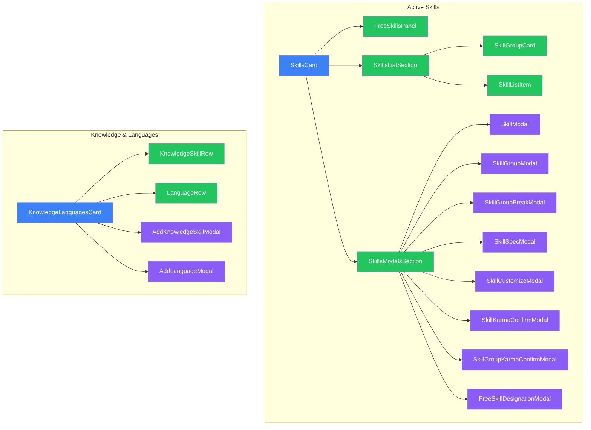

# Skills System

Active skills, skill groups, and knowledge/language skills.

## Component Hierarchy

## Active Skills (`/skills/`)

### SkillsCard

Location: `/components/creation/SkillsCard.tsx`

Main container for active skill selection. Delegates to extracted sub-components for list rendering and modal management. Uses `useSkillsCardHandlers` hook for handler logic. Features:

- Individual skill selection and rating
- Skill group selection
- Specialization management
- Karma spending for additional skills
- Budget indicators and validation status

### SkillsListSection

Location: `/components/creation/skills/SkillsListSection.tsx`

Renders the skill groups list and individual skills list. Extracted from SkillsCard for maintainability.

- Skill groups with SkillGroupCard sub-components
- Individual skills with SkillListItem sub-components
- Add buttons for skills and groups
- Empty state displays

### SkillsModalsSection

Location: `/components/creation/skills/SkillsModalsSection.tsx`

Renders all modal dialogs used by the SkillsCard component:

- Skill/group add modals
- Customization and break confirmation modals
- Karma purchase confirmation modals
- Specialization and free skill designation modals

### SkillGroupCard

Location: `/components/creation/skills/SkillGroupCard.tsx`

Display component for a skill group within the skills list:

- Group name and member skills
- Rating controls (increase/decrease)
- Karma purchase and restore actions
- Broken group indicator

### SkillListItem

Location: `/components/creation/skills/SkillListItem.tsx`

Display component for individual skills:

- Skill name and rating
- Linked attribute
- Specialization display
- Edit/remove actions

### SkillModal

Location: `/components/creation/skills/SkillModal.tsx`

Modal for selecting individual active skills:

- Skill catalog browsing
- Attribute filtering
- Category filtering
- Rating selection

### SkillGroupModal

Location: `/components/creation/skills/SkillGroupModal.tsx`

Modal for selecting skill groups:

- Lists all skill groups
- Shows member skills
- Rating selection

### SkillGroupBreakModal

Location: `/components/creation/skills/SkillGroupBreakModal.tsx`

Modal for breaking a skill group:

- Explains consequences (karma cost)
- Confirms group dissolution
- Shows affected skills

### SkillSpecModal

Location: `/components/creation/skills/SkillSpecModal.tsx`

Modal for adding specializations:

- Common specialization suggestions
- Custom specialization input
- Cost display (1 skill point or 7 karma)

### SkillCustomizeModal

Location: `/components/creation/skills/SkillCustomizeModal.tsx`

Modal for customizing exotic skills or skills with variable options

### SkillKarmaConfirmModal

Location: `/components/creation/skills/SkillKarmaConfirmModal.tsx`

Confirmation dialog for karma-based skill purchases when skill points are exhausted

### SkillGroupKarmaConfirmModal

Location: `/components/creation/skills/SkillGroupKarmaConfirmModal.tsx`

Confirmation dialog for karma-based skill group purchases when group points are exhausted

### FreeSkillsPanel

Location: `/components/creation/skills/FreeSkillsPanel.tsx`

Panel for managing free skill allocations from magic priority:

- Displays allocation slots and status
- Designate/undesignate skills
- Opens FreeSkillDesignationModal

### FreeSkillDesignationModal

Location: `/components/creation/skills/FreeSkillDesignationModal.tsx`

Modal for selecting skills to designate as free allocations from magic priority

## Knowledge & Languages (`/knowledge-languages/`)

### KnowledgeLanguagesCard

Location: `/components/creation/knowledge-languages/KnowledgeLanguagesCard.tsx`

Main container for knowledge skills and languages. Features:

- Knowledge skill management
- Language management
- Free points from (INT + LOG) x 2

### KnowledgeSkillRow

Location: `/components/creation/knowledge-languages/KnowledgeSkillRow.tsx`

Row component for knowledge skills:

- Skill name and category
- Rating (1-6)
- Edit/remove actions

### LanguageRow

Location: `/components/creation/knowledge-languages/LanguageRow.tsx`

Row component for languages:

- Language name
- Rating (1-6 or "Native")
- Edit/remove actions

### AddKnowledgeSkillModal

Location: `/components/creation/knowledge-languages/AddKnowledgeSkillModal.tsx`

Modal for adding knowledge skills:

- Category selection (Academic, Interest, Professional, Street)
- Custom skill name input
- Rating selection

### AddLanguageModal

Location: `/components/creation/knowledge-languages/AddLanguageModal.tsx`

Modal for adding languages:

- Common language suggestions
- Custom language input
- Rating selection (or Native designation)

### Supporting Files

| File           | Purpose                        |
| -------------- | ------------------------------ |
| `constants.ts` | Knowledge skill categories     |
| `types.ts`     | Knowledge/language types       |
| `index.ts`     | Exports KnowledgeLanguagesCard |

## Supporting Hooks

| Hook                    | Location                           | Purpose                                             |
| ----------------------- | ---------------------------------- | --------------------------------------------------- |
| `useSkillsCardHandlers` | `/skills/useSkillsCardHandlers.ts` | Handler callbacks, data accessors, spec modal state |
| `useSkillDesignations`  | `/skills/useSkillDesignations.ts`  | Free skill designation management                   |
| `useGroupBreaking`      | `/skills/useGroupBreaking.ts`      | Group break/restore logic                           |
| `useKarmaPurchase`      | `/skills/useKarmaPurchase.ts`      | Karma purchase mode and confirmation                |

## File Summary

| Folder                  | Files | Components                                    |
| ----------------------- | ----- | --------------------------------------------- |
| `/skills/`              | 13    | 1 card, 3 sections, 1 item, 7 modals, 1 panel |
| `/knowledge-languages/` | 8     | 1 card, 2 rows, 2 modals                      |
| Root                    | 1     | SkillsCard.tsx                                |

## Budget Integration

Skills consume multiple budget types:

| Budget               | Source            | Used By                            |
| -------------------- | ----------------- | ---------------------------------- |
| `skill-points`       | Priority (Skills) | Individual skills, specializations |
| `skill-group-points` | Priority (Skills) | Skill groups                       |
| `knowledge-points`   | (INT + LOG) x 2   | Knowledge skills, languages        |
| `karma`              | Starting 25       | Overflow skills/groups             |

## Context Dependencies

- **RulesetContext** - `useSkills()`, `useSkillGroups()` for catalogs
- **CreationBudgetContext** - Point tracking, karma conversion
