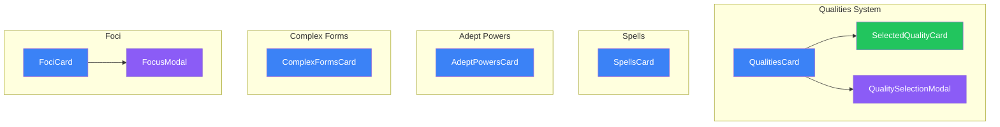

# Qualities & Magic

Positive/negative qualities and magical abilities (spells, adept powers, complex forms, foci).

## Component Hierarchy

## Qualities System (`/qualities/`)

### QualitiesCard

Location: `/components/creation/qualities/QualitiesCard.tsx`

Main container for quality selection. Features:

- Positive qualities (cost karma)
- Negative qualities (grant karma)
- 25 karma limit per type
- Quality stacking rules

### QualitySelectionModal

Location: `/components/creation/qualities/QualitySelectionModal.tsx`

Modal for browsing and selecting qualities:

- Category filtering
- Karma cost display
- Prerequisites checking
- Incompatibility warnings

### SelectedQualityCard

Location: `/components/creation/qualities/SelectedQualityCard.tsx`

Display component for selected qualities:

- Quality name and karma value
- Rating display (if applicable)
- Remove button

### Supporting Files

| File           | Purpose                   |
| -------------- | ------------------------- |
| `constants.ts` | Quality categories        |
| `utils.ts`     | Karma calculation helpers |
| `types.ts`     | Quality selection types   |
| `index.ts`     | Exports QualitiesCard     |

## Spells

### SpellsCard

Location: `/components/creation/SpellsCard.tsx`

Spell selection for magicians, mystic adepts, and aspected mages.

Features:

- Free spells from Magic priority
- Karma purchase for additional spells (5 karma each)
- Category filtering (Combat, Detection, Health, Illusion, Manipulation)
- Spell details display

Conditional rendering: Only shown when magical path is `magician`, `mystic-adept`, or `aspected-mage`.

## Adept Powers

### AdeptPowersCard

Location: `/components/creation/AdeptPowersCard.tsx`

Adept power selection for adepts and mystic adepts.

Features:

- Power Point budget (= Magic rating)
- Fractional power costs (0.25, 0.5, etc.)
- Karma purchase for additional PP
- Level-based powers

Conditional rendering: Only shown when magical path is `adept` or `mystic-adept`.

## Complex Forms

### ComplexFormsCard

Location: `/components/creation/ComplexFormsCard.tsx`

Complex form selection for technomancers.

Features:

- Free forms from Resonance priority
- Karma purchase for additional forms
- Threading options display

Conditional rendering: Only shown when magical path is `technomancer`.

## Foci (`/foci/`)

### FociCard

Location: `/components/creation/foci/FociCard.tsx`

Magical focus selection and bonding.

Features:

- Focus purchase (nuyen cost)
- Focus bonding (karma cost = Force)
- Focus type categories

### FocusModal

Location: `/components/creation/foci/FocusModal.tsx`

Modal for selecting and bonding foci:

- Focus type selection
- Force rating selection
- Cost calculation (nuyen + karma)
- Bonding confirmation

Conditional rendering: Only shown when magical path is `magician`, `mystic-adept`, or `aspected-mage`.

## File Summary

| Folder/File            | Files | Components                 |
| ---------------------- | ----- | -------------------------- |
| `/qualities/`          | 7     | 1 card, 1 modal, 1 display |
| `SpellsCard.tsx`       | 1     | 1 card                     |
| `AdeptPowersCard.tsx`  | 1     | 1 card                     |
| `ComplexFormsCard.tsx` | 1     | 1 card                     |
| `/foci/`               | 3     | 1 card, 1 modal            |

## Budget Integration

| Budget           | Source             | Used By                                       |
| ---------------- | ------------------ | --------------------------------------------- |
| `karma`          | Starting 25        | Positive qualities, extra spells/powers/forms |
| `karma` (gained) | Negative qualities | Offsets karma spending                        |
| `spell-slots`    | Magic priority     | Free spells                                   |
| `power-points`   | Magic rating       | Adept powers                                  |

## Karma Limits

| Category            | Limit               |
| ------------------- | ------------------- |
| Positive qualities  | 25 karma max        |
| Negative qualities  | 25 karma max gained |
| Extra spells        | 5 karma each        |
| Extra power points  | 5 karma per PP      |
| Extra complex forms | 4 karma each        |
| Focus bonding       | Force x karma       |

## Context Dependencies

- **RulesetContext** - `useQualities()`, `useSpells()`, `useAdeptPowers()`, `useComplexForms()`, `useFoci()`
- **CreationBudgetContext** - Karma tracking, spell slots, power points
