# Gear & Equipment

General gear, weapons, and armor selection panels.

## Component Hierarchy

```mermaid
graph TD
    subgraph "General Gear"
        GearPanel[GearPanel]
        GearRow[GearRow]
        GearPurchaseModal[GearPurchaseModal]
        GearModificationModal[GearModificationModal]

        GearPanel --> GearRow
        GearPanel --> GearPurchaseModal
        GearRow --> GearModificationModal
    end

    subgraph "Weapons"
        WeaponsPanel[WeaponsPanel]
        WeaponRow[WeaponRow]
        WeaponPurchaseModal[WeaponPurchaseModal]
        WeaponModificationModal[WeaponModificationModal]
        AmmunitionModal[AmmunitionModal]

        WeaponsPanel --> WeaponRow
        WeaponsPanel --> WeaponPurchaseModal
        WeaponRow --> WeaponModificationModal
        WeaponRow --> AmmunitionModal
    end

    subgraph "Armor"
        ArmorPanel[ArmorPanel]
        ArmorRow[ArmorRow]
        ArmorPurchaseModal[ArmorPurchaseModal]
        ArmorModificationModal[ArmorModificationModal]

        ArmorPanel --> ArmorRow
        ArmorPanel --> ArmorPurchaseModal
        ArmorRow --> ArmorModificationModal
    end

    subgraph "Legacy"
        GearCard[GearCard]
        GearTabsCard[GearTabsCard]
    end

    style GearPanel fill:#3b82f6,color:#fff
    style GearRow fill:#22c55e,color:#fff
    style GearPurchaseModal fill:#8b5cf6,color:#fff
    style GearModificationModal fill:#8b5cf6,color:#fff
    style WeaponsPanel fill:#3b82f6,color:#fff
    style WeaponRow fill:#22c55e,color:#fff
    style WeaponPurchaseModal fill:#8b5cf6,color:#fff
    style WeaponModificationModal fill:#8b5cf6,color:#fff
    style AmmunitionModal fill:#8b5cf6,color:#fff
    style ArmorPanel fill:#3b82f6,color:#fff
    style ArmorRow fill:#22c55e,color:#fff
    style ArmorPurchaseModal fill:#8b5cf6,color:#fff
    style ArmorModificationModal fill:#8b5cf6,color:#fff
    style GearCard fill:#6b7280,color:#fff
    style GearTabsCard fill:#6b7280,color:#fff
```



## General Gear (`/gear/`)

### GearPanel

Location: `/components/creation/gear/GearPanel.tsx`

Main container for general equipment. Features:

- Category-based browsing
- Quantity management
- Karma-to-nuyen conversion

### GearRow

Location: `/components/creation/gear/GearRow.tsx`

Expandable row for gear items:

- Collapsed: Name, cost, quantity, actions
- Expanded: Full stats, capacity, modifications

### GearPurchaseModal

Location: `/components/creation/gear/GearPurchaseModal.tsx`

Catalog browser for gear selection:

- Category filtering
- Search functionality
- Availability display
- Cost calculation with quantity

### GearModificationModal

Location: `/components/creation/gear/GearModificationModal.tsx`

Modification management:

- Capacity tracking
- Compatible mod filtering
- Cost calculation

## Weapons (`/weapons/`)

### WeaponsPanel

Location: `/components/creation/WeaponsPanel.tsx`

Main container for weapon selection. Features:

- Weapon type filtering
- Ammunition management
- Modification support

### WeaponRow

Location: `/components/creation/weapons/WeaponRow.tsx`

Expandable row for weapons:

- Collapsed: Name, damage, AP, cost
- Expanded: Full stats, mods, ammunition

### WeaponPurchaseModal

Location: `/components/creation/weapons/WeaponPurchaseModal.tsx`

Weapon catalog browser:

- Type filtering (Melee, Ranged, Exotic)
- Skill filtering
- Stats comparison
- Accessory slots display

### WeaponModificationModal

Location: `/components/creation/weapons/WeaponModificationModal.tsx`

Weapon modification management:

- Accessory slot tracking
- Barrel, Stock, Top, Under slots
- Integral accessories

### AmmunitionModal

Location: `/components/creation/weapons/AmmunitionModal.tsx`

Ammunition selection and purchase:

- Compatible ammo types
- Special ammunition (APDS, Gel, etc.)
- Quantity purchase

## Armor (`/armor/`)

### ArmorPanel

Location: `/components/creation/armor/ArmorPanel.tsx`

Main container for armor selection. Features:

- Armor stacking rules
- Capacity for modifications
- Custom clothing support

### ArmorRow

Location: `/components/creation/armor/ArmorRow.tsx`

Expandable row for armor:

- Collapsed: Name, armor rating, cost
- Expanded: Capacity, modifications, stats

### ArmorPurchaseModal

Location: `/components/creation/armor/ArmorPurchaseModal.tsx`

Armor catalog browser:

- Type filtering
- Custom clothing creation
- Armor rating comparison

### ArmorModificationModal

Location: `/components/creation/armor/ArmorModificationModal.tsx`

Armor modification management:

- Capacity tracking
- Chemical, Fire, etc. resistances
- Built-in features

## Legacy Components

### GearCard

Location: `/components/creation/GearCard.tsx`

Original unified gear interface (superseded by individual panels)

### GearTabsCard

Location: `/components/creation/GearTabsCard.tsx`

Alternative tabbed interface combining all gear types

## File Summary

| Folder      | Files | Components                 |
| ----------- | ----- | -------------------------- |
| `/gear/`    | 5     | 1 panel, 1 row, 2 modals   |
| `/weapons/` | 5     | 1 row, 4 modals            |
| `/armor/`   | 5     | 1 panel, 1 row, 2 modals   |
| Root        | 2     | WeaponsPanel, legacy cards |

## Budget Integration

All equipment uses the nuyen budget with karma conversion option:

| Budget  | Source             | Conversion   |
| ------- | ------------------ | ------------ |
| `nuyen` | Resources priority | Base funds   |
| `karma` | 1 karma = 2,000¥   | Max 10 karma |

## Karma Conversion Flow

```
User selects expensive item
    ↓
Nuyen insufficient
    ↓
KarmaConversionModal opens
    ↓
User selects karma to convert (max 10)
    ↓
Nuyen budget increases
    ↓
Purchase completes
```

## Context Dependencies

- **RulesetContext** - `useGear()`, `useWeapons()`, `useArmor()` for catalogs
- **CreationBudgetContext** - Nuyen tracking, karma conversion
- **useKarmaConversionPrompt** - Conversion modal state
