# Matrix Gear, Vehicles & Augmentations

Matrix equipment (commlinks, cyberdecks), vehicles/drones, and augmentations (cyberware, bioware).

## Component Hierarchy

```mermaid
graph TD
    subgraph "Matrix Gear"
        MatrixGearCard[MatrixGearCard]
        MatrixGearModal[MatrixGearModal]
        MatrixGearFilters[MatrixGearFilters]
        MatrixGearDetailsPane[MatrixGearDetailsPane]
        MatrixGearListItems[MatrixGearListItems]

        MatrixGearCard --> MatrixGearModal
        MatrixGearModal --> MatrixGearFilters
        MatrixGearModal --> MatrixGearDetailsPane
        MatrixGearModal --> MatrixGearListItems
    end

    subgraph "Vehicles & Drones"
        VehiclesCard[VehiclesCard]
        VehicleSystemModal[VehicleSystemModal]
        VehicleSystemFilters[VehicleSystemFilters]
        VehicleSystemDetailsPane[VehicleSystemDetailsPane]
        VehicleSystemItemButton[VehicleSystemItemButton]

        VehiclesCard --> VehicleSystemModal
        VehicleSystemModal --> VehicleSystemFilters
        VehicleSystemModal --> VehicleSystemDetailsPane
        VehicleSystemModal --> VehicleSystemItemButton
    end

    subgraph "Augmentations"
        AugmentationsCard[AugmentationsCard]
        AugmentationModal[AugmentationModal]
        AugmentationFilters[AugmentationFilters]
        AugmentationDetailsPane[AugmentationDetailsPane]
        AugmentationItemButton[AugmentationItemButton]
        CyberwareEnhancementModal[CyberwareEnhancementModal]
        CyberlimbAccessoryModal[CyberlimbAccessoryModal]
        CyberlimbWeaponModal[CyberlimbWeaponModal]

        AugmentationsCard --> AugmentationModal
        AugmentationModal --> AugmentationFilters
        AugmentationModal --> AugmentationDetailsPane
        AugmentationModal --> AugmentationItemButton
        AugmentationModal --> CyberwareEnhancementModal
        AugmentationModal --> CyberlimbAccessoryModal
        AugmentationModal --> CyberlimbWeaponModal
    end

    style MatrixGearCard fill:#3b82f6,color:#fff
    style MatrixGearModal fill:#8b5cf6,color:#fff
    style MatrixGearFilters fill:#06b6d4,color:#fff
    style MatrixGearDetailsPane fill:#06b6d4,color:#fff
    style MatrixGearListItems fill:#06b6d4,color:#fff
    style VehiclesCard fill:#3b82f6,color:#fff
    style VehicleSystemModal fill:#8b5cf6,color:#fff
    style VehicleSystemFilters fill:#06b6d4,color:#fff
    style VehicleSystemDetailsPane fill:#06b6d4,color:#fff
    style VehicleSystemItemButton fill:#06b6d4,color:#fff
    style AugmentationsCard fill:#3b82f6,color:#fff
    style AugmentationModal fill:#8b5cf6,color:#fff
    style AugmentationFilters fill:#06b6d4,color:#fff
    style AugmentationDetailsPane fill:#06b6d4,color:#fff
    style AugmentationItemButton fill:#06b6d4,color:#fff
    style CyberwareEnhancementModal fill:#8b5cf6,color:#fff
    style CyberlimbAccessoryModal fill:#8b5cf6,color:#fff
    style CyberlimbWeaponModal fill:#8b5cf6,color:#fff
```

## Matrix Gear (`/matrix-gear/`)

### MatrixGearCard

Location: `/components/creation/matrix-gear/MatrixGearCard.tsx`

Main container for matrix equipment. Features:

- Commlink selection
- Cyberdeck selection (for deckers)
- Programs and software

### MatrixGearModal

Location: `/components/creation/matrix-gear/MatrixGearModal.tsx`

Unified two-column modal for purchasing commlinks, cyberdecks, and software:

- Category tabs with bulk-add workflow
- Virtualized lists for performance
- State management, filtering logic, and purchase handlers

### MatrixGearFilters

Location: `/components/creation/matrix-gear/MatrixGearFilters.tsx`

Search and filter controls:

- Search input with category-aware placeholder
- Legal-only toggle
- Category pills (Commlinks, Cyberdecks, Software)
- Software subcategory pills (Datasoft, Mapsoft, Shopsoft, Tutorsoft)
- Device compatibility warning

### MatrixGearDetailsPane

Location: `/components/creation/matrix-gear/MatrixGearDetailsPane.tsx`

Right-pane detail preview:

- Commlink details (device rating, data processing, firewall)
- Cyberdeck details (ASDF attributes, program slots, legality warnings)
- Software details (effects, specific details input, skill selection, rating selector)
- Cost card with affordability indicator

### MatrixGearListItems

Location: `/components/creation/matrix-gear/MatrixGearListItems.tsx`

Virtualized list item components:

- CommlinkListItem, CyberdeckListItem, SoftwareListItem
- RatingSelector (shared +/- control)

### matrixGearHelpers

Location: `/components/creation/matrix-gear/matrixGearHelpers.ts`

Constants and utility functions:

- `formatCurrency()`, `getAvailabilityDisplay()`, `formatAttributeArray()`
- `MAX_AVAILABILITY`, category configs, type aliases

## Vehicles & Drones (`/vehicles/`)

### VehiclesCard

Location: `/components/creation/VehiclesCard.tsx`

Main container for vehicles and drones. Features:

- Vehicle selection
- Drone management
- RCC (Rigger Command Console)
- Autosofts

### VehicleSystemModal

Location: `/components/creation/vehicles/VehicleSystemModal.tsx`

Unified two-column modal for purchasing vehicles, drones, RCCs, and autosofts:

- Type tabs (Vehicle, Drone, RCC, Autosoft) with bulk-add workflow
- Virtualized lists for performance
- State management, filtering logic, and purchase handlers

### VehicleSystemFilters

Location: `/components/creation/vehicles/VehicleSystemFilters.tsx`

Search and filter controls:

- Type tabs with color-coded active states
- Search input with type-aware placeholder
- Subcategory filter pills (vehicle categories, drone sizes, RCC tiers, autosoft categories)
- VehicleSystemHeaderIcon helper for modal header

### VehicleSystemDetailsPane

Location: `/components/creation/vehicles/VehicleSystemDetailsPane.tsx`

Right-pane detail preview:

- Vehicle details (handling, speed, body, armor, pilot, sensor)
- Drone details (stats, aerial/aquatic indicators)
- RCC details (device rating, data processing, firewall, features)
- Autosoft details (rating selector, availability, cost per rating)
- Cost card with affordability indicator

### VehicleSystemItemButton

Location: `/components/creation/vehicles/VehicleSystemItemButton.tsx`

List item button component:

- Ownership and affordability indicators
- Legality badges and type-specific metadata
- Color-coded selection states per vehicle system type

### vehicleSystemHelpers

Location: `/components/creation/vehicles/vehicleSystemHelpers.ts`

Constants and utility functions:

- `formatCurrency()`, `getAvailabilityDisplay()`, `isItemAvailable()`, `getRatingTier()`, `getMaxAvailableRating()`
- `MAX_AVAILABILITY`, `TYPE_TABS`, category constants, `CATEGORY_DISPLAY_NAMES`
- `VehicleSystemType` type definition

## Augmentations (`/augmentations/`)

### AugmentationsCard

Location: `/components/creation/AugmentationsCard.tsx`

Main container for cyberware and bioware. Features:

- Essence tracking
- Grade selection (Standard, Alpha, Beta, Delta)
- Cyberlimb management

### AugmentationModal

Location: `/components/creation/augmentations/AugmentationModal.tsx`

Unified two-column modal for purchasing cyberware and bioware:

- Type toggle (Cyberware / Bioware)
- State management, filtering logic, and purchase handlers
- Cyberlimb location selection and conflict detection
- Skill-linked bioware target selection

### AugmentationFilters

Location: `/components/creation/augmentations/AugmentationFilters.tsx`

Search and filter controls:

- Type toggle buttons (Cyberware / Bioware)
- Search input with type-aware placeholder
- Category pills with item counts
- Grade selector dropdown
- AugmentationHeaderIcon helper for modal header

### AugmentationDetailsPane

Location: `/components/creation/augmentations/AugmentationDetailsPane.tsx`

Right-pane detail preview:

- Item info (name, description)
- Rating selector for rated items
- Cyberlimb location selector with conflict indicators
- Skill selector for skill-linked bioware
- Stats grid (essence, cost, availability)
- Bonuses, wireless bonus, capacity info
- Magic/resonance warning for awakened characters
- Validation errors

### AugmentationItemButton

Location: `/components/creation/augmentations/AugmentationItemButton.tsx`

List item button component:

- Grade-adjusted essence, cost, and availability preview
- Rating range indicators for rated items
- Affordability and essence fit validation

### augmentationModalHelpers

Location: `/components/creation/augmentations/augmentationModalHelpers.ts`

Constants and utility functions:

- `getAvailabilityDisplay()`, `getLocationConflict()`
- Re-exports `formatCurrency()`, `formatEssence()` from `./utils.ts`
- `MAX_AVAILABILITY`, category constants, `GRADE_LABELS`, `LOCATION_LABELS`
- `AugmentationType`, `InstalledCyberlimb`, `InstalledSkillLinkedBioware` types

### CyberwareEnhancementModal

Location: `/components/creation/augmentations/CyberwareEnhancementModal.tsx`

Enhancement selection for cyberware:

- Capacity tracking
- Enhancement costs

### CyberlimbAccessoryModal

Location: `/components/creation/augmentations/CyberlimbAccessoryModal.tsx`

Cyberlimb accessory selection:

- Armor
- Strength/Agility enhancements
- Built-in features

### CyberlimbWeaponModal

Location: `/components/creation/augmentations/CyberlimbWeaponModal.tsx`

Cyberlimb weapon selection:

- Hand blades, razors
- Spurs
- Holdouts

## File Summary

| Folder            | Files | Components                                                      |
| ----------------- | ----- | --------------------------------------------------------------- |
| `/matrix-gear/`   | 7     | 1 card, 1 modal, 3 sub-components, 1 helpers, 1 barrel          |
| `/vehicles/`      | 9     | 1 card, 1 modal, 3 sub-components, 1 helpers, 1 barrel          |
| `/augmentations/` | 9     | 1 card, 1 modal, 3 sub-components, 1 helpers, 1 utils, 1 barrel |
| Root              | 2     | VehiclesCard, AugmentationsCard                                 |

## Budget Integration

| Category      | Budget  | Notes                             |
| ------------- | ------- | --------------------------------- |
| Matrix Gear   | `nuyen` | Commlinks, cyberdecks, software   |
| Vehicles      | `nuyen` | Vehicles, drones, RCCs, autosofts |
| Augmentations | `nuyen` | Essence is tracked separately     |

## Essence System

Augmentations reduce maximum Essence:

| Grade    | Essence Multiplier |
| -------- | ------------------ |
| Standard | 1.0x               |
| Alpha    | 0.8x               |
| Beta     | 0.7x               |
| Delta    | 0.5x               |

## Context Dependencies

- **RulesetContext** - `useCommlinks()`, `useCyberdecks()`, `useVehicles()`, `useDrones()`, `useCyberware()`, `useBioware()`
- **CreationBudgetContext** - Nuyen tracking
- **useKarmaConversionPrompt** - Conversion for expensive items
