# Matrix Gear, Vehicles & Augmentations

Matrix equipment (commlinks, cyberdecks), vehicles/drones, and augmentations (cyberware, bioware).

## Component Hierarchy

```mermaid
graph TD
    subgraph "Matrix Gear"
        MatrixGearCard[MatrixGearCard]
        MatrixGearModal[MatrixGearModal]
        MatrixGearFilters[MatrixGearFilters]
        MatrixGearDetailsPane[MatrixGearDetailsPane]
        MatrixGearListItems[MatrixGearListItems]

        MatrixGearCard --> MatrixGearModal
        MatrixGearModal --> MatrixGearFilters
        MatrixGearModal --> MatrixGearDetailsPane
        MatrixGearModal --> MatrixGearListItems
    end

    subgraph "Vehicles & Drones"
        VehiclesCard[VehiclesCard]
        VehicleModal[VehicleModal]
        DroneModal[DroneModal]
        RCCModal[RCCModal]
        AutosoftModal[AutosoftModal]

        VehiclesCard --> VehicleModal
        VehiclesCard --> DroneModal
        VehiclesCard --> RCCModal
        VehiclesCard --> AutosoftModal
    end

    subgraph "Augmentations"
        AugmentationsCard[AugmentationsCard]
        AugmentationModal[AugmentationModal]
        CyberwareEnhancementModal[CyberwareEnhancementModal]
        CyberlimbAccessoryModal[CyberlimbAccessoryModal]
        CyberlimbWeaponModal[CyberlimbWeaponModal]

        AugmentationsCard --> AugmentationModal
        AugmentationModal --> CyberwareEnhancementModal
        AugmentationModal --> CyberlimbAccessoryModal
        AugmentationModal --> CyberlimbWeaponModal
    end

    style MatrixGearCard fill:#3b82f6,color:#fff
    style MatrixGearModal fill:#8b5cf6,color:#fff
    style MatrixGearFilters fill:#06b6d4,color:#fff
    style MatrixGearDetailsPane fill:#06b6d4,color:#fff
    style MatrixGearListItems fill:#06b6d4,color:#fff
    style VehiclesCard fill:#3b82f6,color:#fff
    style VehicleModal fill:#8b5cf6,color:#fff
    style DroneModal fill:#8b5cf6,color:#fff
    style RCCModal fill:#8b5cf6,color:#fff
    style AutosoftModal fill:#8b5cf6,color:#fff
    style AugmentationsCard fill:#3b82f6,color:#fff
    style AugmentationModal fill:#8b5cf6,color:#fff
    style CyberwareEnhancementModal fill:#8b5cf6,color:#fff
    style CyberlimbAccessoryModal fill:#8b5cf6,color:#fff
    style CyberlimbWeaponModal fill:#8b5cf6,color:#fff
```

## Matrix Gear (`/matrix-gear/`)

### MatrixGearCard

Location: `/components/creation/matrix-gear/MatrixGearCard.tsx`

Main container for matrix equipment. Features:

- Commlink selection
- Cyberdeck selection (for deckers)
- Programs and software

### MatrixGearModal

Location: `/components/creation/matrix-gear/MatrixGearModal.tsx`

Unified two-column modal for purchasing commlinks, cyberdecks, and software:

- Category tabs with bulk-add workflow
- Virtualized lists for performance
- State management, filtering logic, and purchase handlers

### MatrixGearFilters

Location: `/components/creation/matrix-gear/MatrixGearFilters.tsx`

Search and filter controls:

- Search input with category-aware placeholder
- Legal-only toggle
- Category pills (Commlinks, Cyberdecks, Software)
- Software subcategory pills (Datasoft, Mapsoft, Shopsoft, Tutorsoft)
- Device compatibility warning

### MatrixGearDetailsPane

Location: `/components/creation/matrix-gear/MatrixGearDetailsPane.tsx`

Right-pane detail preview:

- Commlink details (device rating, data processing, firewall)
- Cyberdeck details (ASDF attributes, program slots, legality warnings)
- Software details (effects, specific details input, skill selection, rating selector)
- Cost card with affordability indicator

### MatrixGearListItems

Location: `/components/creation/matrix-gear/MatrixGearListItems.tsx`

Virtualized list item components:

- CommlinkListItem, CyberdeckListItem, SoftwareListItem
- RatingSelector (shared +/- control)

### matrixGearHelpers

Location: `/components/creation/matrix-gear/matrixGearHelpers.ts`

Constants and utility functions:

- `formatCurrency()`, `getAvailabilityDisplay()`, `formatAttributeArray()`
- `MAX_AVAILABILITY`, category configs, type aliases

## Vehicles & Drones (`/vehicles/`)

### VehiclesCard

Location: `/components/creation/VehiclesCard.tsx`

Main container for vehicles and drones. Features:

- Vehicle selection
- Drone management
- RCC (Rigger Command Console)
- Autosofts

### VehicleModal

Location: `/components/creation/vehicles/VehicleModal.tsx`

Vehicle selection:

- Type filtering (Ground, Air, Water, etc.)
- Speed, Handling, Armor stats
- Modification slots

### DroneModal

Location: `/components/creation/vehicles/DroneModal.tsx`

Drone selection:

- Size categories
- Sensor packages
- Weapon mounts

### RCCModal

Location: `/components/creation/vehicles/RCCModal.tsx`

Rigger Command Console selection:

- Device rating
- Noise reduction
- Data processing

### AutosoftModal

Location: `/components/creation/vehicles/AutosoftModal.tsx`

Autosoft selection for drones:

- Targeting autosofts
- Maneuvering autosofts
- Electronic warfare

## Augmentations (`/augmentations/`)

### AugmentationsCard

Location: `/components/creation/AugmentationsCard.tsx`

Main container for cyberware and bioware. Features:

- Essence tracking
- Grade selection (Standard, Alpha, Beta, Delta)
- Cyberlimb management

### AugmentationModal

Location: `/components/creation/augmentations/AugmentationModal.tsx`

Main augmentation browser:

- Cyberware catalog
- Bioware catalog
- Essence cost display
- Grade selection

### CyberwareEnhancementModal

Location: `/components/creation/augmentations/CyberwareEnhancementModal.tsx`

Enhancement selection for cyberware:

- Capacity tracking
- Enhancement costs

### CyberlimbAccessoryModal

Location: `/components/creation/augmentations/CyberlimbAccessoryModal.tsx`

Cyberlimb accessory selection:

- Armor
- Strength/Agility enhancements
- Built-in features

### CyberlimbWeaponModal

Location: `/components/creation/augmentations/CyberlimbWeaponModal.tsx`

Cyberlimb weapon selection:

- Hand blades, razors
- Spurs
- Holdouts

## File Summary

| Folder            | Files | Components                                             |
| ----------------- | ----- | ------------------------------------------------------ |
| `/matrix-gear/`   | 7     | 1 card, 1 modal, 3 sub-components, 1 helpers, 1 barrel |
| `/vehicles/`      | 5     | 4 modals                                               |
| `/augmentations/` | 5     | 4 modals                                               |
| Root              | 2     | VehiclesCard, AugmentationsCard                        |

## Budget Integration

| Category      | Budget  | Notes                             |
| ------------- | ------- | --------------------------------- |
| Matrix Gear   | `nuyen` | Commlinks, cyberdecks, software   |
| Vehicles      | `nuyen` | Vehicles, drones, RCCs, autosofts |
| Augmentations | `nuyen` | Essence is tracked separately     |

## Essence System

Augmentations reduce maximum Essence:

| Grade    | Essence Multiplier |
| -------- | ------------------ |
| Standard | 1.0x               |
| Alpha    | 0.8x               |
| Beta     | 0.7x               |
| Delta    | 0.5x               |

## Context Dependencies

- **RulesetContext** - `useCommlinks()`, `useCyberdecks()`, `useVehicles()`, `useDrones()`, `useCyberware()`, `useBioware()`
- **CreationBudgetContext** - Nuyen tracking
- **useKarmaConversionPrompt** - Conversion for expensive items
