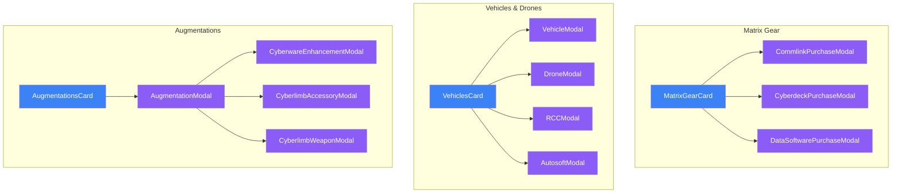

# Matrix Gear, Vehicles & Augmentations

Matrix equipment (commlinks, cyberdecks), vehicles/drones, and augmentations (cyberware, bioware).

## Component Hierarchy

## Matrix Gear (`/matrix-gear/`)

### MatrixGearCard

Location: `/components/creation/matrix-gear/MatrixGearCard.tsx`

Main container for matrix equipment. Features:

- Commlink selection
- Cyberdeck selection (for deckers)
- Programs and software

### CommlinkPurchaseModal

Location: `/components/creation/matrix-gear/CommlinkPurchaseModal.tsx`

Commlink selection:

- Device rating comparison
- Data processing, Firewall stats
- Built-in features

### CyberdeckPurchaseModal

Location: `/components/creation/matrix-gear/CyberdeckPurchaseModal.tsx`

Cyberdeck selection for deckers:

- Attack, Sleaze, Data Processing, Firewall
- Program slots
- Cost comparison

### DataSoftwarePurchaseModal

Location: `/components/creation/matrix-gear/DataSoftwarePurchaseModal.tsx`

Software and program selection:

- Common programs
- Agents
- Data files

## Vehicles & Drones (`/vehicles/`)

### VehiclesCard

Location: `/components/creation/VehiclesCard.tsx`

Main container for vehicles and drones. Features:

- Vehicle selection
- Drone management
- RCC (Rigger Command Console)
- Autosofts

### VehicleModal

Location: `/components/creation/vehicles/VehicleModal.tsx`

Vehicle selection:

- Type filtering (Ground, Air, Water, etc.)
- Speed, Handling, Armor stats
- Modification slots

### DroneModal

Location: `/components/creation/vehicles/DroneModal.tsx`

Drone selection:

- Size categories
- Sensor packages
- Weapon mounts

### RCCModal

Location: `/components/creation/vehicles/RCCModal.tsx`

Rigger Command Console selection:

- Device rating
- Noise reduction
- Data processing

### AutosoftModal

Location: `/components/creation/vehicles/AutosoftModal.tsx`

Autosoft selection for drones:

- Targeting autosofts
- Maneuvering autosofts
- Electronic warfare

## Augmentations (`/augmentations/`)

### AugmentationsCard

Location: `/components/creation/AugmentationsCard.tsx`

Main container for cyberware and bioware. Features:

- Essence tracking
- Grade selection (Standard, Alpha, Beta, Delta)
- Cyberlimb management

### AugmentationModal

Location: `/components/creation/augmentations/AugmentationModal.tsx`

Main augmentation browser:

- Cyberware catalog
- Bioware catalog
- Essence cost display
- Grade selection

### CyberwareEnhancementModal

Location: `/components/creation/augmentations/CyberwareEnhancementModal.tsx`

Enhancement selection for cyberware:

- Capacity tracking
- Enhancement costs

### CyberlimbAccessoryModal

Location: `/components/creation/augmentations/CyberlimbAccessoryModal.tsx`

Cyberlimb accessory selection:

- Armor
- Strength/Agility enhancements
- Built-in features

### CyberlimbWeaponModal

Location: `/components/creation/augmentations/CyberlimbWeaponModal.tsx`

Cyberlimb weapon selection:

- Hand blades, razors
- Spurs
- Holdouts

## File Summary

| Folder            | Files | Components                      |
| ----------------- | ----- | ------------------------------- |
| `/matrix-gear/`   | 5     | 1 card, 3 modals                |
| `/vehicles/`      | 5     | 4 modals                        |
| `/augmentations/` | 5     | 4 modals                        |
| Root              | 2     | VehiclesCard, AugmentationsCard |

## Budget Integration

| Category      | Budget  | Notes                             |
| ------------- | ------- | --------------------------------- |
| Matrix Gear   | `nuyen` | Commlinks, cyberdecks, software   |
| Vehicles      | `nuyen` | Vehicles, drones, RCCs, autosofts |
| Augmentations | `nuyen` | Essence is tracked separately     |

## Essence System

Augmentations reduce maximum Essence:

| Grade    | Essence Multiplier |
| -------- | ------------------ |
| Standard | 1.0x               |
| Alpha    | 0.8x               |
| Beta     | 0.7x               |
| Delta    | 0.5x               |

## Context Dependencies

- **RulesetContext** - `useCommlinks()`, `useCyberdecks()`, `useVehicles()`, `useDrones()`, `useCyberware()`, `useBioware()`
- **CreationBudgetContext** - Nuyen tracking
- **useKarmaConversionPrompt** - Conversion for expensive items
