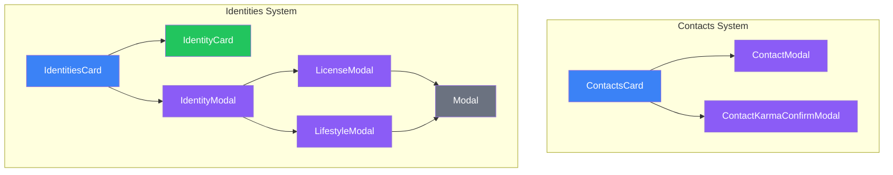

# Social & Identity

Contacts network and identity management (SINs, lifestyles, licenses).

## Component Hierarchy



## Contacts System (`/contacts/`)

### ContactsCard

Location: `/components/creation/contacts/ContactsCard.tsx`

Main container for contact management. Features:

- Free contact points = CHA x 3
- Connection and Loyalty ratings
- Karma overflow for extra contacts

### ContactModal

Location: `/components/creation/contacts/ContactModal.tsx`

Modal for creating/editing contacts:

- Contact name and description
- Connection rating (1-6)
- Loyalty rating (1-6)
- Contact type/profession

### ContactKarmaConfirmModal

Location: `/components/creation/contacts/ContactKarmaConfirmModal.tsx`

Confirmation dialog when contact cost exceeds free pool:

- Shows karma cost
- Confirms karma expenditure

### Supporting Files

| File           | Purpose                                        |
| -------------- | ---------------------------------------------- |
| `constants.ts` | Contact-related constants                      |
| `types.ts`     | ContactKarmaConfirmModalProps                  |
| `index.ts`     | Exports ContactsCard, ContactKarmaConfirmModal |

## Identities System (`/identities/`)

### IdentitiesCard

Location: `/components/creation/identities/IdentitiesCard.tsx`

Main container for identity management. Features:

- Multiple identity support
- SIN management (real, fake)
- Lifestyle selection
- License management

### IdentityCard

Location: `/components/creation/identities/IdentityCard.tsx`

Display component for individual identity:

- SIN type and rating
- Associated lifestyle
- License list
- Edit/remove actions

### IdentityModal

Location: `/components/creation/identities/IdentityModal.tsx`

Modal for creating/editing identities:

- Identity name
- SIN selection (real or fake)
- SIN rating (1-6 for fake)

### LicenseModal

Location: `/components/creation/identities/LicenseModal.tsx`

License management modal:

- License type selection
- Rating (matches SIN rating)
- Cost calculation

### LifestyleModal

Location: `/components/creation/identities/LifestyleModal.tsx`

Lifestyle selection modal:

- Lifestyle tier (Street to Luxury)
- Monthly cost
- Prepaid months
- Lifestyle modifications

### Modal (Shared)

Location: `/components/creation/identities/Modal.tsx`

Shared modal wrapper for identities subsystem

### Supporting Files

| File           | Purpose                    |
| -------------- | -------------------------- |
| `constants.ts` | Lifestyle tiers, SIN costs |
| `types.ts`     | Identity, lifestyle types  |
| `index.ts`     | Exports IdentitiesCard     |

## File Summary

| Folder         | Files | Components                  |
| -------------- | ----- | --------------------------- |
| `/contacts/`   | 6     | 1 card, 2 modals            |
| `/identities/` | 9     | 2 cards, 4 modals, 1 shared |

## Budget Integration

### Contact Points

| Source         | Formula                          |
| -------------- | -------------------------------- |
| Free pool      | CHA x 3                          |
| Karma overflow | 1 karma per point over free pool |

### Identity Costs

| Item         | Cost                          |
| ------------ | ----------------------------- |
| Fake SIN     | Rating x 2,500¥               |
| Fake License | Rating x 200¥                 |
| Lifestyle    | Monthly cost x prepaid months |

## Contact System Flow

```
User adds contact
    ↓
Calculate total cost (Connection + Loyalty)
    ↓
Check against free pool (CHA x 3)
    ↓
If over limit → ContactKarmaConfirmModal
    ↓
Confirm karma expenditure
    ↓
Contact added
```

## Identity System Flow

```
User creates identity
    ↓
Select SIN type (real/fake)
    ↓
If fake → select rating (1-6)
    ↓
Add lifestyle
    ↓
Add licenses (rating ≤ SIN rating)
    ↓
Calculate total cost
```

## Context Dependencies

- **RulesetContext** - Lifestyle options, license types
- **CreationBudgetContext** - Contact points, nuyen, karma
