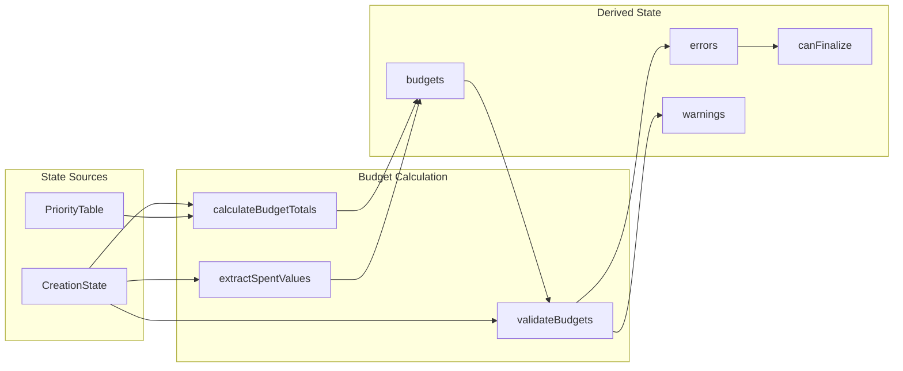

# Context & Data Flow

State management architecture for character creation using React contexts and hooks.

## Context Hierarchy

```mermaid
graph TD
    subgraph "Context Providers"
        RulesetProvider[RulesetProvider]
        CreationBudgetProvider[CreationBudgetProvider]
        AuthProvider[AuthProvider]
    end

    subgraph "Budget Hooks"
        useCreationBudgets[useCreationBudgets]
        useBudget[useBudget]
        useCreationValidation[useCreationValidation]
        useCanFinalize[useCanFinalize]
    end

    subgraph "Ruleset Hooks"
        useRuleset[useRuleset]
        usePriorityTable[usePriorityTable]
        useMetatypes[useMetatypes]
        useSkills[useSkills]
        useSkillGroups[useSkillGroups]
        useQualities[useQualities]
        useSpells[useSpells]
        useGear[useGear]
    end

    subgraph "Shared Hooks"
        useKarmaConversionPrompt[useKarmaConversionPrompt]
        useRatingSelection[useRatingSelection]
    end

    RulesetProvider --> useRuleset
    RulesetProvider --> usePriorityTable
    RulesetProvider --> useMetatypes
    RulesetProvider --> useSkills
    RulesetProvider --> useSkillGroups
    RulesetProvider --> useQualities
    RulesetProvider --> useSpells
    RulesetProvider --> useGear

    CreationBudgetProvider --> useCreationBudgets
    CreationBudgetProvider --> useBudget
    CreationBudgetProvider --> useCreationValidation
    CreationBudgetProvider --> useCanFinalize

    style RulesetProvider fill:#f59e0b,color:#fff
    style CreationBudgetProvider fill:#f59e0b,color:#fff
    style AuthProvider fill:#f59e0b,color:#fff
    style useCreationBudgets fill:#6b7280,color:#fff
    style useBudget fill:#6b7280,color:#fff
    style useCreationValidation fill:#6b7280,color:#fff
    style useCanFinalize fill:#6b7280,color:#fff
    style useRuleset fill:#6b7280,color:#fff
    style usePriorityTable fill:#6b7280,color:#fff
    style useMetatypes fill:#6b7280,color:#fff
    style useSkills fill:#6b7280,color:#fff
    style useSkillGroups fill:#6b7280,color:#fff
    style useQualities fill:#6b7280,color:#fff
    style useSpells fill:#6b7280,color:#fff
    style useGear fill:#6b7280,color:#fff
    style useKarmaConversionPrompt fill:#6b7280,color:#fff
    style useRatingSelection fill:#6b7280,color:#fff
```



## CreationBudgetContext

Location: `/lib/contexts/CreationBudgetContext.tsx`

Central budget tracking and validation for character creation.

### Budget Types

```typescript
type BudgetId =
  | "karma"
  | "nuyen"
  | "attribute-points"
  | "special-attribute-points"
  | "skill-points"
  | "skill-group-points"
  | "knowledge-points"
  | "contact-points"
  | "spell-slots"
  | "power-points";
```

### Budget State

```typescript
interface BudgetState {
  total: number; // Total available
  spent: number; // Amount used
  remaining: number; // total - spent
  displayFormat?: "number" | "currency" | "percentage";
  label: string; // Human-readable label
}
```

### Context Value

```typescript
interface CreationBudgetContextValue {
  budgets: Record<string, BudgetState>;
  updateSpent: (budgetId: string, spent: number) => void;
  errors: ValidationError[];
  warnings: ValidationError[];
  isValid: boolean;
  canFinalize: boolean;
  getBudget: (budgetId: string) => BudgetState | undefined;
  hasRemaining: (budgetId: string) => boolean;
  isOverspent: (budgetId: string) => boolean;
}
```

### Hooks

| Hook                      | Returns                                | Purpose                 |
| ------------------------- | -------------------------------------- | ----------------------- |
| `useCreationBudgets()`    | Full context                           | Access all budget state |
| `useBudget(id)`           | BudgetState                            | Single budget access    |
| `useCreationValidation()` | errors, warnings, isValid, canFinalize | Validation state        |
| `useCanFinalize()`        | boolean                                | Finalization check      |

## Data Flow



## Budget Calculations

### Total Calculations

Totals are derived from priority selections:

| Budget                     | Source                                  |
| -------------------------- | --------------------------------------- |
| `attribute-points`         | Priority (Attributes)                   |
| `skill-points`             | Priority (Skills) skillPoints           |
| `skill-group-points`       | Priority (Skills) skillGroupPoints      |
| `nuyen`                    | Priority (Resources)                    |
| `special-attribute-points` | Priority (Metatype) + selected metatype |
| `contact-points`           | CHA x 3                                 |
| `knowledge-points`         | (INT + LOG) x 2                         |
| `spell-slots`              | Priority (Magic) for selected path      |
| `power-points`             | Magic rating (for adepts)               |
| `karma`                    | Fixed 25                                |

### Spent Calculations

Spent values are derived from selections:

| Budget                     | Derived From                                             |
| -------------------------- | -------------------------------------------------------- |
| `attribute-points`         | selections.coreAttributePointsSpent                      |
| `special-attribute-points` | Sum of selections.specialAttributes                      |
| `contact-points`           | Min(total contact cost, CHA x 3)                         |
| `skill-points`             | Sum of skill ratings + specializations - karma purchases |
| `skill-group-points`       | Sum of group ratings - karma purchases                   |
| `knowledge-points`         | Sum of language + knowledge ratings                      |
| `spell-slots`              | Min(spell count, free slots)                             |
| `nuyen`                    | Sum of all gear, weapons, armor, etc. costs              |
| `karma`                    | Net of quality karma + all karma spends                  |

## Validation Rules

### Errors (Block Finalization)

| Rule                   | Condition           |
| ---------------------- | ------------------- |
| Budget overspent       | Any `remaining < 0` |
| Positive quality limit | > 25 karma          |
| Negative quality limit | > 25 karma gained   |
| Karma conversion limit | > 10 karma          |

### Warnings (Advisory)

| Rule            | Condition           |
| --------------- | ------------------- |
| Nuyen carryover | > 5,000¥ remaining  |
| Karma carryover | > 7 karma remaining |

## RulesetContext Integration

The budget context depends on RulesetContext for:

- Priority table structure
- Metatype special attribute points
- Magic path options
- Catalog lookups for display

## Component Update Pattern

```typescript
// In creation card component
function SomeCard({ state, updateState }) {
  const { getBudget, isOverspent } = useCreationBudgets();
  const budget = getBudget("some-budget");

  const handleSelection = (item) => {
    // Update selections - budgets recalculate automatically
    updateState({
      selections: {
        ...state.selections,
        someItems: [...state.selections.someItems, item],
      },
    });
  };

  return (
    <CreationCard
      status={isOverspent("some-budget") ? "error" : "valid"}
    >
      {/* Card content */}
    </CreationCard>
  );
}
```

## Provider Setup

```tsx
// In creation page
<RulesetProvider edition="sr5">
  <CreationBudgetProvider
    creationState={creationState}
    priorityTable={priorityTable}
    onSpentChange={handleSpentChange}
  >
    <SheetCreationLayout creationState={creationState} updateState={updateState} />
  </CreationBudgetProvider>
</RulesetProvider>
```

## Debounced Validation

Validation runs with a 300ms debounce to prevent excessive recalculation during rapid changes.

```typescript
const validationTimeoutRef = useRef<NodeJS.Timeout | null>(null);

useEffect(() => {
  if (validationTimeoutRef.current) {
    clearTimeout(validationTimeoutRef.current);
  }

  validationTimeoutRef.current = setTimeout(() => {
    const { errors, warnings } = validateBudgets(budgets, creationState);
    setValidationState({ errors, warnings });
  }, validationDebounceMs);

  return () => {
    if (validationTimeoutRef.current) {
      clearTimeout(validationTimeoutRef.current);
    }
  };
}, [budgets, creationState]);
```
