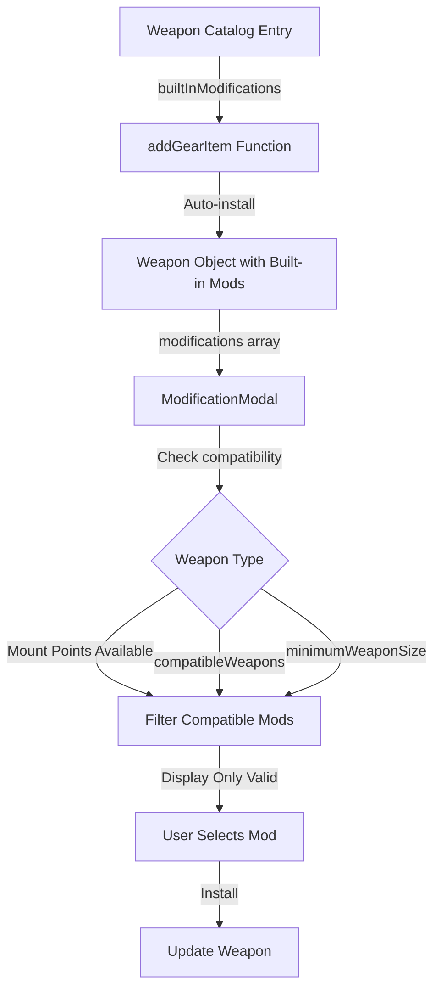

# Built-in Modifications and Mount Point Validation

## Overview

This plan implements two related features:

1. **Built-in modifications**: Weapons like the Browning Ultra-Power come with pre-installed modifications (e.g., laser sight) that should be automatically added when the weapon is purchased and cannot be removed.
2. **Mount point validation**: Different weapon types have different available mount points (e.g., hold-outs can't take any accessories, light pistols only top/barrel). The modification modal should filter out incompatible modifications based on weapon type and available mounts.

## Architecture

### Data Flow



### Mount Point Rules (from SR5 Core Rules)

- **Hold-outs**: No accessories allowed
- **Light pistols**: Top and barrel only
- **Heavy pistols, SMGs, rifles, shotguns, etc.**: All mounts (top, under, side, barrel, stock, internal)

## Implementation Tasks

### 1. Update Type Definitions

**File**: `lib/types/character.ts`

- Add `isBuiltIn?: boolean` to `InstalledWeaponMod` interface to flag built-in modifications that cannot be removed.

**File**: `lib/types/edition.ts` or `lib/rules/RulesetContext.tsx`

- Add `builtInModifications?: Array<{ modificationId: string; mount?: WeaponMountType }>` to weapon data interface (wherever `WeaponData` is defined).

### 2. Add Mount Point Availability Mapping

**File**: `lib/rules/RulesetContext.tsx` or new utility file

Create a function to determine available mount points based on weapon subcategory:

```typescript
export function getAvailableMountsForWeaponType(
  subcategory: string
): WeaponMountType[] {
  // Hold-outs: no mounts
  if (subcategory === "holdouts") return [];
  
  // Light pistols: top and barrel only
  if (subcategory === "light-pistols") return ["top", "barrel"];
  
  // Heavy pistols, SMGs, rifles, shotguns, etc.: all mounts
  return ["top", "under", "side", "barrel", "stock", "internal"];
}
```

### 3. Update Weapon Catalog Data

**File**: `data/editions/sr5/core-rulebook.json`

Add `builtInModifications` array to weapons that have built-in mods:

```json
{
  "id": "browning-ultra-power",
  "name": "Browning Ultra-Power",
  // ... existing fields ...
  "builtInModifications": [
    {
      "modificationId": "laser-sight",
      "mount": "top"
    }
  ]
}
```

**Note**: Need to verify the exact `modificationId` for "laser-sight" in the modifications catalog.

### 4. Update GearStep to Auto-Install Built-in Mods

**File**: `app/characters/create/components/steps/GearStep.tsx`

Modify `addGearItem` function (around line 276) to:

1. Check if weapon has `builtInModifications`
2. Look up each modification in the weapon modifications catalog
3. Create `InstalledWeaponMod` objects with `isBuiltIn: true` and `cost: 0`
4. Add to weapon's `modifications` array
5. Mark mounts as occupied in `occupiedMounts` array

**Key changes**:

- Import `useWeaponModifications` hook to access modification catalog
- After creating `newWeapon`, check `weaponItem.builtInModifications`
- Loop through built-in mods and install them automatically
- Set `isBuiltIn: true` and `cost: 0` for built-in modifications

### 5. Update ModificationModal Compatibility Filtering

**File**: `app/characters/create/components/ModificationModal.tsx`

Enhance `filteredWeaponMods` useMemo (around line 109) to filter by:

1. **Available mounts**: Check if weapon's subcategory allows the modification's mount type
2. **Weapon size requirements**: Check `minimumWeaponSize` against weapon subcategory
3. **Compatible weapons**: Check if weapon subcategory is in `compatibleWeapons` array
4. **Incompatible weapons**: Check if weapon subcategory is NOT in `incompatibleWeapons` array

**Key changes**:

- Import `getAvailableMountsForWeaponType` function
- Get weapon's subcategory from catalog (need to pass weapon catalog data or store it in Weapon type)
- Filter mods by mount availability
- Filter mods by `minimumWeaponSize` (map subcategory to size: "pistols" → "heavy-pistol", "rifles" → "rifle", etc.)
- Filter mods by `compatibleWeapons` and `incompatibleWeapons` arrays

### 6. Update Weapon Type to Store Subcategory

**File**: `lib/types/character.ts`

Add `subcategory?: string` to `Weapon` interface so we can check compatibility in ModificationModal.

**File**: `app/characters/create/components/steps/GearStep.tsx`

When creating `newWeapon`, include `subcategory: weaponItem.subcategory`.

### 7. Prevent Removal of Built-in Modifications

**File**: `app/characters/create/components/steps/GearStep.tsx`

Update `removeWeaponMod` function (around line 508) to check `isBuiltIn` flag and prevent removal if true.

**File**: `app/characters/create/components/steps/GearStep.tsx` (UI section)

In the weapon modification display, show a visual indicator (badge or icon) for built-in modifications and disable the remove button.

### 8. Update ReviewStep Display

**File**: `app/characters/create/components/steps/ReviewStep.tsx`

In the weapons section, show built-in modifications with a visual indicator (e.g., "Built-in" badge or different styling) to distinguish them from user-installed modifications.

## Testing Considerations

1. **Built-in mods**: Add Browning Ultra-Power, verify laser sight is auto-installed and cannot be removed
2. **Mount validation**: Try to add underbarrel mod to light pistol, verify it's filtered out
3. **Size requirements**: Try to add rifle-only mod to pistol, verify it's filtered out
4. **Compatibility lists**: Test mods with `compatibleWeapons` and `incompatibleWeapons` restrictions

## Files to Modify

1. `lib/types/character.ts` - Add `isBuiltIn` flag and `subcategory` field
2. `lib/types/edition.ts` or `lib/rules/RulesetContext.tsx` - Add `builtInModifications` to weapon data type
3. `lib/rules/RulesetContext.tsx` - Add `getAvailableMountsForWeaponType` utility function
4. `data/editions/sr5/core-rulebook.json` - Add `builtInModifications` to relevant weapons
5. `app/characters/create/components/steps/GearStep.tsx` - Auto-install built-in mods, prevent removal, store subcategory
6. `app/characters/create/components/ModificationModal.tsx` - Add compatibility filtering
7. `app/characters/create/components/steps/ReviewStep.tsx` - Visual indicator for built-in mods

## Dependencies

- Weapon modifications catalog must be loaded (already available via `useWeaponModifications` hook)
- Need to map weapon subcategories to mount availability rules
- Need to identi