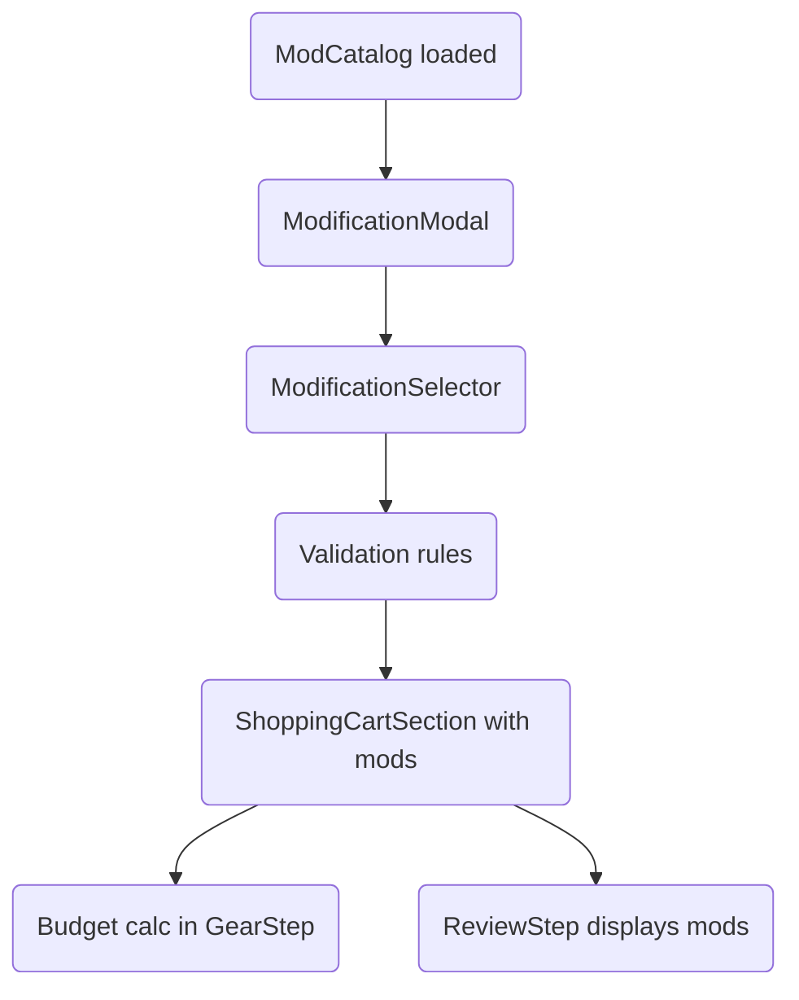

# Phase B10: Gear Modifications Plan

## Scope

Implement complete gear modification support in character creation: catalog data loading, UI to add/inspect modifications, validation (capacity/mount/requirements/availability), and cost tracking through review.

## Approach

- Confirm data structures and catalog hooks exist and align (`/lib/types/character.ts`, `/lib/types/edition.ts`, `/lib/rules/RulesetContext.tsx`).
- Finalize modification catalog in `/data/editions/sr5/core-rulebook.json` and ensure RuleModuleType includes `modifications`.
- Enhance GearStep UI: modification modal/selector, mount selection, capacity display, install/remove flows, and render installed mods in cart.
- Add validation and cost propagation in `GearStep` and `ReviewStep`, backed by rules in `/lib/rules/validation.ts`.
- Verify acceptance criteria with manual checks; update docs if needed.

## Files to touch

- `app/characters/create/components/steps/GearStep.tsx`
- `app/characters/create/components/ShoppingCartSection.tsx`
- `app/characters/create/components/ModificationModal.tsx`
- `app/characters/create/components/ModificationSelector.tsx`
- `app/characters/create/components/steps/ReviewStep.tsx`
- `lib/rules/validation.ts`
- `lib/rules/RulesetContext.tsx`
- `data/editions/sr5/core-rulebook.json`
- `lib/types/character.ts`, `lib/types/edition.ts`

## Validation Flow (Mermaid)

