# Capabilities Documentation

## Purpose

Capability documents define **what the system guarantees**.

They describe the stable, long-lived responsibilities of the system in
declarative, outcome-focused terms. Capabilities are the primary source of truth
for _what must always be true_ about system behavior, regardless of
implementation, technology, or UI.

In an AI-first development environment, capabilities serve as the **contract**
that both humans and AI agents reason against.

---

## What a Capability Is

A capability describes:

- A coherent system responsibility or domain concern
- The guarantees the system provides to its users or other systems
- The constraints under which those guarantees hold
- The explicit non-goals that are out of scope

Capabilities answer the question:

> **“What must this system always guarantee?”**

---

## What a Capability Contains

Each capability document follows a standard structure:

### Purpose

- A concise, abstract description of the outcome the capability exists to ensure
- Written at the _intent_ level, not the process level
- Stable over time

### Guarantees

- Declarative statements of what the system MUST provide
- Observable outcomes, not internal mechanics
- Suitable for validation, audit, and reasoning

### Requirements

- Conditions the system MUST satisfy to uphold the guarantees
- Grouped by logical domains when appropriate
- Still declarative, not procedural

### Constraints

- Limits, invariants, or restrictions the system MUST respect
- Cross-capability interactions or safety boundaries often belong here

### Non-Goals

- Explicit exclusions
- Clarifies what this capability intentionally does NOT cover
- Prevents scope creep and misinterpretation

---

## What a Capability Must NOT Contain

Capabilities must not include:

- Implementation details
- Algorithms, data structures, or APIs
- UI layouts or workflows
- Progress updates or roadmap information
- Rationale or tradeoff explanations (these belong in ADRs)
- Temporary or experimental behavior

If a statement explains _why_ a choice was made, it likely belongs in an ADR.
If it explains _how_ something works, it likely belongs elsewhere.

---

## Why Capabilities Are Stable and Long-Lived

Capabilities are designed to change **slowly**.

- Implementations may evolve
- Technologies may be replaced
- UX may change
- AI agents may come and go

But the guarantees the system provides should remain consistent.
When a guarantee truly changes, that represents a meaningful architectural shift.

---

## How Capabilities Are Used

Capabilities are used to:

- Guide feature design and implementation
- Evaluate whether new work fits existing responsibilities
- Detect gaps or overlaps in system behavior
- Anchor AI reasoning and reduce hallucination
- Audit documentation coverage and system completeness

When adding new behavior, first ask:

> Does this belong to an existing capability, or does it require a new one?

---

## Relationship to ADRs

Capabilities define **what must be true**.  
Architecture Decision Records (ADRs) define **why certain choices were made** to support those guarantees.

Capabilities should not be rewritten to reflect decisions.
Instead, decisions reference capabilities.

---

## Prompts and Automation

AI-first development relies on consistent application of the "Capabilities and Decisions" model. The following prompts are available to help maintain and extend this documentation:

### Core Model & Guidance

- [Explain the Model](file:///Users/jrags/Code/Jasrags/shadow-master/docs/capabilities/prompts/0_explain_the_capabilities_&_decisions_model.md): Use this to onboard new agents or refresh understanding of the system invariants vs. architectural decisions.
- [Prompting Best Practices](file:///Users/jrags/Code/Jasrags/shadow-master/docs/prompts/governance/prompting_best_practices.md): General guidelines for effective AI collaboration in this repository.

### Document Generation

- [1. Generate Capability Doc](file:///Users/jrags/Code/Jasrags/shadow-master/docs/capabilities/prompts/1_prompt-generate-cabability-doc.md): Use this when you have a feature specification and need to extract the stable system guarantees into a new capability document.
- [2. Generate ADR](file:///Users/jrags/Code/Jasrags/shadow-master/docs/capabilities/prompts/2_prompt-generate-adr.md): Use this to capture the "why" behind an architectural choice, ensuring the decision is documented separately from the capability itself.
- [3. Generate Implementation Plan](file:///Users/jrags/Code/Jasrags/shadow-master/docs/capabilities/prompts/3_prompt-generate-implementation-plan.md): Use this to transition from Capability guarantees to a technical blueprint.
- [4. Execute Implementation Plan](file:///Users/jrags/Code/Jasrags/shadow-master/docs/capabilities/prompts/4_prompt-execute-implementation-plan.md): Use this to generate code diffs that are anchored to the implementation plan and system constraints.
- [5. Generate Walkthrough](file:///Users/jrags/Code/Jasrags/shadow-master/docs/capabilities/prompts/5_prompt-generate-walkthrough.md): Use this to audit code against capabilities and document proof of work.

---

## Audience

- Senior engineers
- Technical leads
- Architects
- AI agents operating in this codebase

This folder is authoritative. Treat changes with care.

---

## Capability Registry

### Status Key

| Status         | Meaning                                                            |
| -------------- | ------------------------------------------------------------------ |
| ✅ Implemented | Capability is fully implemented and verified                       |
| 🚧 In Progress | Implementation is underway                                         |
| 📝 Draft       | Capability document exists but not yet approved for implementation |
| 📋 Proposed    | Identified in TODO.md but no capability document yet               |

---

### Character Domain

| Capability            | Status         | Document                                                                                                                                |
| --------------------- | -------------- | --------------------------------------------------------------------------------------------------------------------------------------- |
| Character Management  | ✅ Implemented | [character.management.md](file:///Users/jrags/Code/Jasrags/shadow-master/docs/capabilities/character.management.md)                     |
| Character Advancement | ✅ Implemented | [character.advancement.md](file:///Users/jrags/Code/Jasrags/shadow-master/docs/capabilities/character.advancement.md)                   |
| Character Sheet       | ✅ Implemented | [character.sheet.md](file:///Users/jrags/Code/Jasrags/shadow-master/docs/capabilities/character.sheet.md)                               |
| Quality Governance    | ✅ Implemented | [character.quality-governance.md](file:///Users/jrags/Code/Jasrags/shadow-master/docs/capabilities/character.quality-governance.md)     |
| Augmentation Systems  | 🚧 In Progress | [character.augmentation-systems.md](file:///Users/jrags/Code/Jasrags/shadow-master/docs/capabilities/character.augmentation-systems.md) |

---

### Campaign Domain

| Capability             | Status         | Document                                                                                                                                  |
| ---------------------- | -------------- | ----------------------------------------------------------------------------------------------------------------------------------------- |
| Campaign Management    | ✅ Implemented | [campaign.management.md](file:///Users/jrags/Code/Jasrags/shadow-master/docs/capabilities/campaign.management.md)                         |
| Participant Governance | ✅ Implemented | [campaign.participant-governance.md](file:///Users/jrags/Code/Jasrags/shadow-master/docs/capabilities/campaign.participant-governance.md) |
| Location Governance    | ✅ Implemented | [campaign.location-governance.md](file:///Users/jrags/Code/Jasrags/shadow-master/docs/capabilities/campaign.location-governance.md)       |
| NPC Governance         | ✅ Implemented | [campaign.npc-governance.md](file:///Users/jrags/Code/Jasrags/shadow-master/docs/capabilities/campaign.npc-governance.md)                 |
| Social Governance      | ✅ Implemented | [campaign.social-governance.md](file:///Users/jrags/Code/Jasrags/shadow-master/docs/capabilities/campaign.social-governance.md)           |
| Governance Approval    | ✅ Implemented | [campaign.governance-approval.md](file:///Users/jrags/Code/Jasrags/shadow-master/docs/capabilities/campaign.governance-approval.md)       |
| Live Sessions          | 📝 Draft       | [draft-campaign.live-sessions.md](file:///Users/jrags/Code/Jasrags/shadow-master/docs/capabilities/draft-campaign.live-sessions.md)       |
| GM Combat Tools        | 📝 Draft       | [draft-campaign.gm-combat-tools.md](file:///Users/jrags/Code/Jasrags/shadow-master/docs/capabilities/draft-campaign.gm-combat-tools.md)   |
| Session Chat           | 📝 Draft       | [draft-campaign.session-chat.md](file:///Users/jrags/Code/Jasrags/shadow-master/docs/capabilities/draft-campaign.session-chat.md)         |
| VTT Integration        | 📝 Draft       | [draft-campaign.vtt-integration.md](file:///Users/jrags/Code/Jasrags/shadow-master/docs/capabilities/draft-campaign.vtt-integration.md)   |
| Async Play             | 📝 Draft       | [draft-campaign.async-play.md](file:///Users/jrags/Code/Jasrags/shadow-master/docs/capabilities/draft-campaign.async-play.md)             |

---

### Mechanics Domain

| Capability           | Status         | Document                                                                                                                                        |
| -------------------- | -------------- | ----------------------------------------------------------------------------------------------------------------------------------------------- |
| Action Resolution    | ✅ Implemented | [mechanics.action-resolution.md](file:///Users/jrags/Code/Jasrags/shadow-master/docs/capabilities/mechanics.action-resolution.md)               |
| Action Execution     | 🚧 In Progress | [mechanics.action-execution.md](file:///Users/jrags/Code/Jasrags/shadow-master/docs/capabilities/mechanics.action-execution.md)                 |
| Encounter Governance | ✅ Implemented | [mechanics.encounter-governance.md](file:///Users/jrags/Code/Jasrags/shadow-master/docs/capabilities/mechanics.encounter-governance.md)         |
| Weapon Customization | ✅ Implemented | [mechanics.weapon-customization.md](file:///Users/jrags/Code/Jasrags/shadow-master/docs/capabilities/mechanics.weapon-customization.md)         |
| Magic Mastery        | 🚧 In Progress | [mechanics.magic-mastery.md](file:///Users/jrags/Code/Jasrags/shadow-master/docs/capabilities/mechanics.magic-mastery.md)                       |
| Matrix Operations    | 🚧 In Progress | [mechanics.matrix-operations.md](file:///Users/jrags/Code/Jasrags/shadow-master/docs/capabilities/mechanics.matrix-operations.md)               |
| Rigging Control      | 🚧 In Progress | [mechanics.rigging-control.md](file:///Users/jrags/Code/Jasrags/shadow-master/docs/capabilities/mechanics.rigging-control.md)                   |
| Multiplayer Combat   | 📝 Draft       | [draft-mechanics.multiplayer-combat.md](file:///Users/jrags/Code/Jasrags/shadow-master/docs/capabilities/draft-mechanics.multiplayer-combat.md) |

---

### Ruleset Domain

| Capability             | Status         | Document                                                                                                                                |
| ---------------------- | -------------- | --------------------------------------------------------------------------------------------------------------------------------------- |
| Ruleset Discovery      | ✅ Implemented | [ruleset.discovery.md](file:///Users/jrags/Code/Jasrags/shadow-master/docs/capabilities/ruleset.discovery.md)                           |
| Ruleset Integrity      | ✅ Implemented | [ruleset.integrity.md](file:///Users/jrags/Code/Jasrags/shadow-master/docs/capabilities/ruleset.integrity.md)                           |
| System Synchronization | 🚧 In Progress | [ruleset.system-synchronization.md](file:///Users/jrags/Code/Jasrags/shadow-master/docs/capabilities/ruleset.system-synchronization.md) |

---

### Security Domain

| Capability         | Status         | Document                                                                                                                          |
| ------------------ | -------------- | --------------------------------------------------------------------------------------------------------------------------------- |
| Account Governance | ✅ Implemented | [security.account-governance.md](file:///Users/jrags/Code/Jasrags/shadow-master/docs/capabilities/security.account-governance.md) |
| Account Security   | ✅ Implemented | [security.account-security.md](file:///Users/jrags/Code/Jasrags/shadow-master/docs/capabilities/security.account-security.md)     |

---

### Infrastructure Domain

| Capability    | Status   | Document                                                                                                                                        |
| ------------- | -------- | ----------------------------------------------------------------------------------------------------------------------------------------------- |
| Notifications | 📝 Draft | [draft-infrastructure.notifications.md](file:///Users/jrags/Code/Jasrags/shadow-master/docs/capabilities/draft-infrastructure.notifications.md) |
| Feature Flags | 📝 Draft | [draft-infrastructure.feature-flags.md](file:///Users/jrags/Code/Jasrags/shadow-master/docs/capabilities/draft-infrastructure.feature-flags.md) |

---

### Built-in VTT Domain

| Capability       | Status   | Document                                                                                                                        |
| ---------------- | -------- | ------------------------------------------------------------------------------------------------------------------------------- |
| Map Import       | 📝 Draft | [draft-vtt.map-import.md](file:///Users/jrags/Code/Jasrags/shadow-master/docs/capabilities/draft-vtt.map-import.md)             |
| Tactical Display | 📝 Draft | [draft-vtt.tactical-display.md](file:///Users/jrags/Code/Jasrags/shadow-master/docs/capabilities/draft-vtt.tactical-display.md) |

---

### Implementation Roadmap

---

#### Phase 1: Foundation (Rules & Security) ✅

_Establish the bedrock of the system._

| Capability                  | Status      |
| --------------------------- | ----------- |
| security.account-security   | ✅ Complete |
| security.account-governance | ✅ Complete |
| ruleset.discovery           | ✅ Complete |
| ruleset.integrity           | ✅ Complete |

---

#### Phase 2: Core Character Lifecycle ✅

_Primary value proposition: creating and viewing characters._

| Capability                   | Status      |
| ---------------------------- | ----------- |
| character.management         | ✅ Complete |
| character.sheet              | ✅ Complete |
| character.quality-governance | ✅ Complete |
| character.advancement        | ✅ Complete |

---

_Enable group play and GM oversight._

| Capability                      | Status      |
| ------------------------------- | ----------- |
| campaign.management             | ✅ Complete |
| campaign.participant-governance | ✅ Complete |
| campaign.location-governance    | ✅ Complete |
| campaign.npc-governance         | ✅ Complete |
| campaign.governance-approval    | ✅ Complete |
| campaign.social-governance      | ✅ Complete |

---

#### Phase 4: Dice, Actions, and Resolution 🚧

_Interactive gameplay mechanics._

| Capability                     | Status         |
| ------------------------------ | -------------- |
| mechanics.action-resolution    | ✅ Complete    |
| mechanics.action-execution     | 🚧 In Progress |
| mechanics.encounter-governance | ✅ Complete    |

---

#### Phase 5: Specialized Domains

_Deep-dives into Shadowrun sub-systems._

| Capability                     | Status      |
| ------------------------------ | ----------- |
| mechanics.magic-mastery        | ⏳ Pending  |
| mechanics.matrix-operations    | ⏳ Pending  |
| mechanics.rigging-control      | ⏳ Pending  |
| mechanics.weapon-customization | ✅ Complete |
| character.augmentation-systems | ⏳ Pending  |

---

#### Phase 6: Sync & Scale

_Advanced synchronization features._

| Capability                     | Status     |
| ------------------------------ | ---------- |
| ruleset.system-synchronization | ⏳ Pending |

---

#### Phase 7: Real-Time Foundation 📝

_Infrastructure for live multiplayer sessions, notifications, and feature control._

> [!IMPORTANT] > **Prerequisite:** Phase 4 must be complete (mechanics.action-execution)

| Capability                   | Status   | Priority |
| ---------------------------- | -------- | -------- |
| infrastructure.feature-flags | 📝 Draft | High     |
| infrastructure.notifications | 📝 Draft | High     |
| campaign.live-sessions       | 📝 Draft | High     |
| campaign.session-chat        | 📝 Draft | Medium   |

**Rationale:** Feature flags enable progressive rollouts and edition-specific features. Notifications enable alerts. Live sessions provide WebSocket/SSE infrastructure.

---

#### Phase 8: Multiplayer Combat 📝

_Real-time shared combat resolution._

> [!IMPORTANT] > **Prerequisite:** Phase 7 must be complete (campaign.live-sessions)

| Capability                   | Status   | Priority |
| ---------------------------- | -------- | -------- |
| campaign.gm-combat-tools     | 📝 Draft | High     |
| mechanics.multiplayer-combat | 📝 Draft | High     |

**Rationale:** GM tools must exist before players can join combat. Multiplayer combat builds on both the action system (Phase 4) and live sessions (Phase 7).

---

#### Phase 9: Extended Play Modes 📝

_Alternative play styles beyond real-time._

> [!IMPORTANT] > **Prerequisite:** Phase 7 (session-chat) and Phase 8 (multiplayer-combat) recommended

| Capability               | Status   | Priority |
| ------------------------ | -------- | -------- |
| campaign.async-play      | 📝 Draft | Medium   |
| campaign.vtt-integration | 📝 Draft | Medium   |

**Rationale:** Async play reuses chat infrastructure. VTT integration bridges to external VTT platforms (FoundryVTT, Roll20) for users who prefer those tools.

---

#### Phase 10: Built-in VTT 📝

_Self-contained tactical display without external dependencies._

> [!IMPORTANT] > **Prerequisite:** Phase 3 (campaign.location-governance) for map linking, Phase 8 (multiplayer-combat) for combat integration

| Capability           | Status   | Priority |
| -------------------- | -------- | -------- |
| vtt.map-import       | 📝 Draft | High     |
| vtt.tactical-display | 📝 Draft | High     |

**Rationale:** Map import enables Dungeondraft integration independent of sessions. Tactical display provides a complete VTT experience for groups without external VTT platforms.

---

### Dependency Graph

```mermaid
flowchart TB
    subgraph Phase1["Phase 1: Foundation ✅"]
        sec_security["security.account-security ✅"]
        sec_governance["security.account-governance ✅"]
        rule_discovery["ruleset.discovery ✅"]
        rule_integrity["ruleset.integrity ✅"]
    end

    subgraph Phase2["Phase 2: Character ✅"]
        char_mgmt["character.management ✅"]
        char_sheet["character.sheet ✅"]
        char_quality["character.quality-governance ✅"]
        char_advance["character.advancement ✅"]
    end

    subgraph Phase3["Phase 3: Campaign ✅"]
        camp_mgmt["campaign.management ✅"]
        camp_participant["campaign.participant-governance ✅"]
        camp_location["campaign.location-governance ✅"]
        camp_npc["campaign.npc-governance ✅"]
        camp_approval["campaign.governance-approval ✅"]
        camp_social["campaign.social-governance ✅"]
    end

    subgraph Phase4["Phase 4: Actions 🚧"]
        mech_resolution["mechanics.action-resolution ✅"]
        mech_execution["mechanics.action-execution 🚧"]
        mech_encounter["mechanics.encounter-governance ✅"]
    end

    subgraph Phase5["Phase 5: Specialized"]
        mech_magic["mechanics.magic-mastery ⏳"]
        mech_matrix["mechanics.matrix-operations ⏳"]
        mech_rigging["mechanics.rigging-control ⏳"]
        mech_weapon["mechanics.weapon-customization ✅"]
        char_augment["character.augmentation-systems ⏳"]
    end

    subgraph Phase6["Phase 6: Sync"]
        rule_sync["ruleset.system-synchronization ⏳"]
    end

    subgraph Phase7["Phase 7: Real-Time Foundation 📝"]
        infra_flags["infrastructure.feature-flags 📝"]
        infra_notify["infrastructure.notifications 📝"]
        camp_live["campaign.live-sessions 📝"]
        camp_chat["campaign.session-chat 📝"]
    end

    subgraph Phase8["Phase 8: Multiplayer Combat 📝"]
        camp_gm["campaign.gm-combat-tools 📝"]
        mech_multi["mechanics.multiplayer-combat 📝"]
    end

    subgraph Phase9["Phase 9: Extended Play 📝"]
        camp_async["campaign.async-play 📝"]
        camp_vtt["campaign.vtt-integration 📝"]
    end

    subgraph Phase10["Phase 10: Built-in VTT 📝"]
        vtt_import["vtt.map-import 📝"]
        vtt_display["vtt.tactical-display 📝"]
    end

    %% Phase dependencies
    Phase1 --> Phase2
    Phase2 --> Phase3
    Phase3 --> Phase4

    %% Action execution is the key dependency for multiplayer
    mech_execution --> camp_live
    mech_execution --> camp_gm

    %% Notifications dependencies
    sec_governance --> infra_notify
    infra_notify --> camp_async
    infra_notify --> camp_live

    %% Live sessions enables everything multiplayer
    camp_live --> camp_chat
    camp_live --> camp_gm
    camp_live --> mech_multi
    camp_live --> camp_vtt

    %% GM tools before multiplayer combat
    camp_gm --> mech_multi

    %% Extended play dependencies
    camp_chat --> camp_async
    mech_multi --> camp_vtt

    %% Built-in VTT dependencies
    camp_location --> vtt_import
    vtt_import --> vtt_display
    camp_live --> vtt_display
    mech_multi --> vtt_display

    %% Styling
    classDef complete fill:#22c55e,stroke:#16a34a,color:#fff
    classDef inProgress fill:#f59e0b,stroke:#d97706,color:#fff
    classDef pending fill:#6b7280,stroke:#4b5563,color:#fff
    classDef draft fill:#3b82f6,stroke:#2563eb,color:#fff

    class sec_security,sec_governance,rule_discovery,rule_integrity,char_mgmt,char_sheet,char_quality,char_advance,camp_mgmt,camp_participant,camp_location,camp_npc,camp_approval,camp_social,mech_resolution,mech_encounter,mech_weapon complete
    class mech_execution inProgress
    class mech_magic,mech_matrix,mech_rigging,char_augment,rule_sync pending
    class camp_live,camp_chat,camp_gm,mech_multi,camp_async,camp_vtt,vtt_import,vtt_display,infra_notify,infra_flags draft
```

> [!NOTE]
> Draft capabilities require approval before implementation begins. See [TODO.md](file:///Users/jrags/Code/Jasrags/shadow-master/docs/capabilities/TODO.md) for detailed scope and technical considerations.
