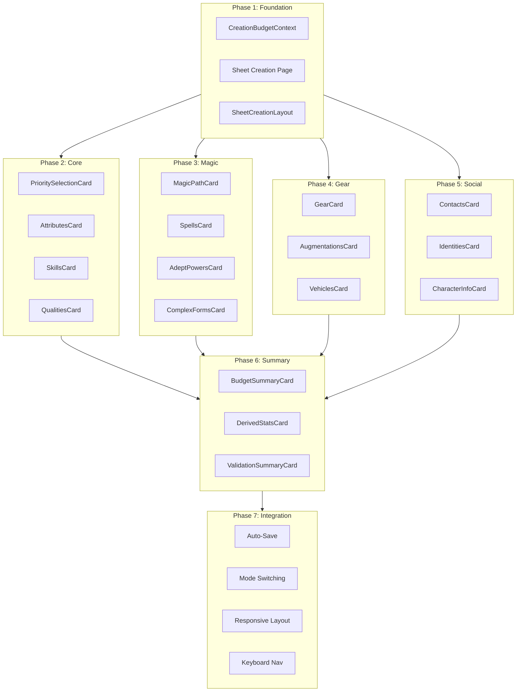

# Sheet-Driven Character Creation Implementation Plan

**Capability Documents:**
- [character.management.md](../character.management.md)
- [character.sheet.md](../character.sheet.md)

**ADRs:**
- [ADR-005: Modular Step Wizard](../../decisions/005-character.modular-step-wizard.md) (context)
- [ADR-011: Sheet-Driven Creation](../../decisions/011-character.sheet-driven-creation.md) (decision)

**Design Reference:** [character-sheet-creation-mode.md](../../prompts/design/character-sheet-creation-mode.md)

**Last Updated:** 2026-01-01
**Status:** In Progress (Phase 2 Complete)
**Priority:** High (Core User Experience)

---

## Goal Description

Implement a Sheet-Driven Character Creation Mode where character creation occurs directly on the character sheet interface. All components (priority selection, attributes, skills, gear, spells, contacts, etc.) are visible and editable simultaneously with real-time budget tracking and inline validation.

This extends ADR-005's wizard system by providing an alternative creation paradigm. Both modes will coexist, allowing users to choose their preferred experience.

**Key Outcomes:**
1. Single interface for creation, viewing, and advancement
2. All budgets visible simultaneously (karma, nuyen, attribute points, skill points)
3. Component reuse across all character lifecycle states
4. Familiar pen-and-paper character sheet mental model

---

## Current Implementation Analysis

### Existing Wizard Infrastructure

| Component | Location | Reuse Potential |
|-----------|----------|-----------------|
| `CreationWizard.tsx` | `/app/characters/create/components/` | State management patterns, budget calculation |
| `PriorityStep.tsx` | `/app/characters/create/components/steps/` | Priority assignment UI (drag-drop) |
| `AttributesStep.tsx` | Same | Attribute allocation logic |
| `SkillsStep.tsx` | Same | Skill/group point spending |
| `QualitiesStep.tsx` | Same | Quality selection with karma tracking |
| `GearStep.tsx` | Same | Gear purchasing with nuyen tracking |
| `SpellsStep.tsx` | Same | Spell selection with slot tracking |
| `ContactsStep.tsx` | Same | Contact point allocation |
| `IdentitiesStep.tsx` | Same | SIN/license/lifestyle management |
| `ValidationPanel.tsx` | Same | Budget display, shopping cart |

**Key Wizard Patterns to Preserve:**
- `CreationState` as single source of truth
- `updateState()` callback pattern for step communication
- Debounced auto-save to server (1-second delay)
- Budget calculation from priority table via `useMemo`
- Centralized validation in orchestrator

### Existing Sheet Components

| Component | Location | Edit Support |
|-----------|----------|--------------|
| `Section.tsx` | `/app/characters/[id]/components/` | N/A (wrapper) |
| `InteractiveConditionMonitor` | Same | Yes (`readonly` prop) |
| `InventoryPanel.tsx` | Same | Yes (`showActions` prop) |
| `QualitiesSection.tsx` | Same | Partial (dynamic state) |
| `ActionPanel.tsx` | Same | View-only |

**Key Sheet Patterns to Leverage:**
- `Section` component for consistent styling
- `readonly` prop pattern for edit toggling
- Modal pattern for complex editing (DynamicStateModal)
- Three-column responsive grid layout

### Gaps to Address

| Gap | Description | Priority |
|-----|-------------|----------|
| Unified creation sheet page | New page combining all creation components | High |
| Budget context provider | Global budget state accessible by all sections | High |
| Creation-mode section components | Existing sheet sections with edit capabilities | High |
| Inline validation display | Per-section error/warning indicators | High |
| Priority selection component | Compact version for sheet (not modal) | High |
| Cross-section dependency handling | Metatype affects attributes, magic affects spells | Medium |
| Mode switching infrastructure | Draft vs active character display | Medium |
| Mobile responsive layout | Three-column to single-column adaptation | Medium |

---

## Architectural Decisions (Resolved)

The following decisions were reviewed and approved on 2026-01-01:

### 1. State Management Strategy

**Decision:** Reuse `CreationState` from the wizard.

- Same state structure works for both wizard and sheet modes
- Existing save logic (auto-save, draft persistence) works unchanged
- Users can switch between modes on the same draft
- Unused fields (currentStep, completedSteps) simply ignored in sheet mode
- Add `creationMode: 'wizard' | 'sheet'` field to track which mode is active

### 2. Component Architecture

**Decision:** Create new unified components in `/components/creation/`.

- Purpose-built for triple mode: `mode: 'create' | 'view' | 'edit'`
- Extract business logic from wizard steps into shared hooks (e.g., `useAttributeAllocation`, `useSkillSpending`)
- Components use sheet-style layout patterns (`Section` wrapper, card-based UI)
- Enables component reuse across creation, character sheet viewing, and advancement editing

### 3. Budget State Distribution

**Decision:** Use React Context (`CreationBudgetContext`).

- Clean access from any component depth without prop drilling
- Reactive updates when budgets change
- Standard React pattern familiar to team
- Context provides:
  - `budgets: Record<string, { total: number, spent: number, remaining: number }>`
  - `updateSpent: (budgetId: string, spent: number) => void`
  - `validation: { errors: ValidationError[], warnings: ValidationError[] }`
  - `isValid: boolean` and `canFinalize: boolean` computed properties

### 4. Validation Timing

**Decision:** Debounced validation with 300ms delay.

- Runs after any state change with 300ms debounce
- Provides near-immediate feedback without performance issues
- Show inline validation indicators per section (error/warning badges)
- Global validation summary updates reactively

---

## Proposed Changes

### Phase 1: Foundation (Budget Context & Page Shell)

**Goal:** Establish the infrastructure for sheet-driven creation.

#### 1.1 Create CreationBudgetContext

**File:** `/lib/contexts/CreationBudgetContext.tsx`

**Capability Reference:**
- character.management: "Real-time validation MUST be enforced throughout the creation process"

**Interface:**
```typescript
interface BudgetState {
  total: number;
  spent: number;
  remaining: number;
}

interface CreationBudgetContextValue {
  budgets: Record<string, BudgetState>;
  updateSpent: (budgetId: string, spent: number) => void;
  validation: {
    errors: ValidationError[];
    warnings: ValidationError[];
  };
  isValid: boolean;
  canFinalize: boolean;
}
```

**ADR Reference:** ADR-011 requires "unified budget tracking context that all purchase components can read"

#### 1.2 Create Sheet Creation Page

**File:** `/app/characters/create/sheet/page.tsx`

**Capability Reference:**
- character.sheet: "Character information MUST be organized into logical, domain-specific domains"

**Structure:**
```typescript
// Wraps with RulesetProvider and CreationBudgetProvider
// Renders SheetCreationLayout with three columns
// Manages CreationState at top level
// Handles auto-save and finalization
```

#### 1.3 Create SheetCreationLayout Component

**File:** `/app/characters/create/sheet/components/SheetCreationLayout.tsx`

**Capability Reference:**
- character.sheet: "The layout MUST adapt dynamically to optimize for readability"

**Structure:**
- Three-column grid (responsive to 2-col tablet, 1-col mobile)
- Column 1: Priority, Karma Summary, Qualities
- Column 2: Attributes, Special Attributes, Magic/Technomancer
- Column 3: Skills, Knowledge, Gear

---

### Phase 2: Core Creation Components

**Goal:** Build the primary creation-mode components.

#### 2.1 PrioritySelectionCard Component

**File:** `/components/creation/PrioritySelectionCard.tsx`

**Capability Reference:**
- character.management: "Initialization MUST support multiple creation methods with method-specific constraints"

**Features:**
- Compact card showing current priority assignments
- Drag-drop reordering within card (not modal)
- Shows derived budgets inline
- Validation state indicator

**Reuse:** Extract drag-drop logic from `PriorityStep.tsx`

#### 2.2 AttributesCard Component

**File:** `/components/creation/AttributesCard.tsx`

**Capability Reference:**
- character.management: "Derived character attributes and characteristics MUST be calculated automatically"

**Features:**
- 8-attribute grid with +/- controls
- Points remaining display
- Metatype min/max enforcement
- Derived stats preview (limits, initiative)

**Reuse:** Calculation logic from `AttributesStep.tsx`

#### 2.3 SkillsCard Component

**File:** `/components/creation/SkillsCard.tsx`

**Features:**
- Skill list with rating selectors
- Skill group section
- Specialization management
- Points remaining display (skill points + group points)

**Reuse:** Logic from `SkillsStep.tsx`

#### 2.4 QualitiesCard Component

**File:** `/components/creation/QualitiesCard.tsx`

**Features:**
- Positive/negative quality lists
- Karma balance display
- Add quality modal (from design doc)
- Incompatibility warnings

**Reuse:** Logic from `QualitiesStep.tsx`, layout from `QualitiesSection.tsx`

---

### Phase 3: Magic & Resonance Components

**Goal:** Support magical and technomancer character creation.

#### 3.1 MagicPathCard Component

**File:** `/components/creation/MagicPathCard.tsx`

**Features:**
- Path selection (Magician, Adept, Mystic Adept, Aspected, Technomancer, Mundane)
- Tradition selection (for magicians)
- Mentor spirit selection
- Magic/Resonance attribute display

**Reuse:** Logic from `MagicStep.tsx`

#### 3.2 SpellsCard Component

**File:** `/components/creation/SpellsCard.tsx`

**Features:**
- Spell list with categories
- Slots remaining display
- Add spell modal
- Drain value preview

**Reuse:** Logic from `SpellsStep.tsx`

#### 3.3 AdeptPowersCard Component

**File:** `/components/creation/AdeptPowersCard.tsx`

**Features:**
- Power point budget display
- Power list with levels
- Add power modal

#### 3.4 ComplexFormsCard Component

**File:** `/components/creation/ComplexFormsCard.tsx`

**Features:**
- Technomancer forms
- Living Persona display
- Sprites section

---

### Phase 4: Resources & Gear Components

**Goal:** Handle nuyen-based purchasing.

#### 4.1 GearCard Component

**File:** `/components/creation/GearCard.tsx`

**Features:**
- Category tabs (Weapons, Armor, Electronics, etc.)
- Shopping cart display
- Nuyen remaining
- Add gear modal with search/filter

**Reuse:** Logic from `GearStep.tsx`, layout patterns from `InventoryPanel.tsx`

#### 4.2 AugmentationsCard Component

**File:** `/components/creation/AugmentationsCard.tsx`

**Features:**
- Cyberware/Bioware tabs
- Essence tracking with progress bar
- Grade selection
- Magic/Resonance loss warning

**Reuse:** Logic from `AugmentationsStep.tsx`

#### 4.3 VehiclesCard Component

**File:** `/components/creation/VehiclesCard.tsx`

**Features:**
- Vehicle list
- Drone list
- RCC display
- Modification support

---

### Phase 5: Social & Identity Components

**Goal:** Complete the character's social aspects.

#### 5.1 ContactsCard Component

**File:** `/components/creation/ContactsCard.tsx`

**Features:**
- Contact points budget (CHA × 3)
- Contact list with Connection/Loyalty
- Add contact modal

**Reuse:** Logic from `ContactsStep.tsx`

#### 5.2 IdentitiesCard Component

**File:** `/components/creation/IdentitiesCard.tsx`

**Features:**
- Street name field
- Real SIN (from SINner quality)
- Fake SINs with ratings
- Licenses per SIN
- Lifestyles tied to identities

**Reuse:** Logic from `IdentitiesStep.tsx`, modal patterns from existing editors

#### 5.3 CharacterInfoCard Component

**File:** `/components/creation/CharacterInfoCard.tsx`

**Features:**
- Portrait upload
- Physical description fields
- Background/personality text areas
- All fields optional

---

### Phase 6: Summary & Finalization

**Goal:** Provide overview and completion flow.

#### 6.1 BudgetSummaryCard Component

**File:** `/components/creation/BudgetSummaryCard.tsx`

**Features:**
- All budgets in compact display
- Visual progress bars
- Overall validation status
- Finalize button (when valid)

#### 6.2 DerivedStatsCard Component

**File:** `/components/creation/DerivedStatsCard.tsx`

**Features:**
- Calculated limits
- Initiative values
- Condition monitor sizes
- Movement rates
- Defense ratings

**Capability Reference:**
- character.sheet: "Derived stats, including limits and initiative, MUST be calculated according to active ruleset formulas"

#### 6.3 ValidationSummaryCard Component

**File:** `/components/creation/ValidationSummaryCard.tsx`

**Features:**
- List of all errors (must fix)
- List of all warnings (advisory)
- Links to relevant sections
- Finalize blocked if errors exist

---

### Phase 7: Integration & Polish

**Goal:** Complete the implementation with cross-cutting concerns.

#### 7.1 Auto-Save Integration

**File:** Update `/app/characters/create/sheet/page.tsx`

**Capability Reference:**
- character.management: "All character state modifications MUST be persistent and recoverable"

**Implementation:**
- Reuse debounced save logic from `CreationWizard.tsx`
- Save to same endpoint: `POST/PATCH /api/characters`
- Store `creationState` in character metadata
- Add `creationMode: 'sheet'` to distinguish from wizard

#### 7.2 Mode Switching Support

**Files:**
- `/app/characters/create/page.tsx` (add mode selector)
- `/app/characters/[id]/edit/page.tsx` (support sheet mode resume)

**Features:**
- User can choose wizard or sheet mode at creation start
- Existing drafts can be continued in either mode
- Mode preference persisted in user settings (future)

#### 7.3 Responsive Layout

**File:** `/app/characters/create/sheet/components/SheetCreationLayout.tsx`

**Breakpoints:**
- Desktop (>1280px): Three columns
- Tablet (768-1280px): Two columns
- Mobile (<768px): Single column with collapsible sections

#### 7.4 Keyboard Navigation

**Features:**
- Tab order flows logically through sections
- Arrow keys for rating adjustments
- Enter to open modals
- Escape to close modals

---

## Verification Plan

### Automated Tests

#### Unit Tests

| Test | File | Validates |
|------|------|-----------|
| Budget context calculations | `/lib/contexts/__tests__/CreationBudgetContext.test.ts` | Budget math, remaining calculation |
| Priority budget derivation | Same | Priority table lookup produces correct budgets |
| Attribute validation | `/components/creation/__tests__/AttributesCard.test.tsx` | Min/max enforcement, points tracking |
| Quality karma tracking | `/components/creation/__tests__/QualitiesCard.test.tsx` | Positive/negative karma limits |
| Cross-section dependencies | Integration tests | Metatype change updates attribute limits |

#### Integration Tests

| Test | Validates |
|------|-----------|
| Full character creation flow | Can create valid character via sheet mode |
| Budget exhaustion | Cannot exceed any budget |
| Validation blocking | Cannot finalize with errors |
| Auto-save recovery | Draft persists and can be resumed |
| Mode switching | Draft started in wizard can continue in sheet |

### Manual Verification

| Scenario | Expected Outcome |
|----------|------------------|
| Create Elf Magician | All sections functional; spells visible; proper essence |
| Create Ork Street Samurai | Cyberware works; gear purchasing; no magic sections |
| Create Technomancer | Complex forms visible; living persona calculated |
| Budget edge cases | Exactly 0 remaining allowed; negative blocked |
| Mobile responsive | All sections accessible; no horizontal scroll |
| Draft recovery | Close browser; reopen; draft intact |

### Capability Guarantee Verification

| Guarantee | Verification Method |
|-----------|---------------------|
| "controlled lifecycle" | Character status transitions draft → active only on finalize |
| "consistent with edition" | All catalogs filter to selected edition |
| "persistent and recoverable" | Auto-save test; browser refresh test |
| "satisfy validation criteria" | Finalize blocked with errors; allowed with warnings |
| "calculated automatically" | Derived stats update on attribute change |
| "optimized for mobile, tablet, desktop" | Responsive layout tests |

---

## Dependency Ordering



---

## Risk Assessment

| Risk | Likelihood | Impact | Mitigation |
|------|------------|--------|------------|
| Performance with all sections mounted | Medium | Medium | Virtualize long lists; lazy load catalogs |
| Validation race conditions | Low | High | Debounce validation; atomic state updates |
| State sync between sections | Medium | High | Single source of truth in context |
| Mobile layout complexity | Medium | Medium | Progressive enhancement; desktop-first |
| Wizard/sheet state incompatibility | Low | Medium | Shared CreationState; mode flag only |

---

## Success Criteria

1. **Functional Parity:** All character types creatable via sheet mode (Magician, Adept, Street Sam, Technomancer, Face)
2. **Budget Accuracy:** All budgets match wizard calculations exactly
3. **Validation Equivalence:** Same errors/warnings as wizard for identical selections
4. **Performance:** Initial load < 2s; interaction response < 100ms
5. **Accessibility:** WCAG 2.1 AA compliance; keyboard navigable
6. **Mobile Usable:** All functions accessible on 375px viewport

---

## Open Questions

1. **Guided Mode:** Should we offer a "guided sheet" that highlights sections in recommended order for new players?
2. **Partial Finalization:** Can users finalize with warnings? (Current wizard allows this)
3. **Preset Templates:** Should we offer archetype presets that pre-fill sections?
4. **Undo/Redo:** Is section-level undo needed, or is draft recovery sufficient?

---

## Appendix: File Structure

```
/app/characters/create/sheet/
├── page.tsx                          # Sheet creation entry point
├── components/
│   └── SheetCreationLayout.tsx       # Three-column layout
│
/components/creation/
├── PrioritySelectionCard.tsx
├── AttributesCard.tsx
├── SkillsCard.tsx
├── QualitiesCard.tsx
├── MagicPathCard.tsx
├── SpellsCard.tsx
├── AdeptPowersCard.tsx
├── ComplexFormsCard.tsx
├── GearCard.tsx
├── AugmentationsCard.tsx
├── VehiclesCard.tsx
├── ContactsCard.tsx
├── IdentitiesCard.tsx
├── CharacterInfoCard.tsx
├── BudgetSummaryCard.tsx
├── DerivedStatsCard.tsx
├── ValidationSummaryCard.tsx
└── shared/
    ├── BudgetIndicator.tsx           # Reusable budget display
    ├── ValidationBadge.tsx           # Error/warning indicator
    └── AddItemModal.tsx              # Generic add modal pattern
│
/lib/contexts/
└── CreationBudgetContext.tsx         # Budget state provider
```
