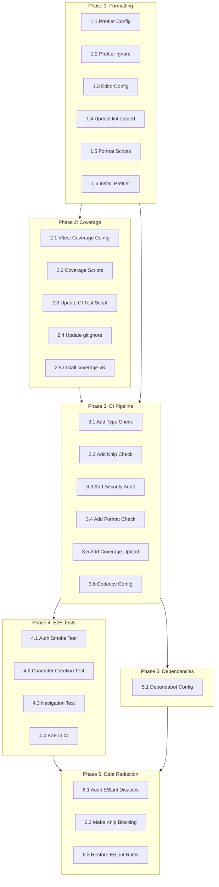

# Implementation Plan: Code Quality Infrastructure Enhancement

## Goal Description

Implement comprehensive improvements to the code quality infrastructure to establish consistent formatting, reliable test coverage tracking, a robust CI pipeline, E2E testing, and automated dependency management.**Current State:** The codebase has a solid foundation with ESLint 9, TypeScript strict mode, 83+ Vitest unit tests, Husky hooks, and Knip for dead code detection. However, there are notable gaps:

- No code formatter (Prettier) leading to inconsistent style
- No test coverage tracking or thresholds
- CI pipeline missing type-check, knip, security audit
- Empty E2E test directory despite Playwright configuration
- No automated dependency updates
- 50 ESLint disable comments scattered across codebase
- Several ESLint rules downgraded to warnings

**Target State:** Complete code quality infrastructure with:

- Consistent code formatting via Prettier
- Test coverage tracking with minimum thresholds
- Comprehensive CI pipeline with all quality gates
- E2E smoke tests for critical user flows
- Automated dependency updates via Dependabot
- Reduced type suppressions and restored ESLint rules

---

## Architectural Decisions

1. **Formatter Choice**

- **Decision:** Prettier with ESLint integration
- **Rationale:** Industry standard, works with existing ESLint setup

2. **Coverage Provider**

- **Decision:** V8 coverage (built into Vitest)
- **Rationale:** No additional dependencies, fast, accurate

3. **Coverage Service**

- **Decision:** Codecov for coverage tracking
- **Rationale:** Free for open source, good GitHub integration

4. **E2E Testing Scope**

- **Decision:** Smoke tests only for MVP
- **Rationale:** Focus on critical paths (auth, character creation) first

5. **Dependency Updates**

- **Decision:** Dependabot with grouped PRs
- **Rationale:** Native GitHub integration, low maintenance

---

## Proposed Changes

### Phase 1: Code Formatting Foundation

#### 1.1 Add Prettier Configuration

**File:** [`.prettierrc`](.prettierrc) (NEW)

```json
{
  "semi": true,
  "singleQuote": true,
  "trailingComma": "es5",
  "tabWidth": 2,
  "printWidth": 100,
  "plugins": []
}
```


#### 1.2 Add Prettier Ignore

**File:** [`.prettierignore`](.prettierignore) (NEW)

```javascript
.next
node_modules
pnpm-lock.yaml
data/
coverage/
playwright-report/
```


#### 1.3 Add EditorConfig

**File:** [`.editorconfig`](.editorconfig) (NEW)

```ini
root = true

[*]
indent_style = space
indent_size = 2
end_of_line = lf
charset = utf-8
trim_trailing_whitespace = true
insert_final_newline = true

[*.md]
trim_trailing_whitespace = false
```


#### 1.4 Update lint-staged Configuration

**File:** [`package.json`](package.json)Modify `lint-staged` section:

```json
"lint-staged": {
  "*.{ts,tsx}": ["eslint --fix", "prettier --write"],
  "*.{json,md,yml,yaml,css}": ["prettier --write"]
}
```


#### 1.5 Add Formatting Scripts

**File:** [`package.json`](package.json)Add scripts:

```json
"format": "prettier --write .",
"format:check": "prettier --check ."
```


#### 1.6 Install Dependencies

- `prettier` (dev dependency)

---

### Phase 2: Test Coverage Infrastructure

#### 2.1 Configure Vitest Coverage

**File:** [`vitest.config.ts`](vitest.config.ts)Add coverage configuration:

```typescript
test: {
  // ... existing config
  coverage: {
    provider: 'v8',
    reporter: ['text', 'html', 'lcov'],
    reportsDirectory: './coverage',
    exclude: [
      '**/__tests__/**',
      '**/mocks/**',
      '*.config.*',
      'e2e/**',
      '.next/**',
    ],
    thresholds: {
      lines: 50,
      branches: 50,
      functions: 50,
      statements: 50,
    }
  },
}
```


#### 2.2 Add Coverage Scripts

**File:** [`package.json`](package.json)Add scripts:

```json
"test:coverage": "vitest run --coverage",
"test:coverage:watch": "vitest --coverage"
```


#### 2.3 Update CI Test Script

**File:** [`package.json`](package.json)Modify existing script:

```json
"test:ci": "vitest run --coverage --reporter=verbose"
```


#### 2.4 Add Coverage to .gitignore

**File:** [`.gitignore`](.gitignore)Ensure coverage directory is ignored (verify existing):

```javascript
coverage/
```


#### 2.5 Install Dependencies

- `@vitest/coverage-v8` (dev dependency)

---

### Phase 3: CI Pipeline Enhancements

#### 3.1 Add Type Checking to CI

**File:** [`.github/workflows/ci.yml`](.github/workflows/ci.yml)Add step after linter:

```yaml
- name: Type check
  run: pnpm type-check
```


#### 3.2 Add Knip Check to CI

**File:** [`.github/workflows/ci.yml`](.github/workflows/ci.yml)Add step after type check:

```yaml
- name: Check for unused code
  run: pnpm knip --max-issues 50
```


#### 3.3 Add Security Audit to CI

**File:** [`.github/workflows/ci.yml`](.github/workflows/ci.yml)Add step:

```yaml
- name: Security audit
  run: pnpm audit --audit-level=high
  continue-on-error: true
```


#### 3.4 Add Prettier Check to CI

**File:** [`.github/workflows/ci.yml`](.github/workflows/ci.yml)Add step after lint:

```yaml
- name: Check formatting
  run: pnpm format:check
```


#### 3.5 Add Coverage Upload to CI

**File:** [`.github/workflows/ci.yml`](.github/workflows/ci.yml)Add step after tests:

```yaml
- name: Upload coverage to Codecov
  uses: codecov/codecov-action@v4
  with:
    files: ./coverage/lcov.info
    fail_ci_if_error: false
```


#### 3.6 Add Codecov Configuration

**File:** [`codecov.yml`](codecov.yml) (NEW)

```yaml
coverage:
  status:
    project:
      default:
        target: auto
        threshold: 1%
    patch:
      default:
        target: 80%

comment:
  layout: "reach,diff,flags,files"
  behavior: default
  require_changes: true
```

---

### Phase 4: E2E Testing Setup

#### 4.1 Create Authentication Smoke Test

**File:** [`e2e/auth.spec.ts`](e2e/auth.spec.ts) (NEW)

```typescript
import { test, expect } from '@playwright/test';

test.describe('Authentication', () => {
  test('should display sign in page', async ({ page }) => {
    await page.goto('/signin');
    await expect(page.getByRole('heading', { name: /sign in/i })).toBeVisible();
  });

  test('should show validation errors on invalid login', async ({ page }) => {
    await page.goto('/signin');
    await page.getByRole('button', { name: /sign in/i }).click();
    await expect(page.getByText(/email.*required/i)).toBeVisible();
  });

  test('should navigate to sign up from sign in', async ({ page }) => {
    await page.goto('/signin');
    await page.getByRole('link', { name: /sign up/i }).click();
    await expect(page).toHaveURL('/signup');
  });
});
```


#### 4.2 Create Character Creation Smoke Test

**File:** [`e2e/character-creation.spec.ts`](e2e/character-creation.spec.ts) (NEW)

```typescript
import { test, expect } from '@playwright/test';

test.describe('Character Creation', () => {
  test('should display edition selector on create page', async ({ page }) => {
    await page.goto('/characters/create');
    await expect(page.getByText(/select.*edition/i)).toBeVisible();
  });
});
```


#### 4.3 Create Navigation Smoke Test

**File:** [`e2e/navigation.spec.ts`](e2e/navigation.spec.ts) (NEW)

```typescript
import { test, expect } from '@playwright/test';

test.describe('Navigation', () => {
  test('should load home page', async ({ page }) => {
    await page.goto('/');
    await expect(page).toHaveTitle(/shadow master/i);
  });
});
```


#### 4.4 Add E2E to CI (Optional Job)

**File:** [`.github/workflows/ci.yml`](.github/workflows/ci.yml)Add separate job:

```yaml
e2e-tests:
  name: E2E Tests
  runs-on: ubuntu-latest
  needs: lint-test-build
  steps:
        - uses: actions/checkout@v4
        - uses: pnpm/action-setup@v4
        - uses: actions/setup-node@v4
      with:
        node-version: 20.x
        cache: 'pnpm'
        - run: pnpm install --frozen-lockfile
        - run: pnpm exec playwright install --with-deps chromium
        - run: pnpm test:e2e --project=chromium
```

---

### Phase 5: Dependency Management Automation

#### 5.1 Add Dependabot Configuration

**File:** [`.github/dependabot.yml`](.github/dependabot.yml) (NEW)

```yaml
version: 2
updates:
    - package-ecosystem: "npm"
    directory: "/"
    schedule:
      interval: "weekly"
      day: "monday"
    groups:
      production-deps:
        patterns:
                    - "*"
        dependency-type: "production"
      dev-deps:
        patterns:
                    - "*"
        dependency-type: "development"
    open-pull-requests-limit: 10
    commit-message:
      prefix: "deps"
    labels:
            - "dependencies"

    - package-ecosystem: "github-actions"
    directory: "/"
    schedule:
      interval: "monthly"
    commit-message:
      prefix: "ci"
    labels:
            - "ci"
```

---

### Phase 6: Code Quality Debt Reduction

#### 6.1 Audit ESLint Disable Comments

Review and address the 50 ESLint disable comments across 18 files:| File | Count | Action |

|------|-------|--------|

| `lib/rules/__tests__/merge.test.ts` | 10 | Add proper type guards |

| `lib/rules/__tests__/loader.test.ts` | 16 | Add proper type guards |

| `lib/storage/__tests__/*.test.ts` | ~5 | Review mock types |

| Other files | ~19 | Case-by-case review |Priority: Convert `@ts-ignore` to `@ts-expect-error` with explanatory comments.

#### 6.2 Make Knip Blocking in Pre-Push

**File:** [`.husky/pre-push`](.husky/pre-push)Once issues are resolved, update:

```bash
pnpm knip --max-issues 0
```


#### 6.3 Restore Downgraded ESLint Rules

**File:** [`eslint.config.mjs`](eslint.config.mjs)After fixing underlying issues, restore rules to `error`:

```javascript
// Target state (after code fixes)
rules: {
  "react-hooks/preserve-manual-memoization": "error",
  "react-hooks/set-state-in-effect": "error",
  // ... etc
}
```

---

## Dependency Ordering



**Critical Path:** Formatting (Phase 1) -> Coverage (Phase 2) -> CI (Phase 3)Phases 4, 5, and 6 can proceed in parallel after Phase 3 is complete.---

## Verification Plan

### Automated Verification

| Phase | Verification Step |

|-------|-------------------|

| Phase 1 | Run `pnpm format:check` - should pass with no diffs |

| Phase 1 | Commit a file, verify lint-staged runs Prettier |

| Phase 2 | Run `pnpm test:coverage` - should generate coverage report |

| Phase 2 | Check `./coverage/index.html` opens and shows metrics |

| Phase 3 | Push to PR branch, verify all CI checks pass |

| Phase 4 | Run `pnpm test:e2e` locally - should pass 3+ tests |

| Phase 5 | Merge to main, verify Dependabot creates PRs within a week |

### Manual Verification Steps

1. **Formatting Consistency**

- [ ] Create new file, verify auto-format on save (if editor configured)
- [ ] Run `pnpm format` and verify no unexpected changes
- [ ] Commit staged changes, verify lint-staged applies Prettier

2. **Coverage Reporting**

- [ ] Run tests and verify coverage summary in terminal
- [ ] Open `coverage/index.html` in browser
- [ ] Verify thresholds enforcement (temporarily lower threshold, verify failure)

3. **CI Pipeline**

- [ ] Create PR, verify all new checks appear
- [ ] Verify type errors would fail CI (introduce intentional error)
- [ ] Verify Codecov comment appears on PR

4. **E2E Tests**

- [ ] Run `pnpm test:e2e:ui` locally
- [ ] Verify Playwright opens browser and runs tests
- [ ] Check playwright-report for test results

---

## File Summary

### New Files

| File | Purpose |

|------|---------|

| `.prettierrc` | Prettier configuration |

| `.prettierignore` | Files to exclude from formatting |

| `.editorconfig` | Editor settings consistency |

| `codecov.yml` | Coverage reporting configuration |

| `.github/dependabot.yml` | Automated dependency updates |

| `e2e/auth.spec.ts` | Authentication smoke tests |

| `e2e/character-creation.spec.ts` | Character creation smoke tests |

| `e2e/navigation.spec.ts` | Navigation smoke tests |

### Modified Files

| File | Changes |

|------|---------|

| `package.json` | Add format scripts, update lint-staged, update test:ci |

| `vitest.config.ts` | Add coverage configuration |

| `.github/workflows/ci.yml` | Add type-check, knip, format, security, coverage, e2e |

| `.husky/pre-push` | Eventually make Knip blocking |

| `eslint.config.mjs` | Eventually restore downgraded rules |

### Dependencies to Install

| Package | Type | Purpose |

|---------|------|---------|

| `prettier` | dev | Code formatting |

| `@vitest/coverage-v8` | dev | Test coverage |---

## Estimated Effort

| Phase | Effort | Priority |

|-------|--------|----------|

| Phase 1 (Formatting) | 1-2 hours | High |

| Phase 2 (Coverage) | 1 hour | High |

| Phase 3 (CI Pipeline) | 2-3 hours | High |

| Phase 4 (E2E Tests) | 2-4 hours | Medium |

| Phase 5 (Dependabot) | 30 min | Medium |

| Phase 6 (Debt) | 4-8 hours | Low |