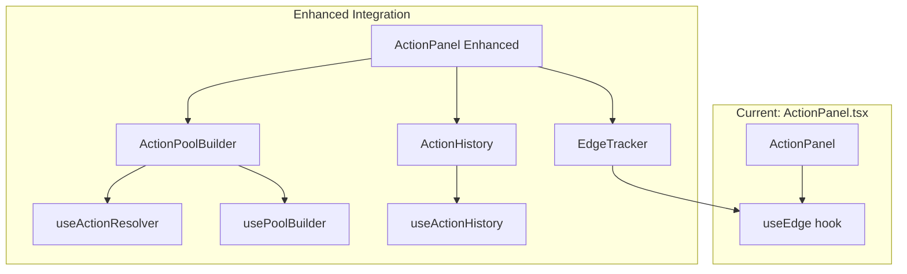

# Unused Exports Cleanup Plan

## Current State

- **Unused exports:** ~224
- **Unused types:** ~78  
- **Unused files:** ~46
- **Root cause:** Backend/hooks/types built ahead of UI implementation

---

## Phase 1: Immediate Cleanup (Safe Deletions)

Remove code that is truly dead and will not be consumed by any planned capability.

### 1.1 Remove Unused Barrel Export Files

These `index.ts` files re-export from other modules but nothing imports them:| File | Action |

|------|--------|

| [components/action-resolution/index.ts](components/action-resolution/index.ts) | Delete |

| [components/character/index.ts](components/character/index.ts) | Delete |

| [components/combat/index.ts](components/combat/index.ts) | Delete |

| [lib/rules/character/index.ts](lib/rules/character/index.ts) | Delete |

| [lib/storage/index.ts](lib/storage/index.ts) | Delete |

| [app/characters/[id]/components/index.ts](app/characters/[id]/components/index.ts) | Delete |

| [app/characters/create/components/index.ts](app/characters/create/components/index.ts) | Delete |**Expected reduction:** ~7 unused files

### 1.2 Remove Superseded Components

These components were replaced by unified step components:| File | Superseded By | Action |

|------|---------------|--------|

| [app/characters/create/components/SpellSelector.tsx](app/characters/create/components/SpellSelector.tsx) | SpellsStep.tsx / MagicStep.tsx | Delete |

| [app/characters/create/components/AdeptPowerSelector.tsx](app/characters/create/components/AdeptPowerSelector.tsx) | AdeptPowersStep.tsx / MagicStep.tsx | Delete |**Expected reduction:** ~2 unused files, ~4-6 unused exports

### 1.3 Run knip and Record Baseline

```bash
pnpm knip > knip-baseline-phase1.txt
```

**Expected total reduction after Phase 1:** ~9 files, ~10-15 exports---

## Phase 2: Wire Up Action Resolution UI

Integrate the pre-built action resolution components and hooks into the character sheet.

### 2.1 Current State of Action Resolution

**Already integrated:**

- `useEdge` hook used in [app/characters/[id]/components/ActionPanel.tsx](app/characters/[id]/components/ActionPanel.tsx)
- API routes consume action-resolution backend functions

**Not integrated (causing unused exports):**

- `ActionPoolBuilder` component
- `ActionHistory` component  
- `EdgeTracker` component
- `useActionResolver` hook
- `usePoolBuilder` hook
- `useActionHistory` hook

### 2.2 Integration Strategy




### 2.3 Integration Tasks

**Task 2.3.1: Integrate ActionPoolBuilder into ActionPanel**The existing ActionPanel has quick-roll buttons but doesn't use the full pool builder. Enhance it to:

1. Import `ActionPoolBuilder` from [components/action-resolution/ActionPoolBuilder.tsx](components/action-resolution/ActionPoolBuilder.tsx)
2. Add an "Advanced Roll" mode that shows the full pool builder
3. Wire `onRoll` callback to use `useActionResolver` for server-side roll persistence

**Task 2.3.2: Add EdgeTracker Widget**

1. Import `EdgeTracker` from [components/action-resolution/EdgeTracker.tsx](components/action-resolution/EdgeTracker.tsx)
2. Add to character sheet header or ActionPanel
3. Connect to existing `useEdge` hook data

**Task 2.3.3: Add ActionHistory Panel**

1. Import `ActionHistory` from [components/action-resolution/ActionHistory.tsx](components/action-resolution/ActionHistory.tsx)
2. Add as collapsible section in character sheet or modal
3. Wire to `useActionHistory` hook for local history + API fetch

**Task 2.3.4: Migrate ActionPanel to useActionResolver**Replace the current inline roll logic with the full hook:

```typescript
// Current approach (simplified)
const handleRoll = (pool: number) => {
  // Local roll only
};

// Enhanced approach
const { roll, currentResult, isRolling, history } = useActionResolver({
  characterId: character.id,
  persistRolls: true,
});
```


### 2.4 Files to Modify

| File | Changes |

|------|---------|

| [app/characters/[id]/components/ActionPanel.tsx](app/characters/[id]/components/ActionPanel.tsx) | Import ActionPoolBuilder, integrate useActionResolver |

| [app/characters/[id]/page.tsx](app/characters/[id]/page.tsx) | Add EdgeTracker and ActionHistory to layout |

### 2.5 Expected Reduction After Phase 2

| Category | Exports Consumed |

|----------|------------------|

| ActionPoolBuilder component | 1 |

| EdgeTracker component | 1 |

| ActionHistory component | 1 |

| useActionResolver hook | 1 |

| usePoolBuilder hook | 1 |

| useActionHistory hook | 1 |

| Supporting types | ~8-10 |

| Pool builder utilities | ~5-8 |**Expected reduction:** ~20-25 unused exports---

## Phase 3: Verification and Documentation

### 3.1 Run Final knip Analysis

```bash
pnpm knip > knip-post-phase2.txt
diff knip-baseline-phase1.txt knip-post-phase2.txt
```


### 3.2 Update Tracking Document

Update [docs/architecture/unused-exports-tracking.md](docs/architecture/unused-exports-tracking.md) with:

- New baseline counts
- Check off Action Resolution UI section as complete
- Note remaining areas for future phases

### 3.3 Remaining Areas for Future Work

After Phases 1-2, the remaining unused exports will be:| Area | Est. Unused | Future Phase |

|------|-------------|--------------|

| Matrix Operations UI | ~15 | Phase 5 |

| Rigging Control UI | ~15 | Phase 5 |

| Augmentation UI | ~10 | Phase 5 |

| Combat Real-time | ~20 | Phase 7-8 |

| Social/Contact utilities | ~25 | As needed |---

## Summary

| Phase | Scope | Reduction |

|-------|-------|-----------|

| Phase 1 | Delete dead code | ~15 exports, 9 files |

| Phase 2 | Wire Action Resolution UI | ~20-25 exports |

| **Total** | | **~35-40 exports** |Starting point: ~224 unused exports

Expected after plan: ~185-190 unused exports