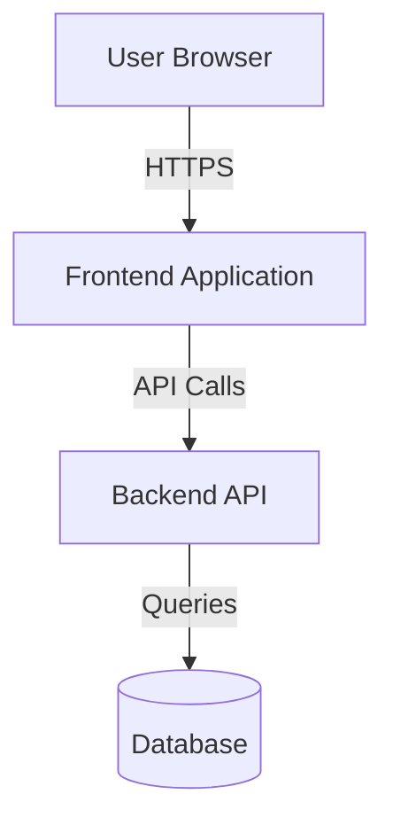
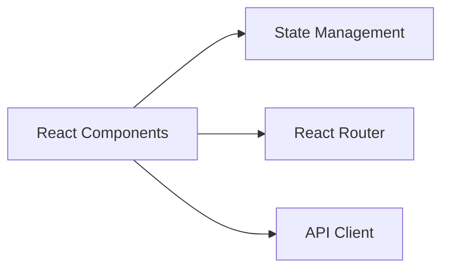
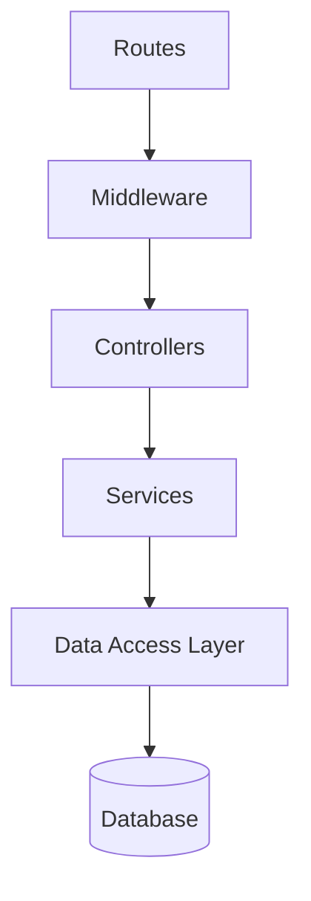
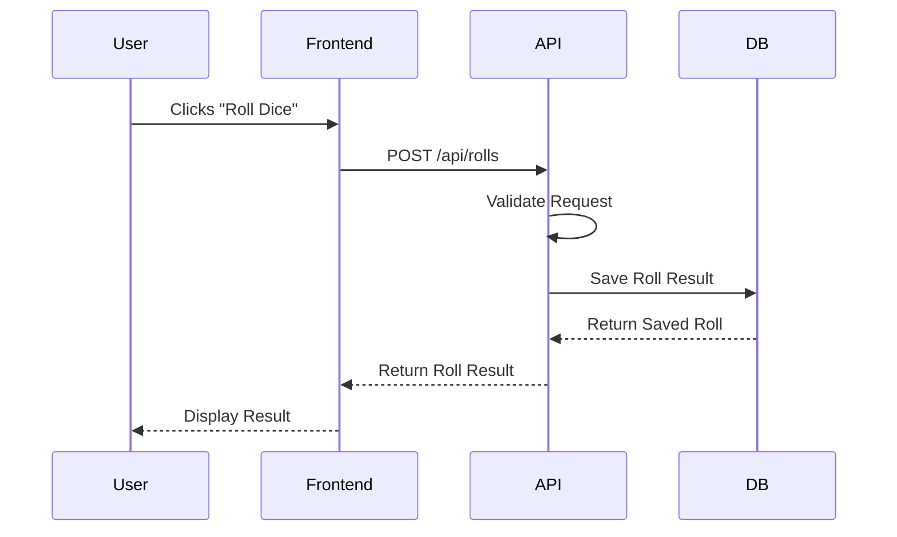
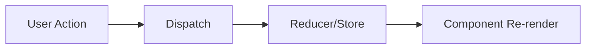
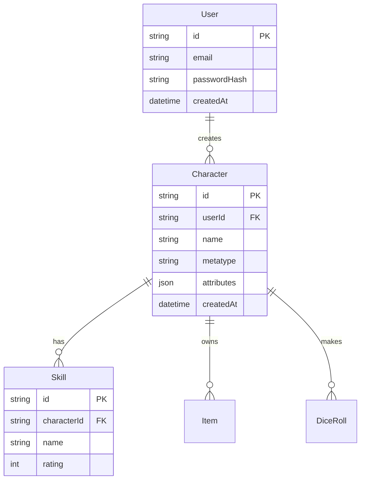

# Architecture Overview Documentation Prompt

## Instructions
Run this prompt after completing the initial analysis to generate architecture documentation.

---

# Generate Architecture Overview Documentation

Based on your previous analysis of the codebase, create a comprehensive architecture overview document that explains the system design, data flow, and key architectural decisions.

## Requirements

### 1. System Architecture
- High-level system diagram (use Mermaid syntax)
- Frontend architecture
- Backend architecture
- Database architecture
- Deployment architecture (if evident)

### 2. Data Flow
Document how data flows through the system:
- User interaction → Frontend component
- Frontend → API request
- API → Business logic → Database
- Database → Response → Frontend → UI update
- Real-time updates (WebSocket flow if applicable)

### 3. Component Architecture

#### Frontend
- Component hierarchy and organization
- State management flow
- Routing structure
- Key shared components/utilities
- Build and bundle strategy

#### Backend
- Request lifecycle
- Middleware chain
- Controller/Service/Repository layers (or equivalent)
- Database access patterns
- Error handling flow

### 4. Key Architectural Patterns
Document each pattern found:
- Pattern name (e.g., "Repository Pattern", "Service Layer", "HOC Pattern")
- Why it's used
- Where it's implemented
- Code examples
- Benefits observed
- Any drawbacks or issues

### 5. Design Decisions
For major architectural choices, document:
- The decision made
- Alternatives considered (if evident from code/comments)
- Reasoning (if documented or inferable)
- Trade-offs
- Impact on the system

### 6. Technology Choices
- Why each major library/framework was chosen (if evident)
- How they integrate together
- Version constraints or compatibility notes
- Migration paths (if any deprecated tech is used)

### 7. Data Models
- Core entity relationships (use Mermaid ER diagram)
- Key domain models
- How they map between layers (DB → API → Frontend)
- Validation strategy per layer

### 8. Security Architecture
- Authentication implementation
- Authorization strategy
- Data protection measures
- Input sanitization
- CORS configuration
- Security headers
- Rate limiting

### 9. Performance Considerations
- Caching strategies
- Query optimization patterns
- Frontend optimization (code splitting, lazy loading)
- Asset optimization
- Any identified bottlenecks

### 10. Scalability & Reliability
- Current scalability approach
- Error handling and recovery
- Logging and monitoring
- Retry mechanisms
- Circuit breakers (if any)

## Output Format

Create the file as `/docs/claude/architecture-overview.md` with this structure:

```markdown
# Architecture Overview

## Executive Summary
[High-level description of the system architecture in 2-3 paragraphs]

## System Architecture

### High-Level Diagram


### Frontend Architecture
[Detailed frontend architecture description]



### Backend Architecture
[Detailed backend architecture description]



### Database Architecture
[Detailed database architecture description]

## Data Flow

### Request Flow


### State Management Flow
[How state flows through the application]



## Architectural Patterns

### Repository Pattern
**Description**: Abstracts database access behind a clean interface

**Purpose**: Decouples business logic from data access, makes testing easier

**Implementation**: Located in `src/repositories/`, one repository per domain entity

**Example**:
```typescript
class CharacterRepository {
  async findById(id: string): Promise<Character> {
    // Database query logic
  }
  
  async save(character: Character): Promise<Character> {
    // Save logic
  }
}
```

**Benefits**: Clean separation, easier to mock for tests, database agnostic

**Drawbacks**: Additional abstraction layer, can be overkill for simple CRUD

---

[Repeat for each pattern: Service Layer, Factory Pattern, Observer Pattern, etc.]

## Technology Stack

### Frontend
- **React 18**: Chosen for component-based architecture and ecosystem
- **TypeScript**: Type safety and better developer experience
- **Tailwind CSS**: Utility-first styling, rapid development
- **React Router**: Standard routing solution
- **Axios**: HTTP client with interceptor support

### Backend
- **Node.js + Express**: Familiar stack, large ecosystem
- **TypeScript**: Shared types with frontend
- **PostgreSQL**: Relational data, ACID compliance for game state
- **Prisma**: Type-safe ORM, excellent migration tools
- **JWT**: Stateless authentication

### Infrastructure
- **Docker**: Containerization for consistent environments
- **[Other tools based on your codebase]**

## Data Models

### Entity Relationship Diagram


### Core Models

#### Character Model
- **Fields**: id, userId, name, metatype, attributes, skills, gear, createdAt, updatedAt
- **Relationships**: belongs to User, has many Skills, has many Items
- **Validation**: Metatype-specific attribute limits, skill point allocation rules
- **Business Rules**: Shadowrun 5e character creation rules applied

[Continue for other models...]

## Security Architecture

### Authentication
- JWT tokens stored in httpOnly cookies
- Access tokens (15min expiry) + Refresh tokens (7 day expiry)
- Password hashing with bcrypt (10 rounds)

### Authorization
- Role-based access control (RBAC)
- Middleware checks JWT and user roles
- Resource ownership validation for character access

### Data Protection
- SQL injection prevention via Prisma parameterized queries
- XSS prevention via React auto-escaping + DOMPurify for user content
- CSRF protection via SameSite cookies
- Rate limiting: 100 requests/15min per IP

## Performance & Scalability

### Current Performance Strategies
- Frontend code splitting by route
- Backend query optimization with indexes on user_id, character_id
- No caching currently implemented
- Database connection pooling (max 10 connections)

### Identified Bottlenecks
- Character list queries not paginated
- No Redis caching for frequently accessed data
- Large dice roll history queries slow without pagination

### Scalability Considerations
- Stateless backend can scale horizontally
- Database would need read replicas for scaling
- WebSocket connections (if added) would need sticky sessions

## Strengths
- Clear separation of concerns (frontend/backend/database)
- Type safety throughout with TypeScript
- Good validation coverage on API layer
- Shadowrun business rules properly encapsulated

## Areas for Improvement
- No automated testing currently
- Inconsistent error handling patterns
- Missing API documentation
- No monitoring or observability
- Database migrations not well organized
- Frontend state management could be simplified
- Missing pagination on list endpoints
- No caching strategy

## Recommendations for Refactor
1. **Add comprehensive testing**: Unit tests for business logic, integration tests for API
2. **Standardize error handling**: Create custom error classes, unified error middleware
3. **Implement caching**: Redis for session data and frequently accessed characters
4. **Add pagination**: All list endpoints should support pagination
5. **Improve type sharing**: Share types between frontend/backend via monorepo or package
6. **Add monitoring**: Application metrics, error tracking, performance monitoring
7. **Document as you build**: Keep API docs in sync with code
8. **Consider state management alternatives**: Evaluate if Redux/Zustand needed or Context sufficient

## Architectural Risks
- Database is single point of failure (no replication)
- No backup strategy documented
- Authentication tokens in cookies may complicate mobile apps
- Tightly coupled to PostgreSQL (migration would be difficult)
```

## Additional Notes
- Use Mermaid diagrams wherever they add clarity
- Be honest about technical debt or architectural issues
- Highlight what should be preserved vs. changed
- Note any coupling or dependencies that complicate changes
- Flag any security concerns
- Document any "temporary" solutions that became permanent

---

**Output File**: Save the complete documentation to `/docs/claude/architecture-overview.md`