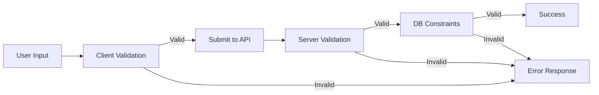

# Validation Systems Documentation Prompt

## Instructions
Run this prompt after completing the initial analysis to document all validation logic.

---

# Generate Validation Systems Documentation

Based on your previous analysis of the codebase, create comprehensive documentation of all validation systems, rules, and patterns used throughout the application.

## Requirements

### 1. Validation Architecture
- Where validation occurs (client-side, server-side, both)
- Validation libraries/frameworks used
- Overall validation strategy
- Validation flow diagram (use Mermaid)

### 2. Client-Side Validation

#### Form Validation
For each form or input area, document:
- Form purpose (character creation, dice roll, etc.)
- Field-level validation rules
- Cross-field validation rules
- Real-time vs. submit-time validation
- Error message patterns
- User feedback mechanisms

#### Type Safety
- TypeScript interfaces/types used
- PropTypes (if React without TypeScript)
- Runtime type checking
- Type guards

### 3. Server-Side Validation

#### Request Validation
For each API endpoint, document:
- Validation middleware or decorators used
- Schema definitions
- Required vs optional fields
- Type validation
- Format validation (email, URL, date, etc.)
- Range validation (min/max)
- Pattern matching (regex)
- Custom validators

#### Business Rule Validation
Document Shadowrun-specific rules:
- Character creation rules
- Attribute limits and calculations
- Skill point allocation
- Gear/equipment restrictions
- Dice pool calculations
- Success/failure thresholds
- Edge case handling

### 4. Database Constraints
- Database-level validation (NOT NULL, CHECK, etc.)
- Foreign key constraints
- Unique constraints
- Default values
- Triggers or stored procedures (if any)

### 5. Validation Schemas
For each major data type, provide:
- Complete schema definition (Zod, Yup, JSON Schema, etc.)
- Commented with reasoning for each rule
- Example valid data
- Example invalid data with expected errors

### 6. Error Handling

#### Validation Errors
- Error format/structure
- Error code conventions
- Error message patterns
- Internationalization (if applicable)
- How errors bubble up through layers

#### User-Facing Errors
- How validation errors are displayed to users
- Field-level error display
- Form-level error display
- Toast/notification patterns

### 7. Common Validation Patterns
Document reusable patterns:
- Email validation
- Password strength
- Name validation
- Number ranges
- Date validation
- File upload validation
- Array validation (min/max items)
- Nested object validation

### 8. Shadowrun-Specific Validation

#### Character Rules
- Metatype restrictions
- Attribute ranges by metatype
- Skill maximums
- Quality/flaw validation
- Starting resources
- Character advancement rules

#### Game Mechanics
- Dice pool validation
- Modifier validation
- Threshold calculations
- Edge usage rules
- Initiative validation
- Combat action validation

### 9. Data Sanitization
- Input sanitization approach
- XSS prevention
- SQL injection prevention
- HTML/script stripping
- Whitelist vs blacklist approach

### 10. Validation Testing
- How validation rules are tested
- Test coverage
- Edge cases covered
- Example test cases

## Output Format

Create the file as `/docs/claude/validation-systems.md` with this structure:

```markdown
# Validation Systems

## Overview
[High-level description of validation strategy - where it happens, philosophy, libraries used]

## Validation Flow


## Validation Libraries
- **Client-side**: React Hook Form + Zod (or whatever is used)
- **Server-side**: Zod/Yup/Joi (or whatever is used)
- **Why chosen**: [Reasoning if evident]

## Client-Side Validation

### Form Validation Patterns
[Common patterns used across forms]

### Character Creation Form

**Purpose**: Create new Shadowrun character

**Fields**:
- `name`: 
  - Required: Yes
  - Type: String
  - Min length: 1
  - Max length: 50
  - Pattern: Alphanumeric with spaces and hyphens
  - Error messages: "Name is required", "Name must be 1-50 characters"
  
- `metatype`:
  - Required: Yes
  - Type: Enum
  - Values: ['human', 'elf', 'dwarf', 'ork', 'troll']
  - Error message: "Please select a valid metatype"
  
- `attributes.body`:
  - Required: Yes
  - Type: Integer
  - Min: 1
  - Max: Varies by metatype (human: 6, troll: 9)
  - Error message: "Body must be between {min} and {max} for {metatype}"

[Continue for all fields...]

**Cross-field Rules**:
- Total attribute points cannot exceed starting allocation (typically 20)
- Attribute values must respect metatype minimums and maximums
- Special attributes (Magic, Resonance) only available if character has appropriate quality

**Schema**:
```typescript
const characterSchema = z.object({
  name: z.string().min(1).max(50),
  metatype: z.enum(['human', 'elf', 'dwarf', 'ork', 'troll']),
  attributes: z.object({
    body: z.number().int().min(1).max(6), // Adjusted by metatype
    agility: z.number().int().min(1).max(6),
    reaction: z.number().int().min(1).max(6),
    strength: z.number().int().min(1).max(6),
    willpower: z.number().int().min(1).max(6),
    logic: z.number().int().min(1).max(6),
    intuition: z.number().int().min(1).max(6),
    charisma: z.number().int().min(1).max(6),
  }).refine(validateAttributeTotal, {
    message: "Total attribute points cannot exceed 20"
  })
});
```

**Valid Example**:
```json
{
  "name": "Shadowjack",
  "metatype": "human",
  "attributes": {
    "body": 3,
    "agility": 4,
    "reaction": 3,
    "strength": 2,
    "willpower": 3,
    "logic": 2,
    "intuition": 2,
    "charisma": 1
  }
}
```

**Invalid Example**:
```json
{
  "name": "",
  "metatype": "invalid",
  "attributes": {
    "body": 10  // Too high
  }
}
```

**Expected Errors**:
```json
{
  "errors": [
    {"field": "name", "message": "Name is required"},
    {"field": "metatype", "message": "Please select a valid metatype"},
    {"field": "attributes.body", "message": "Body must be between 1 and 6 for human"}
  ]
}
```

---

[Repeat for other forms: Dice Roll, Skill Check, Equipment Purchase, etc.]

### Type Safety
- **TypeScript Interfaces**: All forms have corresponding interfaces
- **Runtime Validation**: Zod schemas provide runtime type checking
- **Type Guards**: Used for discriminated unions (e.g., different character types)

## Server-Side Validation

### Validation Middleware
[How validation is implemented - middleware chain, decorators, etc.]

```typescript
// Example validation middleware
app.post('/api/characters', 
  validateRequest(characterSchema), 
  createCharacter
);
```

### Endpoint Validation

#### POST /api/characters

**Schema**:
```typescript
const createCharacterSchema = z.object({
  name: z.string().min(1).max(50),
  metatype: z.enum(['human', 'elf', 'dwarf', 'ork', 'troll']),
  attributes: z.object({
    body: z.number().int().min(1),
    agility: z.number().int().min(1),
    // ... etc
  }),
  skills: z.array(z.object({
    name: z.string(),
    rating: z.number().int().min(0).max(6)
  })).optional(),
}).refine(validateMetatypeAttributes, {
  message: "Attributes must be within metatype limits"
}).refine(validateAttributePointTotal, {
  message: "Total attribute points exceed allowed limit"
});
```

**Validation Rules**:
1. **Name validation**:
   - Required
   - 1-50 characters
   - No special characters except spaces and hyphens
   
2. **Metatype validation**:
   - Must be one of the valid Shadowrun metatypes
   
3. **Attribute validation**:
   - All attributes required
   - Must be integers
   - Must respect metatype-specific minimums and maximums:
     - Human: 1-6 for all attributes
     - Elf: Body 1-6, Agility 2-7, Charisma 3-8
     - Dwarf: Body 3-8, Strength 3-8, Willpower 2-7
     - Ork: Body 4-9, Strength 3-8, Logic 1-5
     - Troll: Body 5-10, Strength 5-10, Agility 1-5, Logic 1-5
   - Total attribute points cannot exceed starting allocation
   
4. **Skill validation** (if provided):
   - Skill name must be valid Shadowrun skill
   - Rating between 0-6
   - Cannot exceed total skill points for character creation

**Error Response Format**:
```json
{
  "error": "VALIDATION_ERROR",
  "message": "Character validation failed",
  "details": [
    {
      "field": "attributes.body",
      "value": 10,
      "message": "Body attribute cannot exceed 6 for human metatype",
      "code": "ATTRIBUTE_OUT_OF_RANGE"
    }
  ]
}
```

---

[Repeat for all endpoints]

## Business Rules

### Character Creation Rules

#### Metatype Attribute Modifiers
```typescript
const METATYPE_LIMITS = {
  human: { body: [1, 6], agility: [1, 6], /* ... */ },
  elf: { body: [1, 6], agility: [2, 7], charisma: [3, 8], /* ... */ },
  dwarf: { body: [3, 8], strength: [3, 8], willpower: [2, 7], /* ... */ },
  ork: { body: [4, 9], strength: [3, 8], logic: [1, 5], /* ... */ },
  troll: { body: [5, 10], strength: [5, 10], agility: [1, 5], logic: [1, 5], /* ... */ }
};
```

#### Attribute Point Allocation
- Priority system: Attributes get A/B/C/D/E priority
- Priority A: 24 attribute points
- Priority B: 20 attribute points
- Priority C: 16 attribute points
- Priority D: 14 attribute points
- Priority E: 12 attribute points

#### Skill Point Allocation
- Skills follow similar priority system
- No skill can start above rating 6
- Specializations cost additional points

### Dice Mechanics Validation

#### Dice Pool Calculation
```typescript
// Dice pool = Attribute + Skill + Modifiers
function validateDicePool(
  attribute: number,
  skill: number,
  modifiers: number[]
): boolean {
  const pool = attribute + skill + modifiers.reduce((a, b) => a + b, 0);
  return pool >= 0; // Can't have negative dice pool
}
```

#### Success Threshold
- Each die that rolls 5 or 6 is a "hit"
- Target number determines hits needed
- Glitches occur when more than half dice show 1
- Critical glitch: glitch + no hits

### Combat Rules Validation

#### Initiative
```typescript
// Initiative = Reaction + Intuition + Initiative Dice
// Initiative Dice typically 1d6, can be modified by cyberware/magic
```

#### Action Economy
- Simple action: 1 per turn
- Complex action: Uses full turn
- Free actions: Multiple allowed
- Interrupt actions: Special timing

## Database Constraints

### Character Table
```sql
CREATE TABLE characters (
  id UUID PRIMARY KEY,
  user_id UUID NOT NULL REFERENCES users(id) ON DELETE CASCADE,
  name VARCHAR(50) NOT NULL,
  metatype VARCHAR(20) NOT NULL CHECK (metatype IN ('human', 'elf', 'dwarf', 'ork', 'troll')),
  attributes JSONB NOT NULL,
  created_at TIMESTAMP NOT NULL DEFAULT NOW(),
  updated_at TIMESTAMP NOT NULL DEFAULT NOW(),
  CONSTRAINT valid_name CHECK (LENGTH(name) > 0)
);

CREATE INDEX idx_characters_user_id ON characters(user_id);
```

### Skills Table
```sql
CREATE TABLE skills (
  id UUID PRIMARY KEY,
  character_id UUID NOT NULL REFERENCES characters(id) ON DELETE CASCADE,
  name VARCHAR(50) NOT NULL,
  rating INTEGER NOT NULL CHECK (rating >= 0 AND rating <= 6),
  specialization VARCHAR(50),
  UNIQUE(character_id, name)
);
```

## Validation Utilities

### Reusable Validators

```typescript
// Email validation
export const emailSchema = z.string().email();

// Password strength
export const passwordSchema = z.string()
  .min(8, "Password must be at least 8 characters")
  .regex(/[A-Z]/, "Password must contain uppercase letter")
  .regex(/[a-z]/, "Password must contain lowercase letter")
  .regex(/[0-9]/, "Password must contain number");

// Shadowrun skill name validator
export function isValidSkill(name: string): boolean {
  return VALID_SKILLS.includes(name);
}

// Attribute total validator
export function validateAttributeTotal(
  attributes: Attributes,
  allowedPoints: number
): boolean {
  const total = Object.values(attributes).reduce((sum, val) => sum + val, 0);
  return total <= allowedPoints;
}

// Metatype attribute limits
export function validateMetatypeAttributes(
  metatype: Metatype,
  attributes: Attributes
): { valid: boolean; errors: string[] } {
  const limits = METATYPE_LIMITS[metatype];
  const errors: string[] = [];
  
  for (const [attr, value] of Object.entries(attributes)) {
    const [min, max] = limits[attr];
    if (value < min || value > max) {
      errors.push(`${attr} must be between ${min} and ${max} for ${metatype}`);
    }
  }
  
  return { valid: errors.length === 0, errors };
}
```

## Error Handling Patterns

### Client-Side Error Display
- Field-level errors shown below input
- Form-level errors shown at top of form
- Toast notifications for server errors
- Color coding: red for errors, yellow for warnings

### Server Error Response
```typescript
interface ValidationErrorResponse {
  error: 'VALIDATION_ERROR';
  message: string;
  details: Array<{
    field: string;
    value?: any;
    message: string;
    code: string;
  }>;
}
```

## Data Sanitization

### Input Sanitization
- All string inputs trimmed
- HTML tags stripped from user content
- Script tags explicitly blocked
- SQL injection prevented by ORM parameterization

### XSS Prevention
- React auto-escapes rendered content
- DOMPurify used for any user HTML (if applicable)
- Content Security Policy headers set

## Testing Strategy

### Unit Tests
```typescript
describe('Character Validation', () => {
  it('should validate human attributes within limits', () => {
    const char = {
      name: 'Test',
      metatype: 'human',
      attributes: { body: 6, agility: 6, /* ... */ }
    };
    expect(characterSchema.parse(char)).toBeDefined();
  });
  
  it('should reject attributes exceeding metatype limits', () => {
    const char = {
      name: 'Test',
      metatype: 'human',
      attributes: { body: 10, /* ... */ }
    };
    expect(() => characterSchema.parse(char)).toThrow();
  });
});
```

## Known Issues & Edge Cases

### Known Issues
- Password validation doesn't check against common passwords
- Character name validation allows some problematic Unicode characters
- Dice pool calculation doesn't handle negative modifiers gracefully in UI

### Edge Cases
- Metatype change after attributes set requires full recalculation
- Skills with same name but different specializations need careful handling
- Initiative modifiers from multiple sources can stack unexpectedly

## Recommendations

### For Refactor
1. **Centralize validation schemas**: Share Zod schemas between frontend and backend
2. **Improve error messages**: Make them more user-friendly and specific
3. **Add validation testing**: Comprehensive unit tests for all validators
4. **Document business rules**: Create separate Shadowrun rules reference
5. **Sanitization library**: Add DOMPurify or similar for user-generated content
6. **Rate limiting**: Add validation for repeated failed attempts
7. **Async validation**: Add support for checking unique constraints (username, email)

### Missing Validation
- No validation for concurrent edits (optimistic locking)
- File upload validation incomplete
- No validation for data export/import formats
```

## Additional Notes
- Be exhaustive - capture every validation rule
- Include actual code snippets for complex validators
- Note any inconsistencies in validation between layers
- Flag any missing validation
- Document any "soft" vs "hard" validation rules
- Note performance implications of validation

---

**Output File**: Save the complete documentation to `/docs/claude/validation-systems.md`