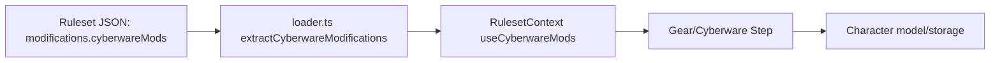

# Plan: Cyberware Modifications (edition-agnostic)

## Scope
- Mirror weapon/armor mod pipeline (ruleset → loader → context/hooks → character state/UI) for cyberware.

## Steps
1) Types & ruleset schema
- Extend gear/mod structures with cyberware mod catalog types and mount/capacity fields in `[lib/rules/loader.ts](lib/rules/loader.ts)` and shared interfaces in `[lib/rules/RulesetContext.tsx](lib/rules/RulesetContext.tsx)`; add character-side installed mod shape (similar to `InstalledWeaponMod`/`InstalledArmorMod`) in `[lib/types/character.ts](lib/types/character.ts)`.
- Update edition types in `[lib/types/edition.ts](lib/types/edition.ts)` to include `cyberwareMods` module entry, matching existing `modifications` module pattern.

2) Data: ruleset JSON
- Add `cyberwareMods` array under `modifications` module in `[data/editions/sr5/core-rulebook.json](data/editions/sr5/core-rulebook.json)` (and ensure data-driven structure so other editions can add their own). Include sample categories, capacity/mount requirements, availability, cost, essence impact.

3) Loader & hooks
- Add `extractCyberwareModifications` in `[lib/rules/loader.ts](lib/rules/loader.ts)` parallel to `extractWeaponModifications`/`extractArmorModifications` and expose via RulesetContext (`useCyberwareMods` hook) in `[lib/rules/RulesetContext.tsx](lib/rules/RulesetContext.tsx)`. Ensure merge strategies are generic (no weapon/armor hard-coding).

4) Character model & persistence
- Add cyberware `modifications`, `capacityUsed`, and mount tracking to cyberware items in `[lib/types/character.ts](lib/types/character.ts)`; ensure storage of installed mods matches gear save flow (draft + saved character) in `[lib/storage/characters.ts](lib/storage/characters.ts)` if needed.

5) UI wiring (creation wizard)
- Surface cyberware mods in gear/cyberware selection: extend `[app/characters/create/components/steps/GearStep.tsx](app/characters/create/components/steps/GearStep.tsx)` or a dedicated cyberware step to list mods, enforce capacity/mounts, cost, availability, and update budgets; mirror armor mod UI patterns.
- Update review display in `[app/characters/create/components/steps/ReviewStep.tsx](app/characters/create/components/steps/ReviewStep.tsx)` to show installed cyberware mods and totals.

6) Validation & UX polish
- Add client-side validations for capacity/mount conflicts and availability restrictions (similar to weapon/armor checks). Document data shape and rules in `[docs/architecture/beta_implementation_plan_v2.md](docs/architecture/beta_implementation_plan_v2.md)` section for cyberware.

## Data/flow sketch

