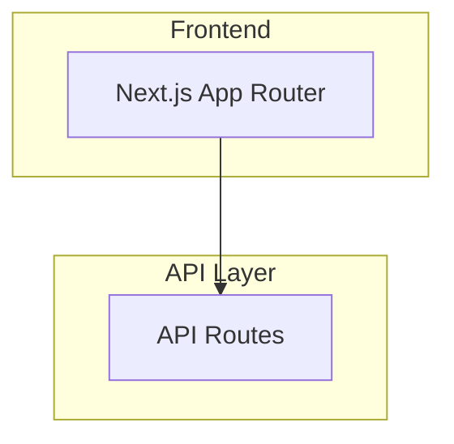
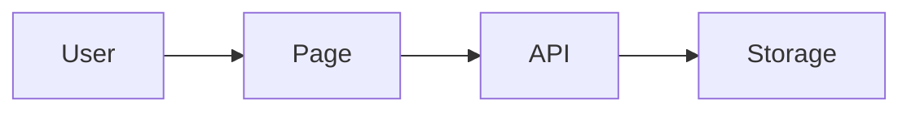

# Prompt: Update Architecture Overview

Use this prompt to update `/docs/architecture/architecture-overview.md` to reflect the current state of the Shadow Master codebase.

---

## Goals
1. Keep existing project structure diagram format but update to current reality
2. Maintain Mermaid diagrams for visual architecture representation
3. Create a living document that's easy to maintain

## Required Sections

### 1. Tech Stack (update versions and additions)
- Verify current package.json versions
- Add testing stack: Vitest, Playwright, Testing Library
- Add lucide-react for icons
- Note uuid package for ID generation

### 2. Project Structure Diagram (major updates needed)
Current structure now includes:
- /app/campaigns/* - Campaign management with tabs (overview, roster, sessions, notes, characters, locations)
- /app/settings/* - User settings with password/export/account
- /app/rulesets/* - Edition browser UI
- /app/characters/[id]/edit/* - Character editing
- /lib/storage/campaigns.ts, locations.ts - New storage modules
- /lib/types/campaign.ts, location.ts, vehicles.ts, programs.ts - New type files
- /lib/themes.ts - Theme configuration
- /components/ThemeProvider.tsx, DiceRoller.tsx - Shared components

### 3. Add Mermaid Diagrams for:
a) **System Architecture Overview** - High-level component relationships
b) **Data Flow Diagram** - How data moves through the app
c) **API Route Structure** - Visual map of /api/* endpoints
d) **Character Creation Flow** - Wizard step progression
e) **Campaign Management Flow** - GM/Player interactions

### 4. Core Domain Expansion
Document these new domains:
- **Campaign System**: GM-owned campaigns with player roster, sessions, notes, locations
- **Location System**: Hierarchical locations with templates, visibility, linking
- **Theme System**: Character sheet theming with ThemeProvider
- **Settings System**: User preferences, password change, data export

### 5. API Endpoints Map
Create comprehensive list of all /api/* routes grouped by domain:
- /api/auth/*
- /api/characters/*
- /api/campaigns/*
- /api/locations/*
- /api/settings/*
- /api/rulesets/*
- /api/editions/*

### 6. Testing Infrastructure
Document the testing setup:
- Vitest for unit/integration tests
- Playwright for E2E tests
- Location of test files (__tests__ directories)
- Test commands: pnpm test, pnpm test:e2e

### 7. Development Workflow Updates
- Add test commands to Available Scripts
- Note the testing workflow

## Format Guidelines
- Use ```mermaid code blocks for diagrams
- Keep diagrams focused (don't overcrowd)
- Include diagram titles/descriptions
- Maintain collapsible sections for detailed lists
- Link to related docs where appropriate

## Example Mermaid Diagram Styles to Use:





## Do NOT:
- Remove existing content that's still accurate
- Over-document implementation details (keep high-level)
- Create separate files (update the existing doc)
