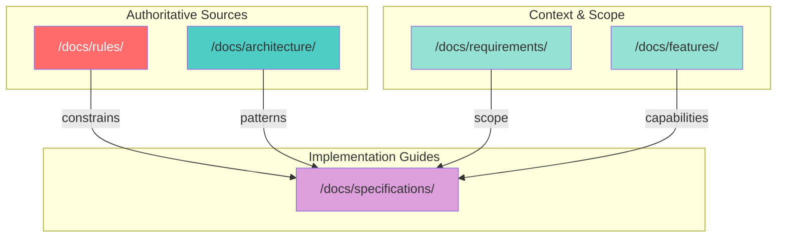
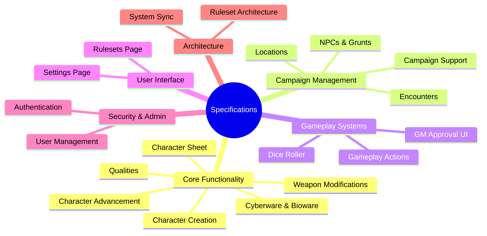
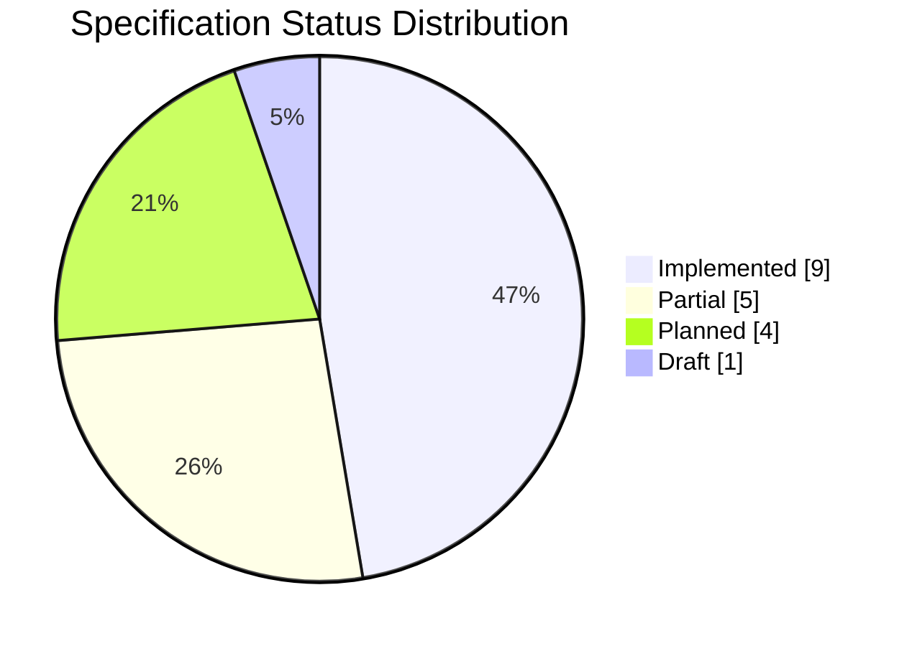
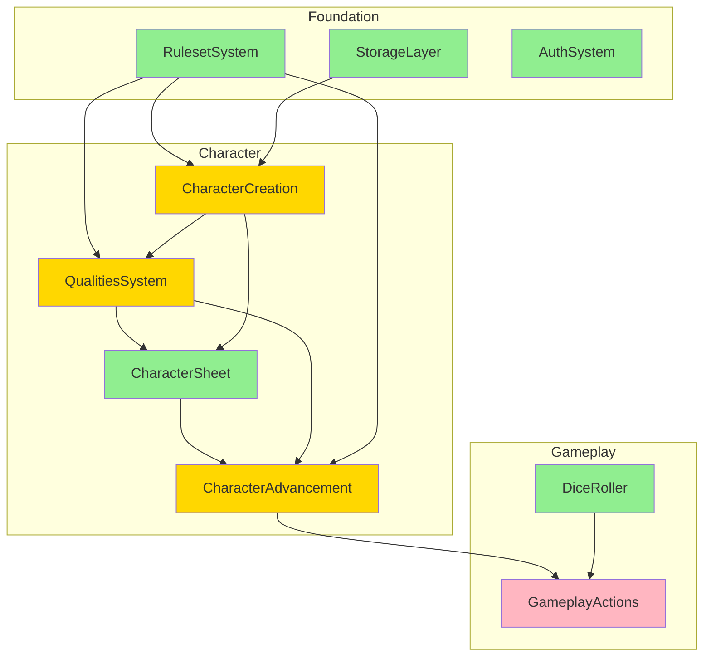
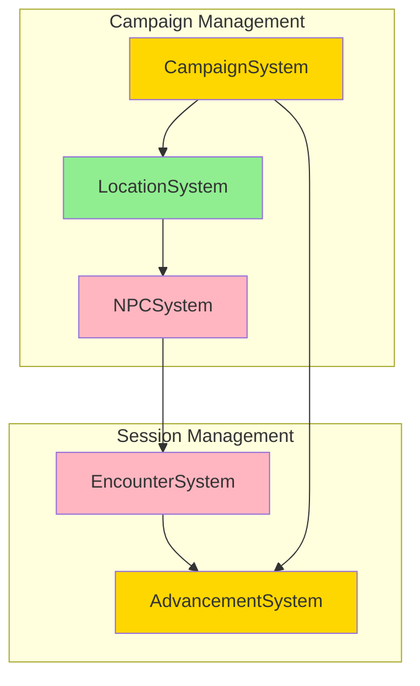
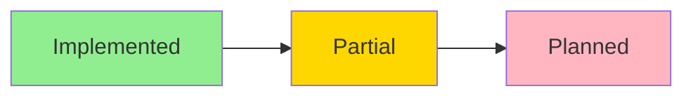
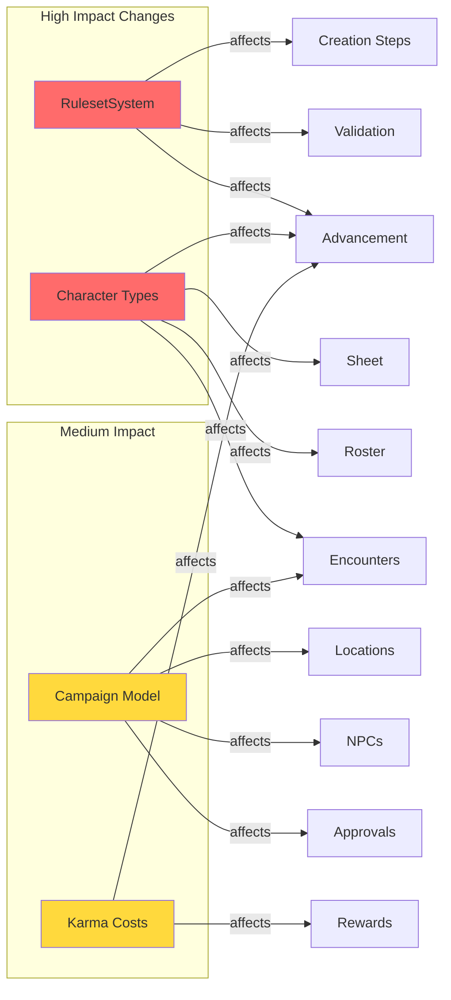
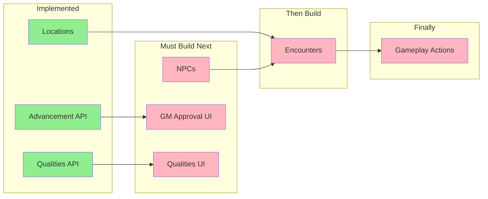

# Specifications Overview

**Last Updated:** 2025-12-21

---

## A. Purpose of Specifications

Specifications in this directory define the requirements, user stories, data models, API contracts, and UI components for Shadow Master features. They serve as the authoritative design documents that guide implementation.

### Relationship to Other Documentation

- **Rules (`/docs/rules/`)**: Specifications must conform to game rules. Rules are authoritative for mechanics (karma costs, attribute limits, skill calculations).
- **Architecture (`/docs/architecture/`)**: Specifications implement patterns defined in architecture docs (API patterns, storage patterns, component structure).
- **Features (`/docs/features/`)**: Feature docs describe high-level capabilities; specifications provide implementation details.
- **Requirements (`/docs/requirements/`)**: Requirements define scope and intent; specifications translate these into actionable designs.

**Critical Constraint:** All specifications must conform to the rules defined in `/docs/rules/`. When a specification conflicts with rules documentation, the rules take precedence.

---

## B. Specification Inventory

### Specification Categories Overview

### Status Legend

| Status | Meaning |
|--------|---------|
| **Implemented** | Core features complete and in production |
| **Partial** | Some features implemented, others pending |
| **Planned** | Designed but not yet implemented |
| **Draft** | Under active design, not ready for implementation |

### Core Functionality

| Specification | Summary | Status | Dependencies |
|---------------|---------|--------|--------------|
| [Character Creation & Management](character_creation_and_management_specification.md) | Wizard-based character creation with priority system | **Partial** | RulesetSystem, StorageLayer |
| [Character Sheet](character_sheet_specification.md) | Character viewing and editing interface | **Implemented** | CharacterCreation |
| [Character Advancement](character_advancement_specification.md) | Post-creation karma spending for progression | **Partial** | RulesetSystem, CampaignSystem |
| [Qualities](qualities_specification.md) | Character traits, effects, and dynamic state management | **Partial** | RulesetSystem, CharacterCreation |
| [Cyberware & Bioware](cyberware_bioware_specification.md) | Augmentation selection and essence management | **Partial** | RulesetSystem, CharacterCreation |
| [Weapon Modifications](weapon_modifications_and_mount_points_specification.md) | Mount points and modification validation | **Planned** | RulesetSystem, GearStep |

### Campaign Management

| Specification | Summary | Status | Dependencies |
|---------------|---------|--------|--------------|
| [Campaign Support](campaign_support_specification.md) | GM campaign creation, player management, ruleset control | **Partial** | RulesetSystem, AuthSystem |
| [Locations](locations_specification.md) | Hierarchical location management for world-building | **Implemented** | CampaignSystem |
| [NPCs & Grunts](npcs_grunts_specification.md) | NPC creation and grunt team management | **Planned** | CampaignSystem, RulesetSystem |
| [Encounter](encounter_specification.md) | Combat/encounter management with initiative tracking | **Planned** | CampaignSystem, NPCs |

### Gameplay Systems

| Specification | Summary | Status | Dependencies |
|---------------|---------|--------|--------------|
| [Dice Roller](dice_roller_specification.md) | Dice pool rolling with glitch detection and Edge | **Implemented** | None |
| [Gameplay Actions](gameplay_actions_specification.md) | Combat, magic, and matrix action resolution | **Planned** | RulesetSystem, DiceRoller |
| [GM Approval UI](gm_approval_ui_implementation.md) | Frontend for GM advancement approval workflow | **Implemented** | AdvancementSystem |

### User Interface

| Specification | Summary | Status | Dependencies |
|---------------|---------|--------|--------------|
| [Rulesets Page](rulesets_page_specification.md) | Edition and ruleset browsing interface | **Implemented** | RulesetSystem |
| [Settings Page](settings_page_specification.md) | User preferences and account settings | **Implemented** | AuthSystem |

### Security & Administration

| Specification | Summary | Status | Dependencies |
|---------------|---------|--------|--------------|
| [Authentication](authentication_specification.md) | User signup, signin, session management | **Implemented** | StorageLayer |
| [User Management](user_management_specification.md) | Admin user administration interface | **Implemented** | AuthSystem |

### System Architecture

| Specification | Summary | Status | Dependencies |
|---------------|---------|--------|--------------|
| [Ruleset Architecture](ruleset_architecture_and_source_material_system.md) | Edition/book loading and merge system | **Implemented** | StorageLayer |
| [System Synchronization](system_synchronization_specification.md) | Character-ruleset drift management | **Draft** | RulesetSystem |

---

## C. Progress Overview

### Implementation Status

### Complete

- **Authentication**: Email/password auth with cookie sessions
- **User Management**: Admin interface for user CRUD
- **Dice Roller**: Full dice pool system with glitches and Edge
- **Rulesets Page**: Edition browsing and selection
- **Settings Page**: User preferences
- **Character Sheet**: Full viewing capabilities
- **Locations**: Hierarchical location management with templates
- **Ruleset Architecture**: Edition loading, book merging, module system
- **GM Approval UI**: Campaign tab for GMs to approve/reject character advancements

### Partially Complete

| Feature | What's Done | What Remains |
|---------|-------------|--------------|
| Character Creation | Priority wizard, 16 creation steps, draft auto-save | Validation engine, karma point-buy method |
| Character Advancement | Attributes, skills, edge advancement; karma ledger; API complete; GM approval UI | Spells, initiation |
| Qualities | Core system, validation, karma accounting, effects engine, dynamic state, API | Quality selection UI, advancement UI, full effects catalog |
| Campaign Support | Campaign CRUD, player roster, sessions, notes | Reward distribution UI, full advancement integration |
| Cyberware/Bioware | Basic selection in GearStep | Enhanced essence tracking, grade selection UI |

### Not Yet Started

- **NPCs & Grunts**: NPC creation and grunt team management
- **Encounter System**: Initiative tracking, combat management
- **Gameplay Actions**: Action resolution for combat/magic/matrix
- **Weapon Modifications**: Mount point validation and mod installation

### Known Blockers

1. **Gameplay Actions**: Requires Encounter system as foundation
2. **System Synchronization**: Draft status, needs architectural review

---

## D. Dependency Map

### Critical Path: Character Lifecycle

### Critical Path: Campaign Play

### Legend

### Cascade Risk Areas

| If This Changes... | These Are Affected |
|--------------------|-------------------|
| RulesetSystem merge logic | All creation steps, validation, advancement costs |
| Character type definitions | Sheet, advancement, campaign roster, encounters |
| Campaign data model | Locations, NPCs, encounters, advancement approval |
| Karma cost formulas | Advancement validation, campaign reward calculations |

### Sequencing Requirements

1. **NPCs before Encounters**: Encounters need NPCs as participants
2. **Encounters before Gameplay Actions**: Actions resolve within encounters
3. **Advancement API before GM Approval UI**: Backend must exist for frontend
4. **Locations before Encounters**: Encounters occur at locations

---

## E. Gaps, Risks, and Inconsistencies

### Missing Specifications

| Implied By | Missing Spec |
|------------|--------------|
| Cyberware spec references enhancements | No cyberware enhancement specification |
| Character creation mentions contacts step | No contacts specification |
| Character creation mentions vehicles step | No vehicles specification |

### Status Inconsistencies Found

| Specification | README Said | File Says | Actual State (MCP) |
|---------------|-------------|-----------|-------------------|
| Character Advancement | Not listed | Specification | **Partial** (API + UI implemented) |
| Locations | Not implemented | Implemented | **Implemented** |
| Campaign Support | Not implemented | Specification | **Partial** (CRUD exists) |

### Underspecified Areas

1. **Training Time**: Optional rule mentioned in advancement, no UI design.
2. **Cross-Campaign Characters**: Rules unclear if character can exist in multiple campaigns.
3. **Ruleset Version Migration**: What happens when ruleset updates break character data?
4. **Contact Management**: How contacts are created, used, and advanced during play.

### Potential Redundancy

- `ruleset_architecture_and_source_material_system.md` overlaps with `/docs/architecture/edition_support_and_ruleset_architecture.md`
- Campaign advancement settings appear in both Campaign and Advancement specs

---

## F. Suggested Next Steps

### High Priority (Unblock Current Work)

1. **Implement GM Approval UI**: Backend complete, frontend is the only blocker
2. **Quality Selection UI**: Build creation step and advancement UI for qualities
3. **Update Campaign Support Status**: Implementation exists, spec doesn't reflect this

### Medium Priority (Complete Partial Features)

4. **Quality Effects Catalog**: Add effects to all qualities in ruleset data
5. **Advancement Phase 3**: Magic/Resonance advancement (initiation, spells)
6. **Cyberware Enhancements**: Enhanced selection UI with grades

### Lower Priority (New Features)

7. **NPCs & Grunts**: Foundation for encounter system
8. **Encounter System**: Required for gameplay actions
9. **Gameplay Actions**: Combat resolution

### Documentation Improvements

10. **Consolidate Ruleset Architecture Docs**: Merge or cross-reference the two ruleset architecture documents
11. **Add Contacts Specification**: Document contact management system
12. **Resolve Status Tracking**: Ensure spec file status matches actual implementation

---

## Related Documentation

- [Architecture Overview](/docs/architecture/architecture-overview.md) - System architecture and design principles
- [Rules Reference](/docs/rules/README.md) - Game rules documentation
- [SR5 Character Creation](/docs/rules/5e/character-creation.md) - Edition-specific creation rules
- [Beta Implementation Plan](/docs/architecture/beta_implementation_plan_v2.md) - Detailed implementation phases

---

## How to Update This Document

When specification status changes:

1. Update the `**Status:**` field in the specification file header
2. Update the corresponding row in Section B tables above
3. Move items between Complete/Partial/Not Started in Section C
4. Document any new gaps or resolved issues in Section E
5. Adjust next steps in Section F as needed

### Status Transition Guidelines

- **Draft → Planned**: Specification reviewed and approved for implementation
- **Planned → Partial**: First features from spec are implemented
- **Partial → Implemented**: All core features complete (enhancements may remain)

---

*This document is maintained as the authoritative index of specifications. Source of truth for implementation status is the MCP memory knowledge graph.*
